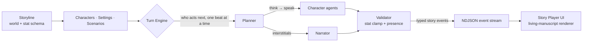

<div align="center">

<picture>
  <source media="(prefers-color-scheme: dark)" srcset="images/LightText.svg">
  
</picture>

### A Library of Myths — an AI-driven, multi-character roleplay engine

*Build a world, cast its characters, and play through scenes narrated in real time by a multi-agent story engine — styled as a living, illuminated manuscript.*

`Next.js` · `React` · `TypeScript` · `Tailwind` · `FastAPI` · `Python 3.13` · `PostgreSQL` · `Redis` · `Neo4j` · `Qdrant`

</div>

---

## What is Mytheca?

**Mytheca** — from *Myth* + the Greek *Bibliotheca* ("library") — is a **library of myths**: a place to author interactive worlds and then live inside them. You create a **storyline** (the world) with its **characters**, **settings**, and **scenarios** (live situations), then play through scenes where AI characters converse with one another and with you, while a persistent **Narrator** describes the world around them. The central chat reads like a scene, not a flat message thread.

The story is driven by a **multi-agent backend** that emits **small, typed, validated story events**. The AI decides *what happens*; the UI decides *how it looks* — the model never dictates layout. A bounded, guidance-driven **stat system** (trust, patience, suspicion, health…) gives the world continuity and consequence over time.

## How it works



Each turn runs a **ReAct loop**: a planner decides one beat at a time — who speaks, whether the narrator cuts in, whether someone leaves, or whether the turn ends — choosing only from characters actually present in the scene. Each chosen character gets **its own isolated LLM call** (a visible in-voice deliberation, then speech), so voices stay distinct. A **validator** clamps every proposed stat change and enforces scene presence, and the result streams to the browser as line-delimited JSON, rendered beat by beat.

## Key features

- **Multi-agent turn loop** — a per-beat ReAct planner over Character, Narrator, and Intent agents, with a server-side validator, streaming token deltas as they generate.
- **Play as anyone** — POV mode lets you speak *as* a cast member instead of as yourself, with follow-up suggestions written in that character's voice.
- **Living-manuscript UI** — an illuminated-codex design with three themes (Parchment, Ember, Slate), warm parchment reading surfaces, wax-seal avatars, and reduced-motion-aware animation.
- **Bounded stat system** — per-storyline stat schemas with labeled bands and Markdown guidance drive continuity and consequence. The model proposes; the server clamps.
- **Scene presence** — characters who die, collapse, or walk out actually leave the scene, and the planner stops calling on them.
- **Conversational authoring** — a scope-aware storyline agent edits your world through chat, gated by a write scope and a transactional diff guard.
- **Hybrid retrieval** — a Qdrant + fastembed RAG pipeline behind a conservative retrieval gate, plus a Neo4j **Story Graph** whose relationship edges condition how characters speak to each other.
- **Durable sessions** — every turn and its diagnostic trace persist; reopening a scene resumes it, and any session exports as JSON or Markdown.
- **Local- or cloud-LLM** — one OpenAI-compatible interface serving cloud OpenAI, vLLM, or llama.cpp, with an auto-detected reasoning budget.

## Tech stack

| Layer | Choice |
| --- | --- |
| **Frontend** | Next.js 16 (App Router) · React 19 · TypeScript · Tailwind CSS v4 · Framer Motion — `web/frontend/` |
| **Backend** | FastAPI (Python 3.13, managed by `uv`) · SQLAlchemy 2.0 · Alembic — `web/backend/`, launched from the root `app.py` |
| **Data** | PostgreSQL (core state) · Redis (live scene state) · Neo4j (Story Graph) · Qdrant (vector RAG) — the last three are best-effort and degrade to no-ops |
| **AI** | One OpenAI-compatible interface (cloud OpenAI, vLLM, or llama.cpp), multi-agent orchestration |
| **Streaming** | NDJSON story events, streamed directly in the turn response |

## Quickstart

> **Prerequisites:** Python 3.13 + [`uv`](https://docs.astral.sh/uv/), Node.js, and Docker (for the Postgres/Redis/Neo4j/Qdrant data stores, which `app.py` starts for you).

```bash
git clone <this-repo> && cd Mytheca
cp .env.example .env          # then fill in values (LLM endpoint, secrets)

uv run python app.py          # [default] backend + frontend together
                              #   UI  → http://localhost:3346
                              #   API → http://127.0.0.1:3345
```

`python app.py` runs both sides: it brings up the data containers, runs backend preflight (schema + seed), waits for health, then starts the frontend; `Ctrl+C` stops both. Run a single side with `uv run python app.py backend` or `python app.py frontend`. Equivalent direct commands:

```bash
cd web/frontend && npm install && npm run dev   # frontend only  → :3346
uv sync && uv run python app.py backend          # backend only   → :3345
uv run pytest                                    # backend tests
cd web/frontend && npm test                      # frontend tests
```

## Project layout

```
app.py            # root launcher — runs backend + frontend together (owns Docker data stores)
web/frontend/     # Next.js app (Library · Storyline creator · Story player · Options)
web/backend/      # FastAPI app — routes, agents, services, rag, events, models, migrations
docs/             # documentation (source of truth) + canonical skills + plans
utils/            # backend tests (pytest), scripts, ComfyUI workflows
images/           # Mytheca brand kit (logos, wordmarks)
media/            # generated portraits + scene art (gitignored, served at /media)
```

Frontend tests live beside the components they test, not under `utils/`.

## Documentation

All durable documentation lives in [`docs/`](docs/) — the single source of truth. Start here:

- [docs/documentation.md](docs/documentation.md) — purpose, domain model, stack, status
- [docs/architecture.md](docs/architecture.md) — modes, boundaries, data layer, decisions
- [docs/workflow.md](docs/workflow.md) — commands, environment, ports, validation gate
- [docs/structure.md](docs/structure.md) — full repository layout
- [docs/data-flow.md](docs/data-flow.md) · [docs/api-contract.md](docs/api-contract.md) — streaming + event contract
- [docs/checklist.md](docs/checklist.md) — genuinely-open work and known gaps

Contributors and coding agents should read [docs/skills/global-project-rules/SKILL.md](docs/skills/global-project-rules/SKILL.md) first. Canonical skills live under [docs/skills/](docs/skills/); the `.claude/`, `.agents/`, and `.cursor/` folders contain only pointers to them.
