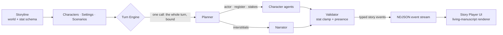

<div align="center">

<picture>
  <source media="(prefers-color-scheme: dark)" srcset="images/LightText.svg">
  
</picture>

### A Library of Myths — an AI-driven, multi-character roleplay engine

*Build a world, cast its characters, and play through scenes narrated in real time by a multi-agent story engine — styled as a living, illuminated manuscript.*

`Next.js` · `React` · `TypeScript` · `Tailwind` · `FastAPI` · `Python 3.13` · `PostgreSQL` · `Redis` · `Neo4j` · `Qdrant`

</div>

<p align="center">
  
</p>

<p align="center"><sub>A turn of <em>The Embergate Conspiracy</em> — four characters, one bound plan, streamed beat by beat.</sub></p>

---

**Status:** active, solo, self-host only. Started June 2026; 848 commits. It runs, and I play it.
It also has no authentication and no multi-user story, no deployment target has been chosen, and of
the four LLM providers only the OpenAI-compatible one has ever been verified against a live endpoint.
[`docs/checklist.md`](docs/checklist.md) is the honest list of what is unbuilt and undecided.

## Why it exists

The obvious way to build this is one model, prompted to play every part, handing back a block of
prose. That version fails in specific ways. The voices converge within a few turns. The model
narrates consequences nothing earned — a wound it decided to inflict, a trust it decided you had
lost — and it will write a line for someone who walked out of the room two beats ago. And a wall of
prose has no seams, so there is nothing for an interface to do with it except put it in a bubble.

Mytheca inverts that. The model never returns a page; it returns small **typed events** — one line
of dialogue, one action, one stat change, one arrival — and a server validates each before anything
reaches the screen. A stat change is clamped to the schema its world declares. A character who is
not present cannot speak. The frontend maps each event type to a component, so **the AI decides what
happens and never how it looks**. That constraint is the design, and the rest is downstream of it:
the turn plan that is a contract, the presence rules, the story graph that conditions how two
particular characters speak to each other.

## What is Mytheca?

**Mytheca** — from *Myth* + the Greek *Bibliotheca* ("library") — is a **library of myths**: a place to author interactive worlds and then live inside them. You create a **storyline** (the world) with its **characters**, **settings**, and **scenarios** (live situations), then play through scenes where AI characters converse with one another and with you, while a persistent **Narrator** describes the world around them. The central chat reads like a scene, not a flat message thread.

A bounded, guidance-driven **stat system** (trust, patience, suspicion, health…) gives the world continuity and consequence over time: the model proposes a change, the server clamps it to the band the world declares, and the value persists across the play-through.

<p align="center">
  
</p>

<p align="center"><sub>The library. Portraits and setting art are generated in-app through a local ComfyUI workflow, in one of three styles.</sub></p>

## Research record

This is also a research repository. Nineteen experiments, their figures, their protocols and
their failures live in [`docs/research/`](docs/research/) under a contract
([`AGENT_INSTRUCTIONS.md`](docs/research/AGENT_INSTRUCTIONS.md)) that says a number may not be
reported anywhere unless it is also written to the experiment that produced it. Runs that failed
are kept, labelled `failed`, not deleted. A result that a later experiment overturns is marked
superseded rather than quietly dropped — [EXP-2026-08-019](docs/research/experiments/EXP-2026-08-019-style-signature-separation/)
re-ran an earlier baseline and moved it by more than the effect that baseline had reported, so
that effect is now recorded as noise.

The longest single piece of writing here is
[**Why Mytheca turns take as long as they do**](docs/research/mytheca-latency-report.pdf) — eight
pages on where a turn's seconds actually go, and what did and did not fix it.

## How it works



Each turn is planned **once**. A single planner call lays out the whole turn — who speaks, in what order, at what emotional register, and why — choosing only from characters actually present in the scene. That plan is then a **contract**: the loop executes it and does not re-plan. Two things outrank it, both deliberately: an instruction from the player that the prose has not yet delivered, and the scene-opening narration, which is written before a plan exists.

Deliberation is spent in the planning, not in the prose. The planner thinks at a high reasoning budget, paid once per turn; the calls that actually write the beats think at none, because each one arrives already knowing its actor, its register, its stakes and the planner's reason for it. A **validator** clamps every proposed stat change and enforces scene presence, and the result streams to the browser as line-delimited JSON, rendered beat by beat.

## Key features

- **Two turn engines, chosen per scene** — `structured` plans the whole turn in one call and decomposes the result into attributed beats; `freetext` drops the planner entirely and writes the turn as one unbroken passage, grading itself against a checklist it wrote first. Both stream token deltas as they generate, both go through the same validator.
- **Play as anyone** — POV mode lets you speak *as* a cast member instead of as yourself, with follow-up suggestions written in that character's voice.
- **Living-manuscript UI** — an illuminated-codex design with three themes (Parchment, Ember, Slate), warm parchment reading surfaces, wax-seal avatars, and reduced-motion-aware animation.
- **Bounded stat system** — per-storyline stat schemas with labeled bands and Markdown guidance drive continuity and consequence. The model proposes; the server clamps.
- **Scene presence** — characters who die, collapse, or walk out actually leave the scene, and the planner stops calling on them.
- **Conversational authoring** — a scope-aware storyline agent edits your world through chat, gated by a write scope and a transactional diff guard.
- **Hybrid retrieval** — a Qdrant + fastembed RAG pipeline behind a conservative retrieval gate, plus a Neo4j **Story Graph** whose relationship edges condition how characters speak to each other.
- **Durable sessions** — every turn and its diagnostic trace persist; reopening a scene resumes it, and any session exports as JSON or Markdown.
- **Local- or cloud-LLM** — four provider adapters (OpenAI-compatible, Anthropic, Gemini, Ollama), each owning the six things that differ per backend and each fail silently: request shape, auth, reply parsing, usage accounting, model listing, and the stream. The reasoning budget is auto-detected from the endpoint. **Only the OpenAI-compatible path has been verified against a live endpoint** — the other three are written against their reference docs and covered by contract tests, and have never made a real request. See [docs/checklist.md](docs/checklist.md).

## Tech stack

| Layer | Choice |
| --- | --- |
| **Frontend** | Next.js 16 (App Router) · React 19 · TypeScript · Tailwind CSS v4 · Framer Motion — `web/frontend/` |
| **Backend** | FastAPI (Python 3.13, managed by `uv`) · SQLAlchemy 2.0 · Alembic — `web/backend/`, launched from the root `app.py` |
| **Data** | PostgreSQL (core state) · Redis (live scene state) · Neo4j (Story Graph) · Qdrant (vector RAG) — the last three are best-effort and degrade to no-ops |
| **AI** | Provider-dispatched LLM layer — OpenAI-compatible · Anthropic · Gemini · Ollama — over ~25 agent call sites |
| **Streaming** | NDJSON story events, streamed directly in the turn response |

## Quickstart

**You need to bring a model.** Mytheca is an engine, not a model — with no LLM endpoint
configured it starts, serves the library, and cannot play a scene. Bring **an OpenAI-compatible
chat-completions endpoint**: a local llama.cpp or vLLM server, a relay in front of one, or the
OpenAI API itself. Anything that can hold a multi-thousand-token prompt and write a few hundred
tokens of prose will play; the engine reads the endpoint's own capabilities and sizes its
context and thinking budget from them rather than assuming. Adapters for Anthropic, Gemini and
Ollama ship too — see the honest caveat in [Key features](#key-features) before relying on one.
You point Mytheca at the endpoint in **Options › Language Models** after first boot, not in
`.env`.

**Also required:** Python 3.13 + [`uv`](https://docs.astral.sh/uv/), Node.js 22, and Docker —
`app.py` owns the Postgres/Redis/Neo4j/Qdrant containers and starts them for you. You never run
`docker compose` yourself.

```bash
git clone https://github.com/brendondgr/Mytheca.git && cd Mytheca
cp .env.example .env          # works as-is for a local run; every var is documented in it

uv run python app.py          # [default] backend + frontend together
                              #   UI  → http://localhost:3346
                              #   API → http://127.0.0.1:3345
```

First run is slow and it is not hung: `uv sync` and `npm install` resolve from scratch, Docker
pulls four images, and the first RAG call downloads ~1.3 GB of embedding models. Expect a few
minutes. Every run after that is seconds.

`python app.py` runs both sides: it brings up the data containers, runs backend preflight (schema + seed), waits for health, then starts the frontend; `Ctrl+C` stops both. Run a single side with `uv run python app.py backend` or `python app.py frontend`. Equivalent direct commands:

```bash
cd web/frontend && npm install && npm run dev   # frontend only  → :3346
uv sync && uv run python app.py backend          # backend only   → :3345
uv run pytest                                    # backend tests
cd web/frontend && npm test                      # frontend tests
```

## Project layout

```
app.py            # root launcher — runs backend + frontend together (owns Docker data stores)
web/frontend/     # Next.js app (Library · Storyline creator · Story player · Options)
web/backend/      # FastAPI app — routes, agents, services, rag, events, models, migrations
docs/             # documentation (source of truth) + canonical skills + plans + research record
utils/            # backend tests (pytest), standalone scripts, ComfyUI workflows
images/           # Mytheca brand kit (logos, wordmarks)
media/            # generated portraits + scene art (gitignored, served at /media)
```

Frontend tests live beside the components they test, not under `utils/`.

## Documentation

All durable documentation lives in [`docs/`](docs/) — the single source of truth. Start here:

- [docs/documentation.md](docs/documentation.md) — purpose, domain model, stack, status
- [docs/architecture.md](docs/architecture.md) — modes, boundaries, data layer, decisions
- [docs/workflow.md](docs/workflow.md) — commands, environment, ports, validation gate
- [docs/structure.md](docs/structure.md) — full repository layout
- [docs/data-flow.md](docs/data-flow.md) · [docs/api-contract.md](docs/api-contract.md) — streaming + event contract
- [docs/checklist.md](docs/checklist.md) — genuinely-open work and known gaps

Contributors and coding agents should read [docs/skills/global-project-rules/SKILL.md](docs/skills/global-project-rules/SKILL.md) first. Canonical skills live under [docs/skills/](docs/skills/); the `.claude/`, `.agents/`, and `.cursor/` folders contain only pointers to them.

## Licence

[MIT](LICENSE). Use it, fork it, build on it.
