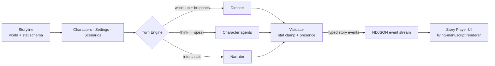

<div align="center">

<picture>
  <source media="(prefers-color-scheme: dark)" srcset="images/LightText.svg">
  
</picture>

### A Library of Myths — an AI-driven, multi-character roleplay engine

*Build a world, cast its characters, and play through scenes narrated in real time by a multi-agent story engine — styled as a living, illuminated manuscript.*

`Next.js` · `React` · `TypeScript` · `Tailwind` · `FastAPI` · `Python 3.13` · `PostgreSQL` · `Redis` · `Neo4j` · `Qdrant`

</div>

---

## What is Mytheca?

**Mytheca** — from *Myth* + the Greek *Bibliotheca* ("library") — is a **library of myths**: a place to author interactive worlds and then live inside them. You create a **storyline** (the world) with its **characters**, **settings**, and **scenarios** (live situations), then play through scenes where AI characters converse with one another and with you, while a persistent **Narrator** describes the world around them. The central chat reads like a scene, not a flat message thread.

The story is driven by a **multi-agent backend** that emits **small, typed, validated story events**. The AI decides *what happens*; the UI decides *how it looks* — the model never dictates layout. A bounded, guidance-driven **stat system** (trust, patience, suspicion, health…) gives the world continuity and consequence over time.

## How it works



Each turn, the **Director** decides who acts and what branches are open, **Character** agents think then speak, and the **Narrator** fills the interstitials. A **Validator** clamps stats and enforces scene presence, then the result is streamed to the browser as a line-delimited (NDJSON) event stream and rendered beat by beat.

## Key features

- **Multi-agent turn loop** — Director / Character / Narrator agents with a state manager and validator, streaming deltas as they generate.
- **Living-manuscript UI** — an illuminated-codex design with three themes (Parchment, Ember, Slate), warm parchment reading surfaces, wax-seal avatars, and reduced-motion-aware animation.
- **Bounded stat system** — per-storyline stat schemas with Markdown guidance drive continuity and consequence instead of free-floating numbers.
- **Conversational authoring** — a scope-aware storyline agent edits your world through chat, with a transactional diff guard.
- **Hybrid retrieval** — a hybrid RAG pipeline (Qdrant + fastembed) plus a Neo4j **Story Graph** substrate for durable world lore.
- **Local- or cloud-LLM** — a provider-agnostic interface runs against OpenAI-compatible endpoints or a local reasoning model.

## Tech stack

| Layer | Choice |
| --- | --- |
| **Frontend** | Next.js (App Router) · React · TypeScript · Tailwind CSS · Framer Motion — `web/frontend/` |
| **Backend** | FastAPI (Python 3.13, managed by `uv`) — `web/backend/`, launched from the root `app.py` |
| **Data** | PostgreSQL (core state) · Redis (live scene/cache) · Neo4j (Story Graph) · Qdrant (vector RAG) |
| **AI** | Provider-agnostic LLMs (OpenAI-compatible or local), multi-agent orchestration |
| **Streaming** | SSE / WebSocket carrying an NDJSON story-event stream |

## Quickstart

> **Prerequisites:** Python 3.13 + [`uv`](https://docs.astral.sh/uv/), Node.js, and Docker (for the Postgres/Redis/Neo4j/Qdrant data stores, which `app.py` starts for you).

```bash
git clone <this-repo> && cd Mytheca
cp .env.example .env          # then fill in values (LLM endpoint, secrets)

uv run python app.py          # [default] backend + frontend together
                              #   UI  → http://localhost:3346
                              #   API → http://127.0.0.1:3345
```

`python app.py` runs both sides: it brings up the data containers, runs backend preflight (schema + seed), waits for health, then starts the frontend; `Ctrl+C` stops both. Run a single side with `uv run python app.py backend` or `python app.py frontend`. Equivalent direct commands:

```bash
cd web/frontend && npm install && npm run dev   # frontend only  → :3346
uv sync && uv run python app.py backend          # backend only   → :3345
uv run pytest                                    # backend tests
cd web/frontend && npm test                      # frontend tests
```

## Project layout

```
app.py            # root launcher — runs backend + frontend together (owns Docker data stores)
web/frontend/     # Next.js app (Library + Story player)
web/backend/      # FastAPI app — routes, agents, services, content, events, models
web/shared/       # shared FE↔BE contracts
docs/             # documentation (source of truth) + canonical skills
utils/            # helpers + tests (pytest + Vitest) + scripts
images/           # Mytheca brand kit (logos, wordmarks)
```

## Documentation

All durable documentation lives in [`docs/`](docs/) — the single source of truth. Start here:

- [docs/documentation.md](docs/documentation.md) — purpose, domain model, stack, status
- [docs/architecture.md](docs/architecture.md) — modes, boundaries, data layer, decisions
- [docs/workflow.md](docs/workflow.md) — commands, environment, ports, validation gate
- [docs/structure.md](docs/structure.md) — full repository layout
- [docs/data-flow.md](docs/data-flow.md) · [docs/api-contract.md](docs/api-contract.md) — streaming + event contract
- [docs/checklist.md](docs/checklist.md) — current status and next steps

Contributors and coding agents should read [docs/skills/global-project-rules/SKILL.md](docs/skills/global-project-rules/SKILL.md) first. Canonical skills live under [docs/skills/](docs/skills/); the `.claude/`, `.agents/`, and `.cursor/` folders contain only pointers to them.
