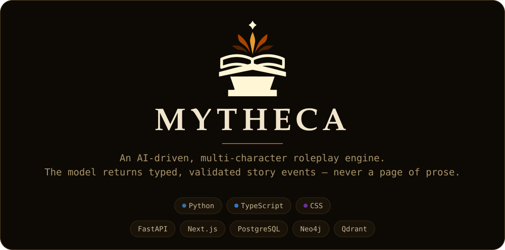
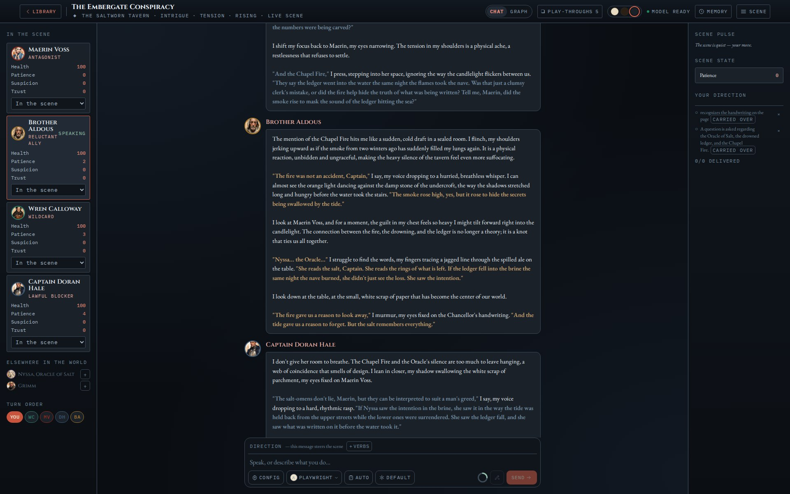
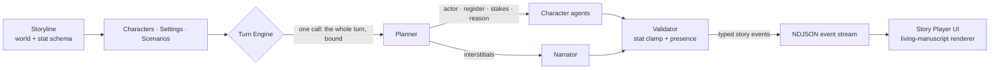
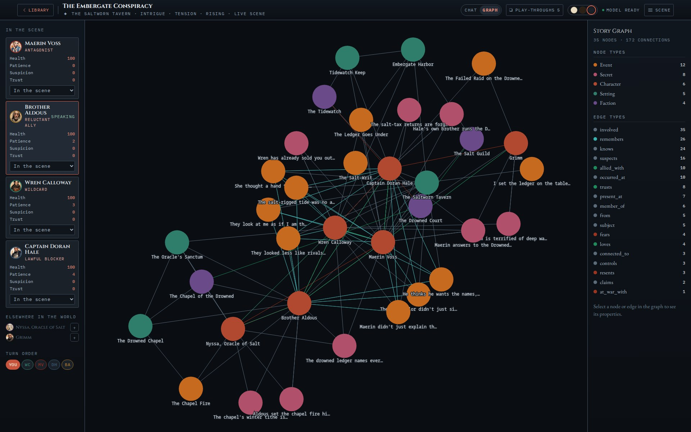
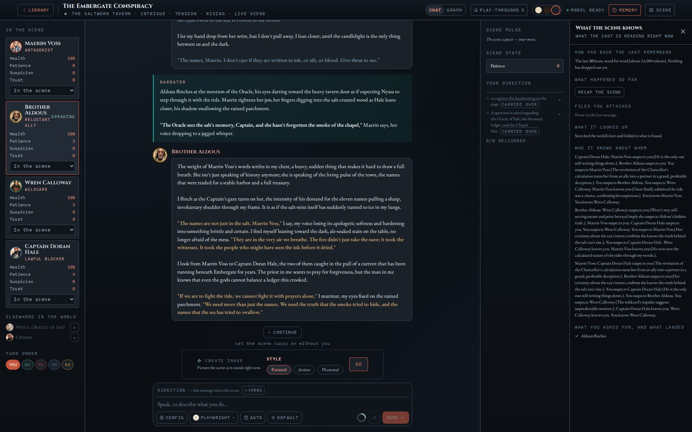
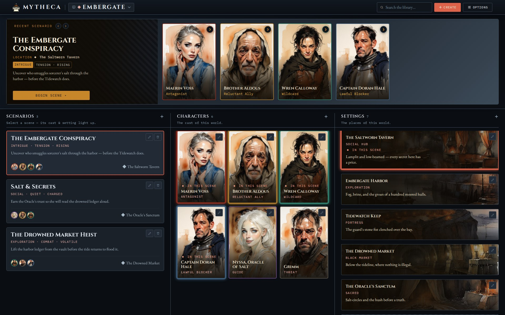

<p align="center">
  
</p>

<p align="center">
  <a href="#how-a-turn-works">Architecture</a> ·
  <a href="#the-research-record">Research record</a> ·
  <a href="#quickstart">Quickstart</a> ·
  <a href="docs/checklist.md">What is unbuilt</a>
</p>

<!-- The opening sentence below is mirrored in utils/scripts/make_header.py (TAGLINE).
     Change one and re-run the script, or the banner starts lying. -->

The obvious way to build an AI roleplay engine is one model, prompted to play every part,
handing back a block of prose. That version fails in specific ways. The voices converge
within a few turns. The model narrates consequences nothing earned — a wound it decided to
inflict, a trust it decided you had lost — and it will write a line for someone who walked
out of the room two beats ago. And a wall of prose has no seams, so there is nothing for an
interface to do with it except put it in a bubble.

**Mytheca inverts that.** The model never returns a page. It returns small **typed events** —
one character's beat, one stat change, one arrival — and a server validates each before
anything reaches the screen. A stat change is clamped to the schema its world declares. A
character who is not present cannot speak. The frontend maps each event type to a component,
so **the AI decides what happens and never how it looks**. That one constraint is the design,
and everything else is downstream of it: a turn plan that is a contract, presence rules, and a
story graph that conditions how two particular characters speak to each other.

<p align="center">
  
</p>

<p align="center"><sub>One turn of <em>The Embergate Conspiracy</em>. Each beat is its own event with its own speaker — the renderer never has to guess who is talking.</sub></p>

**Status:** active, solo, self-host only. Started June 2026; 881 commits. It runs, and I play
it. It also has no authentication and no multi-user story, no deployment target has been
chosen, and of the four LLM providers only the OpenAI-compatible one has ever been verified
against a live endpoint. [`docs/checklist.md`](docs/checklist.md) is the honest list of what
is unbuilt and undecided.

## How a turn works



Each turn is planned **once**. A single planner call lays out the whole turn — who speaks, in
what order, at what emotional register, and why — choosing only from characters actually
present. That plan is then a **contract**: the loop executes it and does not re-plan. Two
things outrank it, both deliberately: an instruction from the player that the prose has not yet
delivered, and the scene-opening narration, which is written before a plan exists.

Deliberation is spent in the planning, not in the prose. The planner thinks at a high
reasoning budget, paid once per turn; the calls that write the beats think at none, because
each arrives already knowing its actor, its register, its stakes and the planner's reason for
it. That split came from a measurement: the prose call was found spending 91% of its output
budget on hidden reasoning.

A **validator** then clamps every proposed stat change and enforces scene presence, and the
result streams to the browser as line-delimited JSON, rendered beat by beat as it generates.

**There are two turn engines**, chosen per scene. The one above is `structured`. The other,
`freetext`, drops the planner entirely and writes the turn as a single unattributed passage,
grading itself against a checklist it wrote first. Which reads better is **unmeasured** —
both ship, and the comparison is an open question in the checklist rather than a claim.

## The story graph

Characters, settings, factions, secrets and events are nodes in a Neo4j graph; how two people
stand with each other is a directed, decaying edge. A scene reads its own cast and room, then
**one hop out** — into the factions they belong to, the secrets they keep, the events they
were part of, and the places those connect to — so the picture a scene shows is the
neighbourhood it sits in rather than the five things standing in the room.

<p align="center">
  
</p>

<p align="center"><sub>One scene's neighbourhood: 35 nodes, 172 connections, 18 edge types. The legend counts what is actually there — <code>knows</code>, <code>suspects</code>, <code>member_of</code>, <code>controls</code>, <code>occurred_at</code>, <code>remembers</code> and the rest.</sub></p>

The part that reaches the model is narrower than the picture. A speaker's direct and two-hop
ties to whoever else is in the room are resolved into a plain sentence and injected into that
character's prompt, which is how the graph actually shapes dialogue. The visualization is a
separate read and feeds nothing. **Whether the authored lore layer changes a single generated
line is not established** — it is visible in the graph and in retrieval, and that is all I can
currently say for it.

## What the scene knows

Durable lore lives in a Qdrant + fastembed hybrid index behind a deliberately conservative
gate: most turns are answered from the working set, and retrieval fires only when the player
names something off the present roster or asks about world history. The cheapest search is the
one you do not run, and a bad retrieval is worse than none.

<p align="center">
  
</p>

<p align="center"><sub>Every input to a turn, shown to the player: how far back the cast remembers, what was retrieved, which ties were reached, and what the last direction actually changed.</sub></p>

Alongside it, characters keep **episodic memory** — verbatim-quoted, salience-ranked,
per-character, canonical in Postgres and mirrored to the graph. Two characters who were in the
same room remember it differently, and a rewind deletes what was learned after the cut.

## The research record

This is also a research repository. Twenty-one experiments, their figures, their protocols and
their failures live in [`docs/research/`](docs/research/) under a contract
([`AGENT_INSTRUCTIONS.md`](docs/research/AGENT_INSTRUCTIONS.md)) with one rule that does most
of the work: **a number may not be reported anywhere unless it is also written to the
experiment that produced it.**

The consequences of that rule are the interesting part:

- Runs that failed are kept and labelled `failed`, not deleted.
  [EXP-2026-08-016](docs/research/experiments/EXP-2026-08-016-continuous-scene-script/) sat
  `planned` with an empty write-up while three documents cited it; it was reconstructed from
  its surviving event log and now reads `failed`. Its actual question is still open.
- A result a later experiment overturns is marked superseded rather than quietly dropped.
  [EXP-2026-08-019](docs/research/experiments/EXP-2026-08-019-style-signature-separation/)
  re-ran an earlier baseline on the same prompts and moved it by more than the effect that
  baseline had reported, so that effect is now recorded as noise.
- Never aggregate over the surviving runs of a partially-failed experiment. Survivors are not
  a random subsample.
  [EXP-2026-08-001](docs/research/experiments/EXP-2026-08-001-planner-vs-oneshot-director/) is
  the worked example of getting this wrong and catching it.

The longest single piece of writing here is
[**Why Mytheca turns take as long as they do**](docs/research/mytheca-latency-report.pdf) —
eight pages on where a turn's seconds actually go, and what did and did not fix it.

## The library

<p align="center">
  
</p>

<p align="center"><sub>Authoring. Portraits and setting art are generated in-app through a local ComfyUI workflow, in one of three styles.</sub></p>

## Key features

- **Two turn engines, chosen per scene** — `structured` plans the whole turn in one call and
  decomposes the result into attributed beats; `freetext` writes it as one unbroken passage and
  grades itself against a checklist it wrote first. Both stream token deltas, both go through
  the same validator.
- **Play as anyone** — POV mode lets you speak *as* a cast member rather than as yourself, with
  follow-up suggestions written in that character's voice.
- **Bounded stat system** — per-storyline stat schemas with labelled bands and Markdown
  guidance. The model proposes; the server clamps.
- **Scene presence** — characters who die, collapse or walk out actually leave, and the planner
  stops calling on them.
- **Episodic memory** — verbatim-quote verification, reinforce-don't-duplicate, lineage-scoped
  recall, and a transactional delete on rewind.
- **Conversational authoring** — a scope-aware storyline agent edits your world through chat,
  gated by a write scope and a transactional diff guard.
- **Durable sessions** — every turn and its diagnostic trace persist; reopening a scene resumes
  it, and any session exports as JSON or Markdown.
- **Living-manuscript UI** — an illuminated-codex design with three themes, wax-seal avatars,
  and reduced-motion-aware animation, held to WCAG AA by a contrast gate in CI.
- **Local- or cloud-LLM** — four provider adapters (OpenAI-compatible, Anthropic, Gemini,
  Ollama), each owning the six things that differ per backend and each fail silently: request
  shape, auth, reply parsing, usage accounting, model listing, and the stream. **Only the
  OpenAI-compatible path has been verified against a live endpoint** — the other three are
  written against their reference docs and covered by contract tests, and have never made a
  real request.

## Tech stack

| Layer | Choice |
| --- | --- |
| **Frontend** | Next.js 16 (App Router) · React 19 · TypeScript · Tailwind CSS v4 · Framer Motion — `web/frontend/` |
| **Backend** | FastAPI (Python 3.13, managed by `uv`) · SQLAlchemy 2.0 · Alembic — `web/backend/`, launched from the root `app.py` |
| **Data** | PostgreSQL (core state) · Redis (live scene state) · Neo4j (Story Graph) · Qdrant (vector RAG) — the last three are best-effort and degrade to no-ops |
| **AI** | Provider-dispatched LLM layer — OpenAI-compatible · Anthropic · Gemini · Ollama — over ~25 agent call sites |
| **Streaming** | NDJSON story events, streamed directly in the turn response |
| **Tests** | 2293 backend cases (pytest) · 1565 frontend cases (Vitest, co-located) |

## Quickstart

**You need to bring a model.** Mytheca is an engine, not a model — with no LLM endpoint
configured it starts, serves the library, and cannot play a scene. Bring **an OpenAI-compatible
chat-completions endpoint**: a local llama.cpp or vLLM server, a relay in front of one, or the
OpenAI API itself. Anything that can hold a multi-thousand-token prompt and write a few hundred
tokens of prose will play; the engine reads the endpoint's own capabilities and sizes its
context and thinking budget from them rather than assuming. You point Mytheca at the endpoint
in **Options › Language Models** after first boot, not in `.env`.

**Also required:** Python 3.13 + [`uv`](https://docs.astral.sh/uv/), Node.js 22, and Docker —
`app.py` owns the Postgres/Redis/Neo4j/Qdrant containers and starts them for you. You never run
`docker compose` yourself.

```bash
git clone https://github.com/brendondgr/Mytheca.git && cd Mytheca
cp .env.example .env          # works as-is for a local run; every var is documented in it

uv run python app.py          # [default] backend + frontend together
                              #   UI  → http://localhost:3346
                              #   API → http://127.0.0.1:3345
```

First run is slow and it is not hung: `uv sync` and `npm install` resolve from scratch, Docker
pulls four images, and the first RAG call downloads ~1.3 GB of embedding models. Expect a few
minutes. Every run after that is seconds.

`app.py` brings up the data containers, runs backend preflight (schema, seed, graph lore), waits
for health, then starts the frontend; `Ctrl+C` stops both. Run a single side with
`uv run python app.py backend` or `python app.py frontend`. Equivalent direct commands:

```bash
cd web/frontend && npm install && npm run dev   # frontend only  → :3346
uv sync && uv run python app.py backend         # backend only   → :3345
uv run pytest                                   # backend tests
cd web/frontend && npm test                     # frontend tests
```

The seeded world, **Embergate**, ships with its cast, its settings, a story-graph lore layer and
an eight-document reference corpus. Re-index that corpus from the Documents page to make
retrieval live — seeding writes the rows, not the embeddings.

## Project layout

```
app.py            # root launcher — runs backend + frontend together (owns Docker data stores)
web/frontend/     # Next.js app (Library · Storyline creator · Story player · Options)
web/backend/      # FastAPI app — routes, agents, services, rag, events, models, migrations
docs/             # documentation (source of truth) + canonical skills + plans + research record
utils/            # backend tests (pytest), standalone scripts, ComfyUI workflows
images/           # Mytheca brand kit + the generated README banner
media/            # generated portraits + scene art (gitignored, served at /media)
```

Frontend tests live beside the components they test, not under `utils/`.

## Documentation

All durable documentation lives in [`docs/`](docs/) — the single source of truth. Start here:

- [docs/documentation.md](docs/documentation.md) — purpose, domain model, stack, status
- [docs/architecture.md](docs/architecture.md) — modes, boundaries, data layer, decisions
- [docs/workflow.md](docs/workflow.md) — commands, environment, ports, validation gate
- [docs/structure.md](docs/structure.md) — full repository layout
- [docs/data-flow.md](docs/data-flow.md) · [docs/api-contract.md](docs/api-contract.md) — streaming + event contract
- [docs/story-graph-neo4j.md](docs/story-graph-neo4j.md) · [docs/rag.md](docs/rag.md) — the graph and the retrieval layer
- [docs/checklist.md](docs/checklist.md) — genuinely-open work and known gaps

Contributors and coding agents should read
[docs/skills/global-project-rules/SKILL.md](docs/skills/global-project-rules/SKILL.md) first.
Canonical skills live under [docs/skills/](docs/skills/); the `.claude/`, `.agents/` and
`.cursor/` folders contain only pointers to them.

## Licence

[MIT](LICENSE). Use it, fork it, build on it.
