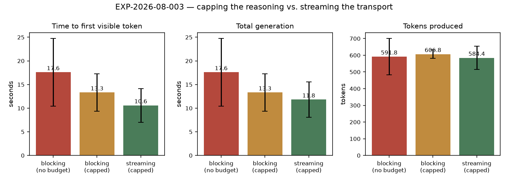

# RESULTS — EXP-2026-08-003 Live turn visibility

**Status:** complete · n = 5 per arm, no runs excluded · 2026-08-19
**Model:** relay `local` — llama.cpp `b9692` · `gemma-4-26B-it`, temperature 0.7
**Every number below is read from [`data/metrics.json`](data/metrics.json).**

> **Scope.** This is a latency measurement on one upstream model. It says nothing about
> output quality, and — because the central finding is about the *shape* of a model's
> think-then-answer split — it does not transfer to a model with a different shape.

## Headline

**Two of the three hypotheses are not supported.** The change that actually makes a turn
feel alive is not the one the plan was built around.

| Arm | first answer token (s) | first reasoning token (s) | total generation (s) | completion tokens |
| --- | --- | --- | --- | --- |
| `blocking-uncapped` | 17.59 ± 7.14 (n=5) | — | 17.59 ± 7.14 (n=5) | 592 ± 108 (n=5) |
| `blocking-capped` | 13.32 ± 3.97 (n=5) | — | 13.32 ± 3.97 (n=5) | 607 ± 25 (n=5) |
| `streaming-capped` | 10.59 ± 3.56 (n=5) | 0.55 ± 0.24 (n=5) | 11.82 ± 3.73 (n=5) | 584 ± 70 (n=5) |

## H1 — "capping the reasoning reduces completion tokens": **not supported**

Completion tokens are flat across arms: 592 ± 108 uncapped, 607 ± 25 capped. The capped
arm is nominally *higher*, and the intervals overlap heavily. A 512-token thinking budget
does not measurably shorten what this upstream produces.

The one real difference is **dispersion**: the uncapped arm's spread (± 108) is four times
the capped arm's (± 25). That is consistent with a budget that bounds the worst case
without moving the median — the failure mode the change was actually made to prevent (a
generation running to the 300 s timeout) is a tail event, and a five-run sample is not
where a tail shows up. This is a plausible reading, not a demonstrated one; it would need a
long run counting timeouts to establish, and that experiment has not been done.

**What this does not overturn:** the detection bug was real and is fixed. Before it, the
budget was not reaching the endpoint at all. This experiment shows the budget arriving does
not shorten a typical generation — not that sending it was pointless.

## H2 — "streaming collapses time-to-first-token": **not supported as stated**

In the streaming arm the first **answer** token arrives at 10.59 s against a total of
11.82 s — about 90 % of the way through the generation. Streaming does not meaningfully
bring the prose forward, because the model spends nearly the whole call thinking before it
writes anything.

But the first **reasoning** token arrives at **0.55 s** — roughly **20× earlier than the
first word of prose**, in the same call.

This is the finding. It is also the one comparison in this experiment that is *clean*: it
is within a single call in a single run, so it cannot be an artefact of arm ordering or
machine load (see Threats). What streaming buys is not earlier prose. It is access to the
reasoning channel during the ~10 s the model is thinking — a window that is otherwise
completely empty.

**Consequence for the product, stated plainly:** the live reasoning channel is the change
that fills the wait, and it is **off by default** (`reasoningVisibility: "summary"`). A
default-configured player still sees no prose for ~10 s; all they get is the status strip's
phase labels, which do fire within ~1 s. Recorded in `docs/checklist.md` as an open
decision rather than silently patched, because moving the default trades spoiler risk
against perceived latency and that is a judgement call, not a bug fix.

## H3 — "streaming does not cost total wall clock": **supported, weakly**

11.82 s streaming vs 13.32 s blocking-capped — no penalty, and nominally faster. Given the
ordering confound below, the honest claim is only *"no evidence of a throughput cost"*.

## Threats to validity

1. **Arm order is fixed and confounded with the results.** Every run executes
   `blocking-uncapped → blocking-capped → streaming-capped`, so anything that warms up
   across a run — prompt-prefix cache on the llama.cpp side, page cache, thermal state —
   systematically favours the later arms. The wall-clock ordering
   (17.59 → 13.32 → 11.82) matches arm order exactly, which is precisely what a warming
   effect would look like. **The cross-arm wall-clock and token comparisons should be
   treated as unreliable.** The H2 finding does not depend on them.
   *Fix for a rerun:* randomise or counterbalance arm order within each run.
2. **n = 5, one prompt, one model.** No claim about other prompts, other models, or the
   deployed `skynet` routing (see ISSUES.md).
3. **No statistical test.** With n = 5 and this dispersion, none is worth running; the
   intervals are reported and the reader can see the overlap.
4. **The usage probe is a second call.** `completion_tokens` comes from a repeat request,
   not the timed one, so token counts and timings describe different (identically
   parameterised) generations.

## What changed as a result

- The plan's framing — that streaming is the headline fix — is wrong for this model, and
  `docs/plans/live-turn-visibility.md` and the checklist now say so.
- Claim **C-008** is entered in `CLAIMS.md` as `partial`, supported only for the
  within-call reasoning-vs-answer gap.
- The ordering confound is a design defect in this runner, recorded here rather than
  quietly fixed, so a rerun starts from an honest baseline.
