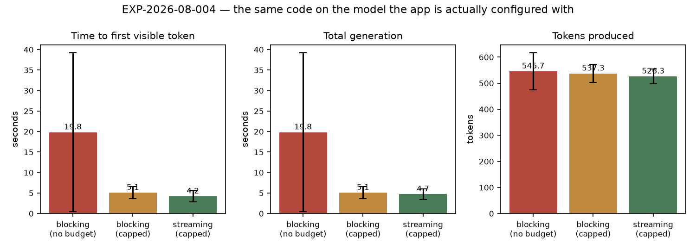

# RESULTS — EXP-2026-08-004 What the deployed model actually gives the player

**Status:** complete · n = 3 per arm, no runs excluded · 2026-08-19
**Model:** relay `skynet` (routes dynamically; observed upstream `qwen38-27B-awq`)
**Every number below is read from [`data/metrics.json`](data/metrics.json).**

## Headline

**The hypothesis is supported, and it materially narrows what EXP-2026-08-003 implies for
this deployment.** On the model the app is actually configured with, the live reasoning
channel produces *nothing at all*, and streaming advances the first visible word by about
half a second.

| Arm | first answer token (s) | first reasoning token (s) | total generation (s) | completion tokens |
| --- | --- | --- | --- | --- |
| `blocking-uncapped` | 19.84 ± 19.35 (n=3) | — | 19.84 ± 19.35 (n=3) | 546 ± 71 (n=3) |
| `blocking-capped` | 5.10 ± 1.43 (n=3) | — | 5.10 ± 1.43 (n=3) | 537 ± 35 (n=3) |
| `streaming-capped` | 4.21 ± 1.34 (n=3) | — | 4.72 ± 1.33 (n=3) | 526 ± 29 (n=3) |



## `first_reasoning_s` is null in every run

`skynet` returned no `reasoning_content` field and no inline `<think>` block on any call.
The reasoning channel is therefore **empty on this model** — setting Reasoning visibility
to `full` shows the player nothing, correctly and silently (the frame is simply never
emitted; no disclosure renders).

This is a model capability, not a defect in the feature. It does mean the headline finding
of EXP-2026-08-003 — reasoning visible ~20× earlier than prose — **does not transfer to
this deployment**. It transfers to the relay's `local` route, which does expose the channel.

## The first visible word still arrives at 89 % of the way through

`streaming-capped` reaches its first answer token at 4.21 s against a 4.72 s total. Streaming
buys roughly half a second here. Same qualitative result as EXP-2026-08-003 (90 %), reached
for a different reason: there, the model spent the time thinking; here, the content simply
does not begin arriving until near the end.

What *is* different is the scale — this model finishes in ~5 s rather than ~12 s, so the
wait being covered is much shorter to begin with.

## What is NOT claimed

`blocking-uncapped` shows 19.84 ± 19.35 s, dominated by a single 47.2 s first run against
6.17 s and 6.14 s. That spread is consistent with a cold route or a queued upstream, and it
is exactly the tail a thinking budget is meant to bound — but **n = 3 with one outlier
cannot establish that**, and it is not claimed here. Per-run rows are in
`data/metrics.json`; the aggregate is reported only because no run failed.

## Consequence for the product

On this deployment the visible-progress work reduces to: the status-strip phases (measured
live at 0.75 s for *Reading your message*, 3.75 s for *Deciding who speaks next*), the
pending beat that holds the speaker's place, and the direction checklist. Those are all
trace-driven and model-independent, so they work regardless of which model is routed.

The streamed-content and reasoning-channel work is **latent capability** for this user
until they point the app at a model that exposes a reasoning channel. Recorded in
`docs/checklist.md` rather than presented as a delivered win.


---

## AMENDMENTS

### 2026-08-19 — The headline finding was an instrument artefact, not a model property

**What this experiment concluded:** that the deployed `skynet` route "returns no
`reasoning_content` field and no inline `<think>` block", so "the reasoning channel is
therefore **empty on this model**".

**That is wrong.** The model does expose a reasoning channel; the measuring instrument was
not reading it. vLLM streams deliberation as `delta.reasoning` (and returns
`message.reasoning`), while llama.cpp uses `delta.reasoning_content`. The streaming parser
in `services/llm.py` read only the `reasoning_content` spelling, so every reasoning token
this endpoint produced was discarded before it could be counted — which is exactly what
`first_reasoning_s: null` in 3/3 runs would look like either way.

Confirmed directly on 2026-08-19:

```
delta: {"reasoning": "We"}            # skynet / qwen38-27B-awq, streaming
message.reasoning: "The user wants…"  # skynet / qwen38-27B-awq, blocking
```

**Consequences.**

* The `first_reasoning_s: null` result is **withdrawn**. It measured the parser, not the
  model. The other measurements in this experiment — `ttft_s`, `wall_clock_s`,
  `completion_tokens` — are unaffected, since they never depended on the reasoning field.
* The product conclusion drawn from it — that the live reasoning channel is "latent
  capability" on this deployment — is **withdrawn** with it.
* The same bug also explains a failure this experiment did not investigate: a completion
  that spends its whole budget thinking arrived as `content=""` with no reasoning the app
  could see, and was reported to the player as "The model returned an empty response".
  That accounted for 3 of 10 turns in EXP-2026-08-005.

**Not amended in place.** The sections above are left exactly as written. A completed
experiment whose conclusion is quietly edited to match later knowledge stops being a
record of what was believed when. The fix is committed
(`llm._reasoning_field` reads both spellings, with tests for each) and a re-measurement
belongs in a new experiment, not in this one.
