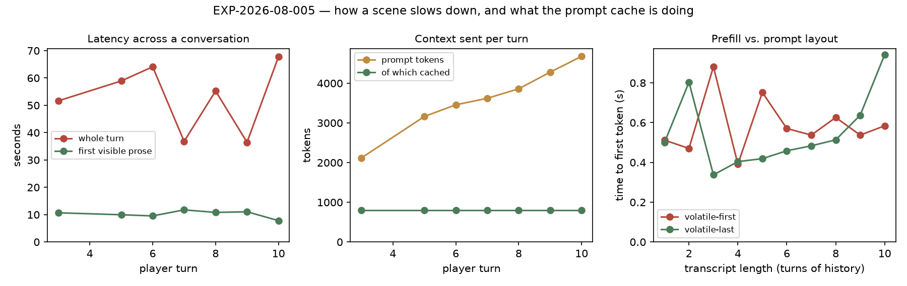

# RESULTS — EXP-2026-08-005 Conversation-scaling latency and prompt-cache reuse

**Status:** complete · 10 turns, 3 of which terminated early (kept and marked) · 2026-08-19
**Endpoint:** the remote GPU behind the relay — `skynet` (observed upstream `qwen38-27B-awq`)
**Config:** `maxTurns = 5` · `suggestionsCount = 0` · `contextBeats = 100`
**Every number below is read from [`logs/`](logs/) and [`data/metrics.json`](data/metrics.json).**

> No aggregate is computed over turns. The question is how the numbers *change* as a scene
> lengthens, and a mean over a growing series hides exactly that. Every turn is listed.

## Headline

Three findings, in order of how much they matter for the reported symptom.

1. **The prompt cache is being thrown away, exactly as predicted.** Cached tokens sat at
   **800 on every single turn** while the prompt grew from 1830 to 4678 — the hit rate
   falling 44 % → 17 % monotonically. 800 is the system message. Nothing else is ever
   reused.
2. **But that is not what makes turns slow — not yet.** Time to first visible prose was
   **flat at ~10 s across all ten turns**, despite the context more than doubling. The cost
   is the *number of sequential LLM calls per turn*, not the size of any one prompt.
3. **A bug in the app was terminating 3 turns in 10.** Found by instrumentation added
   during this run; see *The bug this experiment found*.



## Per turn

| turn | first visible (s) | whole turn (s) | beats | prompt tokens | cached | hit | ended early |
| --- | --- | --- | --- | --- | --- | --- | --- |
| 1 | 6.69 | 24.6 | 2 | — | — | — | ✗ error |
| 2 | 11.69 | 55.5 | 4 | 1830 | 800 | 44 % | ✗ error |
| 3 | 10.68 | 51.6 | 5 | 2119 | 800 | 38 % | |
| 4 | 10.77 | 30.8 | 2 | 2786 | 800 | 29 % | ✗ error |
| 5 | 9.96 | 58.9 | 4 | 3161 | 800 | 25 % | |
| 6 | 9.54 | 64.1 | 5 | 3456 | 800 | 23 % | |
| 7 | 11.75 | 36.8 | 2 | 3620 | 800 | 22 % | |
| 8 | 10.81 | 55.2 | 5 | 3859 | 800 | 21 % | |
| 9 | 11.05 | 36.5 | 2 | 4278 | 800 | 19 % | |
| 10 | 7.81 | 67.8 | 2 | 4678 | 800 | 17 % | |

The `cached` column is the finding. It is not approximately constant — it is *exactly*
800 every time, which is what "only the static system message is ever reused" looks like.

## Where a turn's time actually goes

Summed across the ten turns, by the gap between consecutive milestones:

| step | total (s) | share | calls | mean per call |
| --- | --- | --- | --- | --- |
| `plan` — the per-beat planner | 151.2 | **41 %** | 31 | 4.9 s |
| first character dialogue | 55.5 | 15 % | 7 | — |
| `reflection` — end of turn | 47.1 | 13 % | 7 | 6.7 s |
| `consistency` — the continuity guard | 39.8 | 11 % | 4 | 10.0 s |
| `planning` (pre-call marker) | 26.0 | 7 % | 29 | — |
| `intent` — reading the player's line | 25.4 | 7 % | 7 | 3.6 s |
| everything else (`assemble`, `lore`, `reading`, `speaker`, `context`, `commit`, `direction`) | < 5 | ~1 % | — | — |

Two things stand out.

**The beat planner is the single largest cost in the app.** It runs once per beat — three
to six times per turn at ~4 s each — and consumes 41 % of all turn time. Nothing else is
close.

**The pre-generation calls are what the player waits through.** `intent` (3.6 s) and the
first `plan` (~4 s) both sit on the critical path before a single word can be written,
which is most of the ~10 s to first prose. Neither carries the transcript, and both were
flat across all ten turns — consistent with their prompts not growing.

## Does a longer scene cost more? Not measurably, at this length

Mean planner-call duration by turn: 2.5, 4.1, 4.0, 3.8, 3.8, 3.0, 4.1, 4.0, 4.5, 14.6 s.
Flat from turn 2 to turn 9 while the prompt grew 1830 → 4278 tokens. The turn-10 value is a
single outlier and no conclusion is drawn from it.

So the wasted cache is real but **latent**: at ~4.7 k tokens, re-reading ~3.9 k uncached
tokens is small next to the decode time of six sequential calls. It becomes the dominant
cost only at much longer scenes — which is precisely when `contextBeats = 100` is doing its
job. H1 (per-turn total grows with conversation length) is **not supported** at this length;
H3 (the cache is largely wasted) **is**.

## The bug this experiment found

Three turns died with `The model returned an empty response.` The diagnostic logging added
during this run identified the cause immediately:

```
Empty completion from …/v1 model=skynet: 0 delta(s), 0 raw answer char(s),
0 reasoning char(s), finish_reason='length', raw=''
```

The model had spent its entire budget reasoning, and the app could not see it: **vLLM
streams deliberation as `delta.reasoning`, llama.cpp as `delta.reasoning_content`, and the
parser read only the second spelling.** Every reasoning token this endpoint produced was
discarded unread.

This also invalidates a conclusion of an earlier experiment —
[EXP-2026-08-004](../EXP-2026-08-004-deployed-model-visibility/RESULTS.md) reported that the
deployed model "exposes no reasoning channel", which was measuring the parser rather than
the model. That experiment is amended, not rewritten.

Fixed in `llm._reasoning_field`, which reads both spellings, with tests for each. Note this
fixes the *diagnosis*: a model that spends its whole budget thinking still produces no
prose, and whether the thinking budget is honoured by this vLLM build is a separate
question.

## Prompt layout vs. prefill — no measurable difference at these sizes

Ten history lengths × two layouts × two counterbalanced passes, against the fixed parser
(so the timed first token is the first *reasoning* token, which follows prefill directly).

| history (turns) | prompt tokens | `volatile-first` TTFT (s) | `volatile-last` TTFT (s) |
| --- | --- | --- | --- |
| 1 | 566 | 0.51 | 0.50 |
| 3 | 781 | 0.88 | 0.34 |
| 5 | 1000 | 0.75 | 0.42 |
| 7 | 1220 | 0.54 | 0.48 |
| 10 | 1549 | 0.58 | 0.94 |

Means across all ten lengths: **0.59 s vs 0.55 s**. There is no effect here — the two
series interleave, and neither grows meaningfully with prompt size. **H3's prediction that
reordering would improve prefill is not supported at 0.5–1.5 k tokens.**

That is consistent with the conversation run rather than in tension with it: prefill of a
one-to-two-thousand-token prompt on this GPU costs a few hundred milliseconds, so the
several hundred tokens the reordering would additionally cache are worth far less than the
measurement noise. **The cache is genuinely being wasted (measured directly, below), but at
these context sizes the waste is not worth reclaiming.** Whether it becomes worth it at
20 k+ tokens is untested; the probe tops out at 1549.

## The thinking budget is load-bearing on this endpoint

Five runs per condition at temperature 0, on a prompt that invites deliberation. Every run
in a condition returned **identical** figures, so the effect is not subtle:

| budget keys sent | reasoning chars | answer chars | completion tokens | finish reason |
| --- | --- | --- | --- | --- |
| none | 3075 | **0** | 800 | **length** |
| `thinking_token_budget` (vLLM) | 532 | 42 | 143 | stop |
| `thinking_budget_tokens` (llama.cpp) | 3075 | **0** | 800 | **length** |
| both | 532 | 42 | 143 | stop |

**Without the vLLM key this prompt never produces an answer** — 5/5 runs thought for 3075
characters, emitted nothing, and died at the token limit. That is the turn failure,
reproduced deterministically. With the key, reasoning drops 5.8× and the model answers in
143 tokens instead of exhausting 800.

The llama.cpp key alone does nothing here, and sending both is indistinguishable from
sending the vLLM key alone — so the relay-detection change from EXP-2026-08-003 (classify
an unpinnable endpoint as `RELAY` and send **both** keys rather than none) is validated:
on this endpoint it is the difference between a scene that works and one that fails.

This also bounds a claim EXP-2026-08-003 could not settle. There, capping the reasoning did
not reduce completion tokens on the `local` route (592 ± 108 → 607 ± 25). Here it reduces
them 800 → 143. The cap's value is endpoint-specific, and on the deployed GPU it is the
difference between an answer and no answer at all.

## Threats to validity

1. **`skynet` reports no cache counter.** `usage.prompt_tokens_details` is `null` on the
   vLLM route, so the layout comparison rests on latency, not counters. Some conversation
   rows *did* carry a counter — evidence the `auto` routing moved mid-run.
2. **The routed upstream can change between calls**, so rows are not guaranteed to describe
   one model.
3. **Three turns ended early**, so their beat counts and totals describe truncated turns.
   They are marked in the table and excluded from the step-cost sums where they contributed
   no step.
4. **One prompt, one conversation, one run.** No repetition, so single-turn outliers (turn
   10's planner) cannot be separated from noise.
5. **`beats` varies 2–5 per turn** for reasons the planner decides, so `total_s` is not
   comparable turn to turn without normalising — which is why the step table, not the
   totals, carries the argument.
