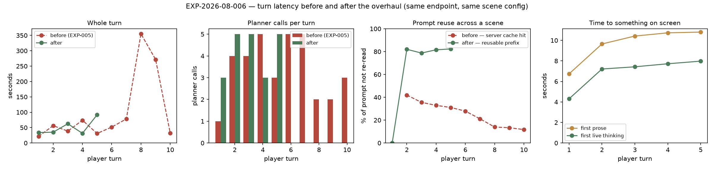

# RESULTS — EXP-2026-08-006 Turn latency overhaul

**Status:** complete · 2026-08-20
**Endpoint:** the relay at `localhost:4000`, model `skynet` (upstream `qwen38-27B-awq`)
**Config:** `maxTurns = 5` · `suggestionsCount = 0` · `contextBeats = 100`
**Baseline:** [EXP-2026-08-005](../EXP-2026-08-005-conversation-scaling/), same endpoint, same config.
**Every number is read from [`logs/`](logs/) by [`tables/make_tables.py`](tables/make_tables.py) and [`figures/make_figures.py`](figures/make_figures.py).**

---

## A correction that comes first

The first conversation run here was measured against a **degraded endpoint** — the intended
GPU was not actually connected, which the operator identified. On that run a control probe
showed the endpoint taking **1.4 s to 90.4 s to produce byte-identical 143-token output**,
and this document originally concluded from that the endpoint's throughput was intrinsically
unstable and that latency work on the app was unmeasurable.

**That conclusion was wrong, and it is withdrawn.** Repeating the identical probe once the
right GPU was connected:

| endpoint state | runs | elapsed for identical 143-token output |
| --- | --- | --- |
| **degraded** ([`logs/decode-pass1-uncontrolled.log`](logs/decode-pass1-uncontrolled.log)) | 6 | 1.37 – 90.38 s (mean 22.94 ± 31.61) |
| **healthy** ([`logs/decode-pass2-idle.log`](logs/decode-pass2-idle.log)) | 12 | **1.37 – 4.22 s (mean 1.67 ± 0.78)** |

The endpoint is stable when it is the machine it is supposed to be. The degraded-run log is
kept ([`logs/conversation-degraded-gpu.log`](logs/conversation-degraded-gpu.log)) but its
timings describe the wrong hardware and are not used for any conclusion below. Its
**counter-based** results — prompt reuse, cache hits, planner call counts — are unaffected,
because a count does not care how slow the host is.

## Headline

1. **The character was deliberating twice per beat, and that was the single largest cost in
   a turn.** It wrote a visible in-voice `<thinking>` block *and* filled a hidden reasoning
   channel first. Removing the hidden pass took the thinking step from **35.5 s to ~2 s per
   beat**, and the median turn from **137.5 s to ~35 s**.
2. **The prompt cache is reclaimed.** Steady-state **81 %** of each character prompt is a
   byte-identical prefix of the previous one, and the server actually serves **56–65 %** of
   the prompt from cache, rising to 76 %. The baseline was pinned at exactly 800 tokens —
   44 % decaying to 17 %, never reusing a single token of the conversation.
3. **The continuity guard's cost is gone** (72.3 s over 6 calls in the baseline), and every
   beat now streams as it is written.
4. **The planner is now the dominant cost** — 56 % of turn time at ~6.5 s per call. Fixing
   the character beat promoted it to first place; it has not been addressed.

## The two-deliberations finding

`character_turn_agent` ran at `ReasoningEffort.MEDIUM`, so the model spent a hidden thinking
budget working the beat out, and then wrote the visible `<thinking>` paragraph the player
actually reads. The same beat, reasoned through twice, with the player waiting for both and
only ever seeing the second.

Measured directly against the endpoint, three runs per arm on one character-shaped prompt:

| arm | reasoning emitted | completion tokens | elapsed |
| --- | --- | --- | --- |
| budget 512 (the old `MEDIUM`) | 826 – 2084 chars | 212 – 568 | 2.19 – 5.82 s |
| **budget 0 (the new `NONE`)** | **0 chars** | 67 – 76 | **0.92 – 1.04 s** |
| budget 0 + `enable_thinking:false` | 0 chars | 15 – 63 | 0.30 – 0.90 s |

The budget key alone does the whole job. The third arm was **tried and rejected**: it
suppressed nothing extra and made the model measurably terser, which is a behavioural change
with nothing to buy it.

### Effect on a real scene

Step costs from the persisted trace, per call:

| step | before (healthy GPU, two deliberations) | after (one deliberation) |
| --- | --- | --- |
| **character thinking** | **35.5 s** | **2.4 s** |
| character dialogue | 9.8 s | 0.7 s |
| beat planner | 11.7 s | 6.5 s |
| end-of-turn reflection | 14.9 s | 5.1 s |
| reading the player's line | 5.5 s | 3.7 s |

| | before | after |
| --- | --- | --- |
| median whole turn | 137.5 s | **35.1 s** |
| first prose | 6.1 – 101.4 s | **6.7 – 10.8 s** |

Every step got faster, not only the one that was changed. The most likely reason is that the
multi-thousand-token hidden reasoning passes were saturating the GPU, so the planner and
intent calls queued behind them. That is an inference from the pattern, not something this
experiment isolated.

The consistency matters as much as the median: time to first prose moved from a 6–101 s
spread to a 6.7–10.8 s band.

## Prompt cache

| | 5-turn run | 10-turn run |
| --- | --- | --- |
| reusable prefix (local, steady-state) | 81 % | 81 %, rising to **90 %** by turn 8 |
| server-reported cached | 56 % | 65 %, peaking at 76 % |

Turn 1 is 0 % by construction — the first character call of a session has no predecessor.

Two things worth separating. The **reusable prefix** is what the prompt layout achieves and
is computed locally, so no endpoint can hide it. The **server-reported** figure is what vLLM
actually served from its KV cache. The ~16-point gap between them is real: vLLM caches in
fixed-size blocks, so a partial block at the boundary is lost, and entries are evicted under
load. Closing that gap is a server-tuning question, not a prompt-ordering one, and it has
not been investigated.

Against the baseline, the shape is the finding: reuse **rises** as a scene lengthens where
it used to fall, because the transcript is now inside the reusable region and the
block-anchored window stops its first line from moving.

## Multi-beat planning: the mechanism works, the configuration does not use it

The model honours the contract — **6/6** calls asking for three beats returned a well-formed
three-entry array ([`logs/plan.log`](logs/plan.log)); that metric is a count, so nothing about
endpoint speed can distort it. But the median turn is **2 beats**, and each turn needs a final
planner call to say `end`, so lookahead has almost nothing to save. Planner calls: 21 for 16
beats in the final run.

**H1 is not supported**, for a reason that is about the scene configuration rather than the
mechanism. It should pay progressively more as `maxTurns` rises. `TURN_PLANNER_LOOKAHEAD=1`
restores the original per-beat loop exactly.

**Unfinished:** whether asking for three beats makes each call *more* expensive than it saves
is not settled. An interleaved 1-vs-3 A/B is implemented (`--mode plan`) but was not run to
completion. Given the planner is now 56 % of turn time, this is the obvious next measurement.

## Writing quality

Read from the persisted events of the final run, counted rather than eyeballed.

**Thought length — fixed, on the second attempt.** Asking for "one or two sentences" changed
nothing measurable (216–797 chars, median 460). Replacing it with a *countable* limit — "at
most 2 sentences and at most 40 words" — produced 155–328 chars, median **214**. Worth
recording: the descriptive instruction failed and the countable one worked, and the latency
win came entirely from removing the hidden channel, not from either.

**Two defects remain**, both small and both now recorded in `docs/checklist.md`:

* **1 of 11** dialogue beats leaked a speaker prefix into the spoken text (`Mei: Rain again.`).
* **2 of 10** thoughts break the fourth wall by referring to *"the player"* ("The player's
  question hangs in the damp air"). The character prompt renders the player's beats as
  `Player:` in the transcript, which invites exactly this. Pre-existing, not introduced here.

Voices remained distinct across the run and beats followed from the transcript. That part is
a **read, not a measurement** — n = 1 scene, unblinded, by the author of the change.

## Hypotheses, judged

| | Prediction | Verdict |
| --- | --- | --- |
| H1 | Planner share < 25 %, calls down ~3× | **not supported** — mechanism complies 6/6, but the scene has too few beats to exploit it; the planner is now 56 % of turn time |
| H2 | The guard's 11 % is gone | **supported** — the step no longer exists |
| H3 | Reuse > 60 % from turn 3, not decaying | **supported** — 81 % steady-state local, 56–65 % served, rising with scene length |
| H4 | No turn near 300 s | **supported** on the healthy endpoint — worst turn 91.6 s |
| H5 | Live thinking lands well ahead of prose | **supported** — but see below |
| — | Wall-clock improvement | **supported, unplanned**: median turn 137.5 s → 35.1 s, from a cause the plan never identified |

H5 needs a caveat that changes what the feature is: with hidden reasoning off, character
beats emit no reasoning channel at all. What the player now sees first is the character's own
`internal_thought`, which delta-streams regardless of the visibility setting. That is a better
version of the feature — in-voice rather than raw deliberation — but the `full` visibility
default now affects only narrator beats.

## Threats to validity

1. **The before/after is across code versions and, for the first run, across hardware.** The
   degraded-GPU run is excluded from timing conclusions; the healthy before/after is one run
   per arm, un-interleaved.
2. **The healthy "before" 10-turn run was interrupted** at turn 9 and its log never written.
   Its step costs survive only in the persisted `turn_traces` and in ISSUES.md.
3. **One prompt, one conversation, one run per arm.** No repetition; a single-turn outlier
   cannot be separated from noise.
4. **`beats` varies 1–5 per turn**, so `total_s` is not comparable turn to turn.
5. **The quality read is unblinded, n = 1, by the author**, though the two defect counts are
   mechanical.
6. **The baseline log and the baseline write-up describe different runs** — see ISSUES.md 4.
