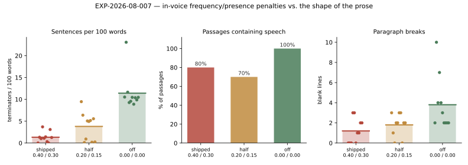

# RESULTS — EXP-2026-08-007 Prose form

**Status:** complete · n = 10 per arm, 30 calls, no failures · `skynet` (upstream
`qwen38-27B-awq`) via the local relay · 2026-08-21

## The finding

The in-voice `frequency_penalty` / `presence_penalty` are what break the prose. They fall
on every token, and the tokens prose is made of are its most repeated ones — the full stop,
the comma, the double quote, `I`, `the`. Penalising them penalises sentences.

| Metric | `shipped` 0.40 / 0.30 | `half` 0.20 / 0.15 | `off` 0.00 / 0.00 |
| --- | --- | --- | --- |
| **sentences per 100 words** (primary) | **1.32 ± 1.16** | 3.80 ± 3.07 | **11.42 ± 3.96** |
| passages containing speech | 80 % | 70 % | **100 %** |
| paragraph breaks | 1.20 ± 1.17 | 1.80 ± 1.08 | **3.80 ± 2.56** |
| characters per passage | 2183 ± 1771 | 1919 ± 1883 | **674 ± 471** |
| flagged as scratchpad | 0 % | 0 % | 0 % |

**The arms do not overlap on the primary metric.** Every run, sorted:

```
shipped   0.0  0.0  0.3  1.0  1.1  1.3  1.3  1.4  3.1  3.7
half      0.1  0.2  0.2  0.9  4.9  5.1  5.2  5.6  6.4  9.5
off       8.9  9.3  9.6  9.9 10.4 10.5 10.5 10.5 11.7 23.1
```

The worst run with the penalties off (8.9) is more than twice the best run with them on
(3.7). `half` is bimodal — four runs below 1.0 and six above 4.9 — which is the shape of a
setting that sometimes tips the model over and sometimes does not.



## What it looks like

Same prompt, same contract, same temperature, same `top_p`, same budgets. Only
`frequency_penalty` and `presence_penalty` differ.

**`shipped` (0.40 / 0.30)** — 1,883 characters, zero sentence terminators, no speech:

> The ledger lies open in front of me, ink still smelling faintly of salt and rain, and I
> keep my eyes on it while your question waits there like a gull that has not decided
> whether it will land or simply hover out of reach until somebody else makes a decision
> for it because that is what gulls do best they make everyone else feel responsible for
> deciding things they themselves have been pretending all along they had already made up
> their minds about anyway so yes I told them though only enough truth wrapped around with
> just enough uncertainty left hanging at both ends deliberately because certainty is
> expensive once you hand it over completely you never get most of it back whole again …

**`off` (0.00 / 0.00)** — 468 characters, ten terminators, three paragraphs, quoted speech:

> The salt is a small thing until it is not. I keep my eyes on the ledger, though the
> figures have gone soft. Mei's question waits just beyond the ink, and I let it wait.
>
> "I told them there was salt," I say. My pen touches the page, a thin line where a number
> should be. "I did not tell them how much. A man can be honest and still leave room."
>
> I close the ledger. The room is quieter now. "If the harbour watch has more than that,
> then someone else has been talking."

## Secondary finding: length was never the problem

A 1200-token ceiling had been imposed on the passage before this run, over the owner's
twice-stated instruction that a character may speak for as long as they want. The
justification was that uncapped beats had been measured at 8,228 and then 10,184 characters
of drift, and that prompt guidance would not bind them — a countable "usually 80–200 words"
target moved the average *up*.

That diagnosis had the wrong cause. With the penalties off, a passage averages **674 ± 471
characters** and its longest run in thirty was **1,923** — nowhere near any ceiling, with no
instruction about length in play at all. The rambling was the sampler; the freedom was
never the problem. The ceiling has been removed, and what makes an unbounded passage safe
is not a length limit but `emission.looks_degenerate` and `emission.repeats_itself`.

## What this does not say

- **One model.** Everything here is `skynet`. Nothing transfers without re-running.
- **Nothing about drift.** The penalties were added to fight in-character drift
  (turn-loop plan §7), and this experiment does not measure drift at all. Removing them may
  bring some back. The trade is taken deliberately — a repetitive but well-formed paragraph
  is readable, a punctuation-free 180-word sentence is not — and it is recorded here rather
  than made quietly.
- **Nothing about whether the writing is *good*.** These are four countable shadows of
  "reads like a scene". The passages above are one author's unblinded read.
- **No significance test.** n = 10 per arm; read the spread, not just the mean. The
  non-overlap on the primary metric is the reason no test was run — there is nothing
  marginal to adjudicate.
- **`half` is not a safe middle.** It is bimodal, not intermediate.

## Amendments

None.
