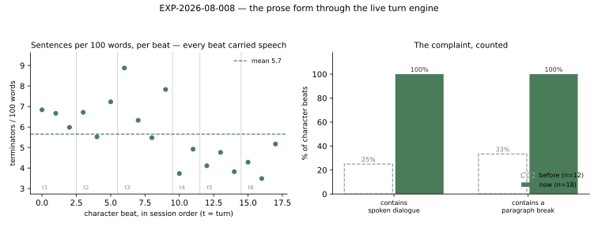

# RESULTS — EXP-2026-08-008 Prose end to end

**Status:** complete · 6 turns, 28 beats (18 character + 10 narration), no failed turns ·
relay alias `skynet` → upstream **`gemma4-26B-mtp`** · 2026-08-21

## 1. Headline

Through the real turn engine, **18 of 18 character beats carried spoken dialogue and 18 of
18 carried a paragraph break**, with no duplicates, no discards and no beat the guards had
to throw away — against a pre-change baseline of 3/12 and 4/12. The hypothesis survives on
the form and **fails on two of its five predictions**: `sentences_per_100_words` landed at
5.65 ± 1.48, well below the 11.42 ± 3.96 it was predicted to match, and the run exposed a
defect none of the metrics were looking for — **13 of 18 character beats and 6 of 10
narration beats call the person in the room "the player"**.

## 2. Results table

**Generated, not typed** — `data/metrics.json` (`aggregate`), written by the runner, and
`data/leak.json`, written by `analyze_leak.py` from `logs/transcript.json`.

| Metric | Result (n = 18 character beats) | Predicted | Verdict |
| --- | --- | --- | --- |
| beats containing spoken dialogue | **18 / 18 (100 %)** | all | ✅ |
| beats containing a paragraph break | **18 / 18 (100 %)** | all | ✅ |
| distinct beats (no duplicate in session) | **18 / 18** | all | ✅ |
| beats discarded by a guard | **0** | single figures | ✅ |
| `sentences_per_100_words` | **5.65 ± 1.48** | 11.42 ± 3.96 | ❌ below range |
| `is_scratchpad` | 0.00 ± 0.00 | — | ✅ |
| `starts_mid_sentence` | 0.00 ± 0.00 | — | ✅ |
| `paragraph_breaks` | 2.28 ± 0.45 | — | — |
| `chars` | 780 ± 140 (599–1148) | — | — |
| **beats naming "the player"** | **13 / 18 (72 %)** | not predicted | ❌ new defect |

Narration, scored separately (it is third person and forbidden dialogue, so the speech
metric does not apply): 10 beats, **6 of them (60 %) naming "the player"**.

Baseline for the first two rows is the twelve most recent `character_prose` events before
this work, from `docs/plans/prose-that-reads-like-a-scene.md` § 1 — a different model and
session, so a *before* picture rather than a controlled arm.

## 3. Figures


*Fig 1 — Left: every character beat in session order, with turn boundaries. Right: the
owner's complaint as a share, against the pre-change baseline. Generated by
`figures/make_figures.py` from `data/metrics.json`.*

## 4. Interpretation

**The form is fixed.** The three defects this plan set out to remove — no quoted speech, no
paragraph breaks, byte-identical duplicate beats — are absent from every beat of a six-turn
session, and the guards did not have to work for it: zero discards means the model produced
well-formed passages rather than the engine filtering badly-formed ones. That distinction is
the point of counting discards, and it is what separates "the prose is good" from "the
guards are busy".

**The narrator now sets up instead of recapping**, which was the third of the owner's three
requirements and is not reducible to a metric. Read in order, the ten narration beats
escalate continuously — a latch clicking, boots in the corridor, the handle rattling, the
door forced, a Watchman filling the doorway — with no beat summarising the exchange before
it. That read is unblinded and by the author of the change; it is offered as a read, not a
result.

**Two predictions failed, and they matter differently.**

`sentences_per_100_words` at 5.65 is less than half the `off` arm of EXP-2026-08-007. The
prediction was wrong to expect a match: that arm was a different model answering a bare
contract in ~674 characters, and these are 780-character passages built from longer,
more subordinated sentences on a model that writes differently. 5.65 is still more than four
times the penalised arm's 1.32, and no beat is a run-on. The honest conclusion is that this
metric does not transfer across models as an absolute, only as a comparison **within** one —
which is a limitation of the metric, recorded here rather than explained away.

The player-label leak is a real defect and the more important finding. It is disclosed in
full in §6.

**Claims.** Nothing here moves `C-012` — that claim is about the sampler, and this run has
no arms. It is single-condition observational evidence that the shipped configuration
produces well-formed prose on a second model, and it is listed as such.

## 5. Threats to validity

- **No control arm.** One configuration, observed once. Nothing here attributes the result
  to any particular fix; EXP-2026-08-007 is the controlled part of the story.
- **One session, one cast, one genre, one model.** n is beats, and beats within a session
  are **not independent** — each conditions on the last through the transcript. Treating
  n = 18 as eighteen independent samples would overstate the evidence, and the ± figures
  should be read as descriptive spread, not as a sampling error.
- **Under-powered in plain words.** Six turns cannot show that a defect occurring in, say,
  one beat in fifty has gone; it can only show that defects occurring in a quarter of beats
  have. The duplicate and run-on defects were of the latter kind. Rarer failures are not
  excluded by this run.
- **The metrics are proxies.** "Reads like a scene" is not countable, and a beat can score
  perfectly on all six while being bad writing. Nothing here measures whether the writing is
  good; the leak in §6 is the proof of that, since it scored a clean sheet on every metric.
- **Wall-clock is not interpreted.** Per-turn time moved from 74 s to 549 s while a probe
  against the same endpoint answered in 0.8 s. See `ISSUES.md`.
- **Unblinded read.** The passages were read by the author of the changes.

## 6. What surprised us

**Thirteen of eighteen character beats called the reader "the player".**

The passage that exposed it scored perfectly on every metric in §2:

> **The player's** question feels like a stone dropped into a well, the sound of it swallowed
> by the approaching weight of those footsteps. I want to tell them, to offer up a name to
> satisfy the curiosity, but the name is the very thing that brought this shadow to our door.
>
> My fingers twitch against the damp parchment […]
>
> "The ledger doesn't lie, but it doesn't always tell the truth," I murmur […]

Quoted speech, four paragraphs, first person, present tense, 780 characters — and a
production term for a human being in its first three words. Others were mid-passage: *"I
feel the player's gaze sweep over us"*, *"his eyes lock onto the player"*.

**The cause was the prompt, not the model.** `character_turn_agent._transcript` and
`narrator_agent._transcript` both labelled the human's line `Player:`. That was the only
name either prompt gave to a person standing in the room, so the models used it as one. The
contract already said *"never write about … the player"* — and was ignored, because the rule
named the concept while the transcript kept supplying the word.

**Neither existing guard could see it.** `looks_like_scratchpad` requires production
vocabulary **and** no first-person pronoun; these passages say "I" throughout.
`starts_mid_sentence` requires a lowercase open; these begin on a capital. And only one of
the thirteen was inside the opening window the engine gates on — twelve were mid-passage,
where the character path has already streamed to the reader. A guard was never going to be
the fix.

The fix, applied after this run: the transcript labels the line `You:`, both prompts ask for
the second person, `emission.names_the_player` backstops the opening, and the runner now
measures the leak per beat so the next run reports it rather than asserting it away.
**EXP-2026-08-009 measures whether it worked**; this experiment records the defect as found.

The second surprise is smaller and visible in Fig 1: `sentences_per_100_words` **declines
across the session**, from ~6.8 in turn 1 to ~4–5 by turn 6. Six turns and one session
cannot tell a real drift from noise, and no claim is made from it — but it is the shape the
protocol named as the way this could be wrong, so it is recorded rather than passed over.

## 7. Follow-ups

Copied into `../../OPEN_QUESTIONS.md` in the same change.

- [ ] **Measure in-character drift with the sampler penalties off** — the trade EXP-2026-08-007
      took on one side of the ledger only.
- [ ] **Re-run the sampler arms on a second model.** Only the shipped configuration has been
      observed on `gemma4-26B-mtp`.
- [ ] **Give the player an identity rather than a label** — a scenario-level player name, or
      a mandatory POV character, removes the ambiguity at the root instead of instructing
      around it.
- [ ] **Add an opening-gate seam to narration.** The character path can discard a bad opening
      and regenerate; narration streams from its first token by design, so a narration leak
      has no backstop but the prompt.
- [ ] **Score the writing, not only its shape.** Every metric here is a countable shadow, and
      §6 is the proof that a beat can pass all of them and still be wrong.
- [ ] **Decide whether `sentences_per_100_words` is comparable across models.** It was
      pre-registered against another model's range and should not have been.

## 8. Reproduction

```bash
uv run python app.py backend    # must be answering before the run starts
uv run python -m utils.scripts.research.run_prose_end_to_end \
  --experiment docs/research/experiments/EXP-2026-08-008-prose-end-to-end --turns 6
uv run python docs/research/experiments/EXP-2026-08-008-prose-end-to-end/analyze_leak.py
uv run python docs/research/experiments/EXP-2026-08-008-prose-end-to-end/figures/make_figures.py
```

Note that the run drives a live LLM at temperature 0.8: a rerun reproduces the *procedure*,
not the passages.

## Amendments

None.
