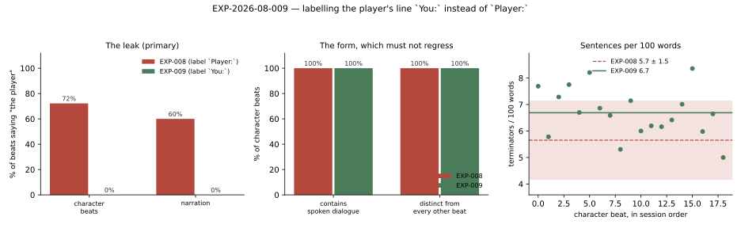

# RESULTS — EXP-2026-08-009 Second person

**Status:** complete · 6 turns, 29 beats (19 character + 10 narration), no failed turns,
**no discards** · relay alias `skynet` → upstream **`gemma4-26B-mtp`**, the same upstream
that served `EXP-2026-08-008` · 2026-08-21

## 1. Headline

Relabelling the player's transcript line from `Player:` to `You:` and asking both prompts for
the second person took the leak from **72 % of character beats and 60 % of narration beats to
zero — 0 / 19 and 0 / 10**. No form metric regressed; three improved. The hypothesis survives
in full, and the effect is total rather than marginal, which is what this design needs it to
be in order to mean anything (see §5).

## 2. Results table

**Generated, not typed.** `tables/leak.md` and `tables/form.md`, written by `analyze_run.py`
from this run's `data/metrics.json` + `logs/transcript.json` and `EXP-2026-08-008`'s own
`manifest.yaml` + `data/leak.json`. The baseline column is read out of the experiment it
belongs to, never retyped.

### The leak (primary)

| Beat kind | EXP-008 (`Player:`) | EXP-009 (`You:`) |
| --- | --- | --- |
| character | 13 / 18 (72 %) | **0 / 19 (0 %)** |
| narration | 6 / 10 (60 %) | **0 / 10 (0 %)** |

### The form, which must not regress

| Metric | EXP-008 | EXP-009 | |
| --- | --- | --- | --- |
| `has_speech` | 1.00 ± 0.00 (n=18) | 1.00 ± 0.00 (n=19) | held |
| `is_distinct` | 1.00 ± 0.00 (n=18) | 1.00 ± 0.00 (n=19) | held |
| `is_scratchpad` | 0.00 ± 0.00 (n=18) | 0.00 ± 0.00 (n=19) | held |
| `starts_mid_sentence` | 0.00 ± 0.00 (n=18) | 0.00 ± 0.00 (n=19) | held |
| `paragraph_breaks` | 2.28 ± 0.45 (n=18) | **3.89 ± 1.29** (n=19) | improved |
| `sentences_per_100_words` | 5.65 ± 1.48 (n=18) | **6.69 ± 0.89** (n=19) | improved |
| `names_the_player` | 0.72 ± 0.45 (n=18) | **0.00 ± 0.00** (n=19) | primary |
| `chars` | 780 ± 140 (n=18) | 1292 ± 378 (n=19) | see §6 |

**Discards: 0**, on every turn. This is load-bearing and not a footnote. `PROTOCOL.md` § Threats
named the risk that the guard and the metric share an implementation — a beat the gate
discards cannot be scored, so a gate doing the work would look identical to a prompt doing
the work. Zero discards means `emission.names_the_player` **never fired**: the models simply
stopped writing the phrase. The prompt is what fixed this, not the guard.

## 3. Figures


*Fig 1 — Left: the primary metric, both beat kinds, before and after. Middle: the form
metrics that had to hold. Right: sentences per 100 words, every beat of this run against
EXP-008's mean ± std band. Generated by `figures/make_figures.py` from both runs' recorded
files.*

## 4. Interpretation

**The label was the mechanism.** The output contract had said *"never write about … the
player"* since before `EXP-2026-08-008`, and 72 % of beats wrote it anyway. Naming the
concept in a rule while the transcript kept supplying the word did nothing; removing the word
and giving a sanctioned alternative removed the behaviour entirely. That is a specific and
generalisable lesson about prompt design — **a negative rule does not compete with a positive
example sitting in the context** — and it is the most transferable thing in this experiment.

**Narration went to zero too, on the prompt alone.** This is the result that surprised most.
Narration has no regeneration seam: it delta-streams from its first token by design, because
it is the first thing a new player sees, so `emission.names_the_player` cannot protect it.
`PROTOCOL.md` predicted narration as the likely survivor for exactly that reason. It was not.
Six of ten before, none of ten after, with nothing but the prompt change.

**The prose is second-person and reads correctly.** The hypothesis named `You:` ambiguity as
the way this could fail — a character mistaking `You:` for their own past line and answering
the wrong speaker. Reading all 19 passages, it did not happen once. The characters
consistently separate themselves, each other, and the addressee:

> He isn't just looking at **you**; he is waiting for the world to tilt, for the lie to fail
> […] I feel the weight of **your** words—the name of that cursed ledger—hanging between us
> like a heavy, suffocating shroud. **You've** traded our anonymity for a target […]
>
> "A messy thing, the sea," I say […] "It brings up all sorts of debris. Things that were
> meant to stay at the bottom."

**Claims.** Nothing here moves `C-012` (the sampler claim). This is single-condition
before/after evidence about a prompt-construction defect, and it is listed as such.

## 5. Threats to validity

- **This is a before/after across two runs, not a controlled A/B — the design's main
  weakness.** The two runs are separated in time on an endpoint that hot-swaps its upstream
  and whose per-turn latency moved 7× *within* the baseline run. A true arm-level test would
  interleave both labels in one session, which the turn engine cannot do without a config
  seam that does not exist. **The result is worth trusting only because the effect is
  total**: 19/19 and 10/10 in one direction, from 72 % and 60 %. A 20-point shift under this
  design would not have been worth reporting.
- **Same upstream, at least.** Both runs were served by `gemma4-26B-mtp`, verified per run
  from a completion's `model` field — so the comparison is not confounded by a model swap,
  which was the specific failure `PROTOCOL.md` said would invalidate it.
- **Sampling.** One session, one cast, one genre, one model. n is beats, and **beats within a
  session are not independent** — each conditions on the last through the transcript. The ±
  figures are descriptive spread, not sampling error.
- **Under-powered for rare failures, in plain words.** Six turns can show that a defect
  occurring in 70 % of beats is gone. It cannot show that one occurring in 2 % is gone. A
  model that reaches for "the player" once in fifty beats would pass this run.
- **Regex proxy.** "Refers to the player as a production object" is approximated by two
  phrases. A model that invents a third way — "the user's input", "the human" — passes.
- **The form comparison is across models' own variance, not a control.** `paragraph_breaks`
  and `sentences_per_100_words` improved, but nothing here shows the label caused that; two
  runs of the same configuration would also differ.
- **Unblinded read**, by the author of the change.

## 6. What surprised us

**Passages got 66 % longer** — 780 ± 140 characters to 1292 ± 378 — which was not predicted
in either direction and is the one number here that deserves suspicion rather than
celebration. Two readings are available and this run cannot separate them: writing *to*
someone in the second person may genuinely give a character more to do than writing *about*
"the player", or the scene simply escalated further (a Watch officer forces the door in turn
3 of this session) and longer beats followed the drama. The variance also tripled, which
argues for the second reading.

It is not a regression by any metric — every beat stayed well inside
`_RUNAWAY_CHARS` (8,192), the sentence density went *up* rather than down, and no beat
repeated itself — but a passage that is half again as long is a real change in the reading
experience and it arrived unmeasured and unrequested. It is recorded here rather than
presented as part of the win.

**The narration result** (§4) is the other surprise, and the more useful one.

## 7. Follow-ups

Copied into `../../OPEN_QUESTIONS.md` in the same change.

- [ ] **Find out why passages got 66 % longer**, and whether it persists across sessions with
      different dramatic arcs. If the second person genuinely lengthens beats, that is a
      finding; if it was this session's escalation, it is noise being reported as a finding.
- [ ] **Build a config seam for arm-level prompt tests.** Every prompt comparison in this
      record is a before/after across runs because the turn engine cannot serve two prompt
      variants inside one session. That is the ceiling on all of this evidence.
- [ ] **Widen the leak detector, or stop trusting it.** Two phrases is a narrow proxy for
      "refers to the reader as a production object".
- [ ] **Check the remaining `Player:` labels.** `planner_agent`, `director_agent` and
      `intent_agent` still use it. Their outputs are structure rather than prose, so a leak
      there is harmless today — but `director_agent` writes branch *labels* the player reads.

## 8. Reproduction

```bash
uv run python app.py backend    # must answer twice before the run starts
uv run python -m utils.scripts.research.run_prose_end_to_end \
  --experiment docs/research/experiments/EXP-2026-08-009-prose-second-person --turns 6
uv run python docs/research/experiments/EXP-2026-08-009-prose-second-person/analyze_run.py
uv run python docs/research/experiments/EXP-2026-08-009-prose-second-person/figures/make_figures.py
```

The run drives a live LLM at temperature 0.8: a rerun reproduces the *procedure*, not the
passages.

## Amendments

None.
