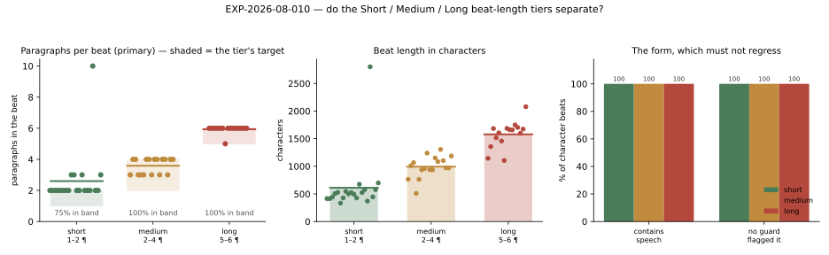

# RESULTS — EXP-2026-08-010 Beat length

**Status:** complete · 3 arms × 6 turns, 52 character beats + 23 narration, no failed turns ·
relay alias `skynet` → upstream **`gemma4-26B-mtp`** · 68.9 min wall clock · 2026-08-21

## 1. Headline

The tiers separate, and the separation is large: **2.60 ± 1.74 / 3.59 ± 0.49 / 5.93 ± 0.25**
paragraphs per beat, with `medium` and `long` landing **100 % inside their stated bands** and
no overlap between them. No form metric regressed at any tier. The hypothesis survives on the
primary metric and **fails on one prediction**: `short` never produced a one-paragraph beat,
sits at 79 % in band once an unrelated defect is set aside, and is the only arm the directive
did not fully bind.

## 2. Results table

**Generated, not typed** — `tables/arms.md` and `data/arms.json`, written by `analyze_run.py`
from `data/metrics.json`; the baseline row is read out of EXP-2026-08-009's recorded manifest.

| Arm | Target | Paragraphs (mean ± std) | Range | In band | Chars (mean ± std) | n |
| --- | --- | --- | --- | --- | --- | --- |
| `short` | 1–2 ¶ | **2.60 ± 1.74** | 2–10 | 15/20 (75 %) | 612 ± 511 | 20 |
| `medium` | 2–4 ¶ | **3.59 ± 0.49** | 3–4 | **17/17 (100 %)** | 994 ± 187 | 17 |
| `long` | 5–6 ¶ | **5.93 ± 0.25** | 5–6 | **15/15 (100 %)** | 1579 ± 234 | 15 |
| _EXP-009, no control_ | — | _4.89_ | — | — | _1292_ | _19_ |

**`short` excluding one leaked beat** (§6 — a scratchpad leak, not a long passage):
**2.21 ± 0.41 paragraphs, range 2–3, 15/19 (79 %) in band, 496 ± 92 characters, n = 19.**
Reported separately and never merged into the headline, because excluding an inconvenient
point is exactly the move the record exists to prevent — the 20-beat row above is the result.

### The form, which had to not regress

| Metric | `short` | `medium` | `long` |
| --- | --- | --- | --- |
| `has_speech` | 1.00 ± 0.00 | 1.00 ± 0.00 | 1.00 ± 0.00 |
| `is_scratchpad` | 0.00 | 0.00 | 0.00 |
| `starts_mid_sentence` | 0.00 | 0.00 | 0.00 |
| `names_the_player` | 0.00 | 0.00 | 0.00 |
| `sentences_per_100_words` | 7.19 ± 2.14 | 5.39 ± 1.09 | 5.94 ± 0.91 |
| duplicate beats | 0 | 0 | 0 |
| discards | 1 (§6) | 0 | 0 |

Duplicates are counted post-hoc by `analyze_run.py` over the transcript: the runner does not
compute `is_distinct`, and rather than leave an empty column claiming to be a measurement,
that key is dropped from its aggregate and the count is made where it can honestly be made.

## 3. Figures


*Fig 1 — Left: every beat as a point against the band its tier asked for (shaded). Middle:
length in characters. Right: the form metrics that had to hold. Generated by
`figures/make_figures.py` from `data/metrics.json`.*

## 4. Interpretation

**A paragraph count binds where a word count did not.** This is the finding worth carrying
forward. EXP-2026-08-007 recorded a countable "usually 80–200 words" target moving the average
passage *up*; the same model, given "five or six paragraphs", produced 5.93 ± 0.25 — a
standard deviation of a quarter of a paragraph across fifteen beats. The difference is not
prompt wording but **what the instruction asks the model to count**: it cannot count words
while writing, but it is already choosing paragraph breaks deliberately. A length instruction
should name a structural unit the model controls, not a quantity it would have to tally.

**`medium` and `long` are working controls, not just different means.** 100 % in band each,
non-overlapping, and tight (± 0.49 and ± 0.25). A mean can be produced by a bimodal mess; these
are not. `long` in particular does what the owner asked and is a genuine increase over what
shipped before (5.93 against the 4.89 EXP-2026-08-009 measured with no control at all).

**`short` is the weak tier, and the weakness is specific.** It never produced a one-paragraph
beat — its floor is 2 — so the band it satisfies in practice is 2–3, not 1–2. Character count
still separates it cleanly (496 ± 92 against `medium`'s 994 ± 187), so the *feature* works:
picking Short does make beats markedly shorter. But the stated band is wrong about its own
behaviour, which matters because the dropdown shows "1–2 ¶" to the reader.

**The default was chosen well.** `medium` at 3.59 paragraphs / 994 characters sits below the
4.89 / 1292 that shipped before this control, which is the direction the owner asked for
("some of the outputs are a little too long") without anyone having to touch the dropdown.

**Claims.** Nothing here moves a claim in `CLAIMS.md`. It is single-model evidence about a
prompt-construction technique and a shipped control.

## 5. Threats to validity

- **Beats are not independent.** Each conditions on the last through its own transcript, so n
  is beats, not n independent samples; the ± figures are descriptive spread.
- **The arms may separate partly by truncation rather than by the directive.** The token
  allowance differs per tier (700 / 1400 / 2048). **The evidence says it did not**: one beat
  in 52 hit its ceiling, and it hit it in the `short` arm for a reason unrelated to length
  (§6). `medium` and `long` produced zero discards, so nothing in those arms was cut.
- **The interleave protects against endpoint drift, not against everything.** Per-turn wall
  clock moved between 68 s and 430 s during the run. Interleaving spreads that across arms
  rather than eliminating it, and no latency claim is made from this experiment.
- **`short` has the least room to be wrong in.** One paragraph is a 50 % swing at `short` and
  17 % at `long`, so the arms are not equally sensitive and `short`'s worse in-band share is
  partly a measurement artefact of its narrow band.
- **One world, one cast, one genre, one model.** Nothing transfers without re-running.
- **Unequal n** (20 / 17 / 15) — the turn loop emits fewer beats when each is longer, under a
  fixed `maxTurns` of 5. That is itself a real consequence of the control (§6) and it means
  the arms are not equally powered.
- **Unblinded read**, by the author of the change.

## 6. What surprised us

**Longer beats mean fewer beats per turn.** `maxTurns` caps *emitted beats*, so `long`
produced 15 character beats across six turns where `short` produced 20. Nobody asked for that
and it is not in any metric here, but it is a real interaction between two controls the owner
sets independently: turning beat length up quietly turns the number of speakers per turn down.
Worth knowing before choosing `long` on a five-character cast.

**The one discarded beat was not a long passage — it was a scratchpad leak, and two guards
that should have caught it did not.** The `short` arm's 2,802-character beat (cut at exactly
that tier's ceiling, 700 tokens × 4) opens:

> you', 'your' — while everyone else stays in the third."
>     *   So, I am narrating for "You" (Aldous).
>     *   *Action:* Mei needs to respond to the question "Who else has been here tonight?"

…and ends mid-audit: *"Final check on 'No reuse': Aldous used: … Mei used: … My words"*. It is
the model quoting the **narrator prompt's own second-person rule** back to itself and working
through its instructions in the open.

Run against the guards directly, that text returns `starts_mid_sentence: True` and
`names_the_player: True` — **either should have discarded it**. Neither fired: the trace
records only `degenerate`, the runaway stop. The opening gate judges a passage's opening and
then releases it, and `written` counts the raw stream independently of the gate, so a leak
that arrives after release is invisible to it. **This is a pre-existing guard defect, not
something this control introduced** — the per-tier ceiling only made the symptom smaller (2,802
characters instead of the 8,192 it would have reached before). Diagnosing why the gate opened
is its own piece of work and is recorded as a follow-up rather than folded into this plan.

The honest reading of the arms is therefore that `short`'s 2–10 range is one defect and
nineteen well-behaved beats, not a control that sometimes produces ten paragraphs.

## 7. Follow-ups

Copied into `../../OPEN_QUESTIONS.md` in the same change.

- [ ] **Find out why the opening gate released a passage that both `starts_mid_sentence` and
      `names_the_player` flag.** A beat the guards can identify as bad was persisted and
      rendered. This is the highest-value item here and it is not about beat length.
- [ ] **Decide whether `short` should be relabelled "2–3 ¶"** or the directive pushed harder
      for a genuine one-paragraph beat. Today the dropdown promises 1–2 and delivers 2–3.
- [ ] **Document the `maxTurns` × `beat_length` interaction** in the UI, or reconsider whether
      a beat cap and a length cap should be independent controls at all.
- [ ] **Re-run on a second model.** Everything here is `gemma4-26B-mtp`.
- [ ] **Test the tiers against `register`.** A `grave` beat is told to be "shorter, sharper"
      while `long` asks for five or six paragraphs; the two directives are never checked
      against each other and could contradict.

## 8. Reproduction

```bash
uv run python app.py backend    # must answer twice before the run starts
uv run python -m utils.scripts.research.run_beat_length \
  --experiment docs/research/experiments/EXP-2026-08-010-beat-length --turns 6
uv run python docs/research/experiments/EXP-2026-08-010-beat-length/analyze_run.py
uv run python docs/research/experiments/EXP-2026-08-010-beat-length/figures/make_figures.py
```

The run drives a live LLM at temperature 0.8: a rerun reproduces the *procedure*, not the
passages.

## Amendments

None.
