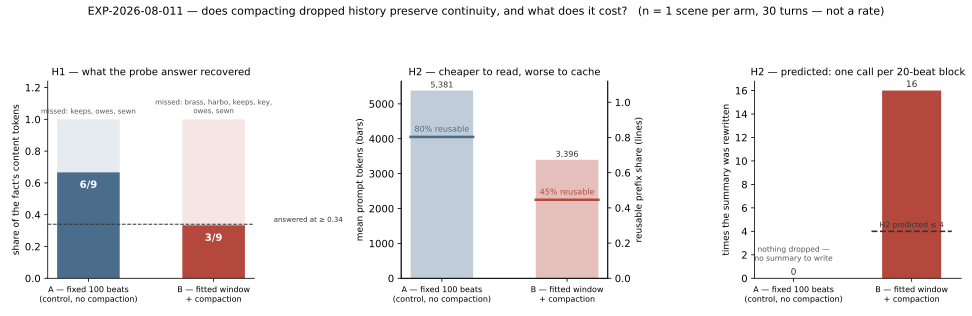

# RESULTS — EXP-2026-08-011 Context compaction

**Status:** complete · run 2 of 2 (run 1 recorded as failed, `ISSUES.md` §2) · 2 arms × 1 scene ×
30 turns, no failed scenes · relay alias `local` → **gemma-4-26B-it** as served 2026-08-22 ·
140.6 min wall clock · 2026-08-22

## 1. Headline

**Compaction did not preserve the fact, and it cost four times the model calls it was supposed
to.** Arm B recovered 3 of the planted fact's 9 content tokens against the control's 6, missing
the probe's threshold outright (0.333 against 0.667), while rewriting the scene summary **16
times** where H2 predicted at most 4 and halving the reusable prompt prefix (44.6 % against
80.3 %). H1 fails in the only form it could be tested in, H2 fails on both of its terms, and
H3 is **not measured**. `TURN_CONTEXT_COMPACTION` stays defaulted **off** and claim
**C-013 stays `unsupported`**.

## 2. Results table

**Generated, not typed** — `tables/arms.md`, written by
`utils/scripts/research/analyze_compaction_probe.py` from `data/metrics.json` and
`data/probe.json`.

<!-- generated from data/metrics.json + data/probe.json -->

| Arm | Probe score | Fact tokens | Answered | Prompt tokens (mean) | Reusable prefix | Summary rewrites | s / turn |
| --- | --- | --- | --- | --- | --- | --- | --- |
| A | 0.667 | 6/9 | yes | 5,381.1 | 80.3% | 0 | 175.73 |
| B | 0.333 | 3/9 | **no** | 3,396.1 | 44.6% | 16 | 105.51 |

**No aggregate row, deliberately.** n = 1 scene per arm; a mean of one number is not a
statistic. Both scenes completed (`failed: 0`), so the two rows are the whole result.

At the probe turn, the two arms were reading very different things:

| | Arm A | Arm B |
| --- | --- | --- |
| Window | 100 beats, `fixed` | 20 beats, fitted to a 2 048-token transcript budget |
| Beats dropped | 0 | 70 |
| Prompt at the probe | 8 693 tokens | 4 007 tokens |
| Scene summary | none | 916 chars, through seq 89 |

## 3. Figures


*Fig 1 — Left: the share of the planted fact's content tokens each arm's answer reached, with
the tokens it missed. Middle: mean prompt tokens (bars) against the share of each prompt
byte-identical to the previous one (lines). Right: how often the summary was rewritten against
the bound H2 predicted. Generated by `figures/make_figures.py` from `data/metrics.json` and
`data/probe.json`.*

## 4. Interpretation

### H1 — the summary kept the gist and dropped the specifics

The planted fact was *"my name is Rensal Vey, I owe the harbourmaster four hundred crowns, and
I keep a brass key sewn into my collar."* Thirty turns later, asked to repeat it back:

> **Arm A** — "Four hundred crowns to the harbourmaster and a brass key in your collar!"
>
> **Arm B** — "Four hundred crowns is what you owe, and that collar is what's keeping you tied
> to this mess!"

Arm B kept the number and the collar and lost **the harbourmaster and the brass key** — the two
things that make the fact a fact rather than a mood. The cause is visible one layer down, in the
summary arm B was actually reading at that moment (`data/probe.json`, `summary_text`):

> `* Rensal: owes 400 crowns.`

That is the whole of what survived compaction. The character did not forget; it answered
faithfully from a summary that had already thrown the details away. **This is the finding.** The
recap agent, asked to keep a scene's memory, kept the load-bearing plot state (the tide, the
key's owner, who is where) and discarded a debt's creditor and a key's material — reasonable
choices for a *scene summary* and fatal for *continuity*, which is made of exactly the specifics
a summary is built to drop.

Two things this does **not** say. It does not say arm B is worse at recall than the code that
ships today: arm A is a fixed 100-beat window that never dropped the plant at all, so it is
"still reading the fact verbatim", not "compaction off" — `ISSUES.md` §1 records that H1 as
pre-registered could not have come out the other way. The comparison that *is* fair is the one
the design actually answers — **does B match A while reading far less?** — and the answer is no.
And it does not say the lexical probe undercounted: both arms missed the same three *verbs*
(`keeps`, `owes`, `sewn`) to ordinary paraphrase, and arm B additionally missed three *nouns*
(`brass`, `key`, `harbo`). The verbs are the metric's known crudeness. The nouns are content.

**The failure mode is worse than a miss.** Arm B did not say it could not remember; it answered
with confidence and invented a replacement ("that collar is the leash"). A scene that forgets
visibly is recoverable by the player. A scene that misremembers fluently is not.

### H2 — the summary moved almost every turn

Compaction is supposed to wait for a whole anchor block (20 beats) to fall out of the window,
so the prompt-cache prefix breaks once per block rather than once per turn. With 70 beats
dropped, that bound is **4 calls**. It ran **16**, folding 20 beats, then 9, then repeatedly 2
and 3 (`data/probe.json`, `compaction_folds`).

The cause is the gate in `services/history_compaction.maybe_compact`, which tests
`fit.dropped_beats < block` — the beats dropped **in total**, not the beats dropped **since the
last summary**. Once 20 beats have ever fallen out, the gate is permanently open and the summary
is rewritten on every turn that produces anything new. The comment directly above that line
describes the intended behaviour correctly; the condition does not implement it. **This is a
defect found by the experiment, not a property of compaction**, and it is what the second half
of H2 measures: the reusable prefix share falls from 80.3 % to 44.6 % because the summary sits
at the head of the append-only region and changed under it nearly every turn.

The rest of the cost is real and in compaction's favour: arm B read **37 % fewer prompt tokens**
(3 396 against 5 381) and took 105.5 s/turn against 175.7 s. Per the protocol, wall-clock
supports no claim on its own — but the token count is a count, and it is the point of a fitted
window.

### H3 — not measured

The protocol pre-registered a **blinded** pairwise read of matched beats, and permitted "not
measured" over a rubric invented after the fact. No blinded read was performed: by the time the
prose was extracted for §4 the arms were already identified, and a preference stated by a reader
who knows the arms is not evidence of anything. Recorded as an open question rather than
answered badly. (Un-blinded and offered only as an observation, not a result: nothing in either
arm's prose looked degraded — arm B's failure is factual, not stylistic.)

### Claims

**C-013 remains `unsupported`.** The evidence gate it names was run, and the result is against
it on both testable hypotheses. `TURN_CONTEXT_COMPACTION` continues to ship **off**, which is
what the plan committed to in advance if the probe came out this way.

## 5. Threats to validity

- **n = 1 scene per arm. This experiment is under-powered and cannot support a rate.** One
  probe, one scene, one model. The two rows are an existence proof — "compaction lost this fact
  here" — and nothing stronger. At ~53 min per 30-turn scene, the protocol's fuller design is
  hours of local inference; that was the trade and it is recorded rather than hidden.
- **The probe is lexical**, and it is a floor on continuity, not a measurement of it. Both arms
  lose paraphrased verbs to it. The §4 reading of the actual prose is what makes arm B's miss a
  content loss rather than a scoring artifact, and that reading is un-blinded.
- **Arm A never dropped the plant**, so it is not the counterfactual the pre-registered H1
  imagined (`ISSUES.md` §1). Any follow-up must push the control past its own window.
- **The 16-rewrite result is confounded by the gate defect.** It measures shipped code
  faithfully, but it is *not* a measurement of "compaction bounded to one call per block",
  which is the design H2 was written about. That design has now never been tested.
- **One model, one machine.** The relay served `gemma-4-26B-it`; `skynet` was down that day
  (`ISSUES.md` §5). A finding on one model is a finding on one model.
- **`code.dirty: true`.** The run started from the working tree of the commit series that
  introduced compaction; the paths under test were unchanged between run start and the recorded
  commit.

## 6. What surprised us

**That the summary was the failure, and that it was legible.** The expectation going in was a
model-attention story — the fact is in the prompt but buried. It was not: the fact was
genuinely gone from the prompt, dropped by the recap agent one turn at a time, and the exact
line that replaced it (`* Rensal: owes 400 crowns.`) is sitting in the record. A continuity
experiment turned out to be a summarisation experiment.

**That the gate defect survived a passing unit suite.** `test_history_compaction.py` asserts
compaction fires once a block has dropped, and it does. Nothing asserted that it fires *only*
then, because the difference needs a scene long enough for a second block — which is the same
length threshold that made run 1 worthless. A 30-turn live scene found in one run what the unit
tests are structurally unable to see.

## 7. Follow-ups

Each one is copied into `../../OPEN_QUESTIONS.md` in the same change.

- [ ] Fix the `maybe_compact` gate to test *beats dropped since the last summary* against the
      anchor block, with a unit test that fails on the current condition, and re-run this
      experiment against the fix. Until then the design H2 describes is untested.
- [ ] Teach the recap agent to preserve entity-attached specifics (numbers, materials, names of
      the people a fact points at) — the summary kept "owes 400 crowns" and dropped both the
      creditor and the key. A prompt change here is the cheapest lever on H1.
- [ ] Re-run with the control pushed past its own window (smaller fixed `contextBeats`, or more
      turns) so H1 is an equivalence test rather than a comparison a fixed window wins by
      construction.
- [ ] Answer H3 properly: a blinded pairwise read of matched beats, by a reader who has not seen
      the arms labelled.

## 8. Reproduction

Requires a backend started with `TURN_CONTEXT_COMPACTION=true` (arm B's treatment is an
environment flag; arm A sets its own policy per scenario) and a reachable model endpoint.

```bash
# backend for the run, on a port that does not disturb the dev server
cd web/backend && TURN_CONTEXT_COMPACTION=true \
  ../../.venv/bin/python -m uvicorn "app.main:create_app" --factory --host 127.0.0.1 --port 3355

# the run itself (~140 min on this hardware; refuses fewer than 24 turns, see ISSUES.md §2)
uv run python -m utils.scripts.research.run_context_compaction \
  --scenes 1 --turns 30 --api http://127.0.0.1:3355/api \
  --experiment docs/research/experiments/EXP-2026-08-011-context-compaction

# read the probe answers and the summary back out while that backend is still up
uv run python -m utils.scripts.research.analyze_compaction_probe \
  --api http://127.0.0.1:3355/api \
  --experiment docs/research/experiments/EXP-2026-08-011-context-compaction

make figures
```
