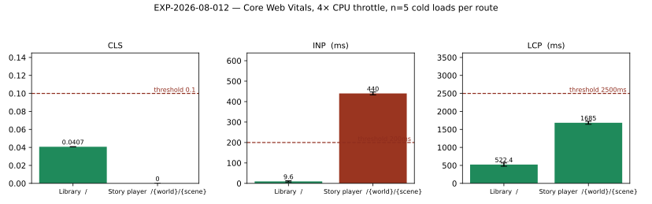

# RESULTS — EXP-2026-08-012 Core web vitals

**Status: complete.** All 10 loads succeeded (5 per route, 0 failures), so every number
below is an aggregate over a complete set.

## What was measured

A real `next build` bundle served by `next start`, driven by headless Chromium 151 at
**4× CPU throttle**, 5 cold loads per route with the cache disabled. Entrypoint:
`node utils/scripts/research/run_core_web_vitals.mjs`.

This is the **first** Core Web Vitals measurement in this repository's history. It was not
possible before: `next/font/google` fetched at build time, so `next build` hard-failed with
no network and there was no production bundle to profile. `docs/plans/reach.md` Phase 9
self-hosted the three families, which is what made this run exist.

## Result

| Route | CLS | INP | LCP |
| --- | --- | --- | --- |
| Library `/` | 0.0407 ± 0 **pass** | 9.6 ± 3.2 ms **pass** | 522.4 ± 45.9983 ms **pass** |
| Story player | 0 ± 0 **pass** | 440 ± 7.1554 ms **FAIL** | 1684.8 ± 41.8301 ms **pass** |

Pre-registered thresholds: CLS < 0.1, INP < 200 ms, LCP < 2500 ms.

## Against the pre-registered hypotheses

- **H1 — both routes pass CLS. Supported.** 0.0407 ± 0 on the Library and
  exactly 0 on the story player, against a 0.1 threshold.
  The structural work (space-reserved images, a reserved error line, a min-height on the
  streaming beat, skeletons matching real card geometry) and the metric-compatible font
  fallbacks hold up.
- **H2 — the Library's LCP passes. Supported.** 522.4 ± 45.9983 ms, comfortably
  under 2.5 s even at 4× throttle.
- **H3 — INP is the weakest, and fails on the story player. Supported.** It is the only
  metric that misses a threshold, and it misses it on the route predicted. Nothing else
  failed, which is the other half of what H3 claimed.

## The one failure, stated precisely

Story-player INP is 440 ± 7.1554 ms, more than double the 200 ms threshold.

**What was clicked matters and is recorded.** INP is the *worst* interaction, not the mean,
and the scripted sequence on this route was: 'Chat', ’'Graph', ’'❑Play-throughs', ’'Parchment'. The
second of those switches the whole centre column to the **Graph** view, which mounts a
force-directed canvas — an expensive interaction by construction. The Library's sequence
('↺ New chat', 'Title', 'Genre', 'Tagline') is ordinary form controls and scores
9.6 ± 3.2 ms, two orders of magnitude better.

So the honest reading is narrower than "the story player is slow to respond": **one
interaction — the chat⇄graph view switch — dominates this number**, and the remaining
controls in the sequence did not move it. That is a lead, not a conclusion; isolating INP
per control is a separate experiment and has not been run.

## What was not controlled

- **One machine, one browser, one run of five loads per route.** No cross-machine or
  cross-browser variance is captured. The std figures are machine noise on a loaded
  workstation, not a population estimate.
- **The measured bundle contains the probe.** `NEXT_PUBLIC_VITALS` is inlined at build
  time, so the bundle was necessarily built with the flag on. `web-vitals` is ~2 KB and
  subscribes to browser APIs that are already running, but it is not nothing.
- **The backend was the dev server**, not a production deployment, so any data-fetch
  latency on the story-player route reflects that.
- **One world.** Both routes were served the repository's seeded Embergate content;
  `embergate/embergate`. A larger world would change
  LCP on the player route and possibly CLS.
- **No interaction-level attribution.** `web-vitals` reports the worst interaction; this
  run records which controls were clicked but not which one produced the worst value.
