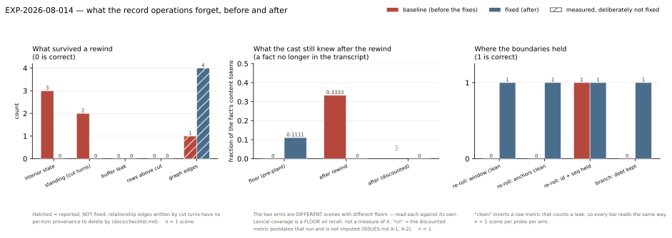

# RESULTS — EXP-2026-08-014 Record controls

**Status:** complete · 2 arms × 5 probes × 1 scene each, no crashed probes · relay route
`skynet` as served 2026-08-22 · Postgres + Redis + Neo4j + Qdrant all live · 2026-08-22

## 1. Headline

**Cutting the rows was never the whole of a rewind, and three of the five record operations
were leaving something behind.** On the baseline arm a rewind removed 11 of 17 event rows,
every trace of the cut turns, the rolling summary and the entire Redis transcript buffer —
and left **3 of 3** per-character interior-state keys and **2 of 2** standing-direction rows
raised by the deleted turns. Asked afterwards about a fact that no longer appeared anywhere
in the transcript, the cast reached **0.333** of its content tokens against a **0.000**
pre-plant floor. A re-roll's context contained the beat it was replacing, in both the
transcript window and the speaker's own voice anchors. A branch inherited **0 of 1**
outstanding requirement.

After the fixes, every one of those reads correct: **0** interior keys, **0** standing rows
from cut turns, **0** occurrences of the target in a re-roll's window or anchors, **1 of 1**
requirement inherited by a branch — and the post-rewind recall fell to **0.000**, *below*
that scene's own **0.111** floor. Claim **C-014** is `supported` as an existence claim.

One channel is measured and **still open**: relationship edges written by cut turns are not
rolled back (4 before, 4 after). That is a stated limitation of the story graph, not a
regression, and it is the last known way a rewound scene can know something its transcript
does not.

**Nine things were checked and found already correct**, in both arms: the Redis buffer
rebuild (0 leaked beats), the summary invalidation, the stat replay, the restored player
line with its direction, the snapshot fork, re-roll's event-id and seq stability, its take
pager (4 distinct takes, `activeTake` last, and **0** duplicated `state_update` or
`internal_thought` rows across three re-rolls), the whole-turn re-run (1 `user_turn` row,
contiguous unique seqs, the player's text preserved), and every structural property of a
branch. This experiment is as much a record of what did not need fixing as of what did.

## 2. Results table

Read from `data/metrics-baseline.json` and `data/metrics-fixed.json`. **No aggregate row.**
n = 1 scene per probe per arm — every entry is an existence check on a mechanism, and a mean
over five different mechanisms would be a number about nothing.

### What a rewind left behind

| Metric | Correct | baseline | fixed |
| --- | --- | --- | --- |
| Event rows above the cut | 0 | **0** | **0** |
| Redis buffer beats leaked from cut turns | 0 | **0** | **0** |
| Rolling summary survived a cut below it | 0 | **0** | **0** |
| Interior-state keys (`interior:{session}:*`) | 0 | **3** ✗ | **0** ✓ |
| Standing-direction rows raised by cut turns | 0 | **2** ✗ | **0** ✓ |
| Standing-direction rows raised by *surviving* turns | keep | 0 of 0 | **1 of 1 kept** ✓ |
| Player's line + direction handed back | 1 | **1** | **1** |
| Snapshot play-through kept | 1 | **1** | **1** |
| Graph edges after (open channel) | — | 1 (from 1) | 4 (from 4) |

The fixed arm's `standing_after: 1` is the important detail: the prune is **selective**, not a
wipe. That scene owed one requirement raised by a turn that survived the cut, and it survived
with it.

### What the cast still knew

| | baseline | fixed |
| --- | --- | --- |
| Floor (asked before the fact was ever planted) | 0.000 | 0.111 |
| After the rewind | **0.333** | **0.000** |
| After, discounting the probe question's own words | not recorded | **0.000** |
| Coverage relative to that arm's own floor | **+0.333** | **−0.111** |

**These two arms are different scenes with different floors**, so the readable comparison is
each arm against *its own* floor, not against the other (`ISSUES.md` A-2). Lexical coverage is
a **floor** on recall, never a measurement of it.

### Where the boundaries held

| Metric | Correct | baseline | fixed |
| --- | --- | --- | --- |
| Re-roll: target beat in the replay window | 0 | **1** ✗ | **0** ✓ |
| Re-roll: target beat in the speaker's voice anchors | 0 | **1** ✗ | **0** ✓ |
| Re-roll: target beat in `turn_beats` | 0 | **0** | **0** |
| Re-roll: event id + seq unchanged | 1 | **1** | **1** |
| Re-roll: distinct takes kept after 3 re-rolls | 4 | **4** | **4** |
| Re-roll: extra `state_update` / `internal_thought` rows | 0 | **0 / 0** | **0 / 0** |
| Turn re-run: `user_turn` rows for that turn | 1 | **1** | **1** |
| Turn re-run: seqs contiguous and unique | 1 | **1** | **1** |
| Branch: source rows changed | 0 | **0** | **0** |
| Branch: fresh ids, identical seqs, identical text | 1 | **1** | **1** |
| Branch: parent's outstanding direction inherited | 1 | **0** ✗ | **1** ✓ |
| Edit: player row + Redis buffer both updated | 1 | **1** | **1** |
| Edit: AI row + Redis buffer both updated | 1 | **1** | **1** |

## 3. Figure

*Fig 1 — Left: counts of what survived a rewind that should not have; the graph-edge bar is
drawn in a third colour because it is reported and deliberately not fixed. Middle: coverage of
the planted fact after the rewind, against each arm's own pre-plant floor; `n/r` marks the
discounted metric the baseline predates (`ISSUES.md` A-1/A-2), which is labelled rather than
imputed. Right: the 0/1 boundary checks, inverted where the raw metric counts a leak so every
bar reads "1 is correct". Generated by `figures/make_figures.py` from the two metrics files.*

## 4. Interpretation

### H1 — a rewind cleared the rows and not the minds

`memory/interior.py` had **no clear function at all**. Each character's disposition and
retrospective is written by `services/reflection.py` after every turn and read straight into
the prompt by `assembler._build_cast`, and `session_state.truncate_session` never touched it.
A rewind therefore deleted the beats and left the stance those beats produced.

The recall probe is the reader-facing form of it. In the baseline scene the planted fact
appeared in **no surviving row** — the plant turn was cut, and `plant_coverage: 0.0` shows the
planting turn's own prose never echoed the fact either — yet the cast still reached a third of
its content tokens when asked. There is no transcript for that to have come from.

Two honest limits on that number. Its 0.333 is 3 of 9 tokens, one of which (`collar`) is in the
probe question itself, so at most 2 tokens are unambiguous leakage — which is why the
discounted metric was added (`ISSUES.md` A-1). And the arms are different scenes with different
floors. **Neither limit touches H1**, because H1 is decided by a count of Redis keys: 3, then 0.

The fix **clears** rather than filters by seq. A record carries the turn it was computed after,
so filtering was available — but there is only ever one record per character, each turn
overwriting the last, so any survivor is the *latest* stance and was formed partly from beats
that no longer exist. Over-clearing costs one recomputation the next turn performs anyway.

### H2 — the scene kept chasing what the player had just deleted

`PlaySession.standing_direction` is a column, not a row, so truncation never saw it. Both
requirements raised by the cut turns survived. The effect on a player is specific and
unpleasant: you rewind precisely because you did not want what happened, and the very next beat
resumes trying to deliver the thing you removed.

`fromTurn` is the raising turn's `Event.seq`, so the cut is exact rather than heuristic, and the
fixed arm demonstrates both halves — 0 rows from cut turns, 1 row from a surviving turn kept. A
row with no usable `fromTurn` is **kept**, matching the asymmetry the direction system uses
everywhere: an un-cancelled requirement costs a beat and is reported as outstanding, while a
wrongly-cancelled one silently loses what the player asked for.

### H3 — one half of a function honoured its own docstring

`turn_setup.context_for_replay` documents `through_seq` as "the last beat the re-run may see",
and its `turn_beats` half walks the persisted rows to enforce exactly that. Its `TurnContext`
half called a plain `assemble_context`, which reads the window off the live Redis buffer — and
at re-roll time that buffer still holds the beat being replaced. The baseline measurement shows
the split precisely: `target_in_turn_beats: 0`, `target_in_replay_window: 1`,
`target_in_voice_anchors: 1`. The anchors matter as much as the window; those are the lines
quoted back to a character as their own recent voice.

**The behavioural cost is not established.** `self_overlap` fell from 0.341/0.409 (mean/max) to
0.284/0.293, which is the direction the hypothesis predicts and is **not evidence**: two scenes,
n = 1 each, on a nondeterministic endpoint, and two versions of one beat share nouns whatever
the model saw. What is established is the mechanism — the model was being shown the line it had
been asked to replace, and now is not. That was the pre-registered falsifier for H3, and it is
what `--replay-window` measures with no model in the loop (`ISSUES.md` A-3).

### H4 — the frontend pointed the controls at the wrong row

Not measured by this harness; established by reading and pinned by co-located tests
(`turn-stream.test.ts`). A character's `internal_thought`, `character_action` and
`character_dialogue` fold into one transcript beat, and the thought both opened that beat and
claimed its `id`; only a following dialogue took the id back. A character who thought and acted
but never spoke therefore kept the **thought's** id — so **Edit** opened empty and would have
written the player's new words onto the private thought, and **Re-roll** was refused 422
(`internal_thought` is not in `RERUNNABLE_TYPES`). Reproduced on both the live reducer and
`rehydrateFromHistory`, and worst on reload, where no `speaker` trace frame opens an id-less
pending beat.

The live probes could not reach this: neither arm's scenes produced an `internal_thought` row
at all (`thought_row_present: 0` in both), so the API-side behaviour of a thought beat is
**unmeasured here**. That is a gap in the probe, not a finding.

### H5 — a fork forgot the debt

`copy_history` carried events, traces and stat values, and deliberately cleared the rolling
summary for a stated reason. The outstanding direction fell between the two and was simply not
copied: 0 of 1 inherited. It is now carried, pruned to the fork seq by the same rule a rewind
uses. The summary stays uncopied — it is a *derived* record that would go stale the moment the
branch diverged, with no seq to notice by, whereas a direction is what the player asked for and
has not yet been given.

### The graph, which is still open

4 edges before the rewind, 4 after. `session_state` prunes the `:Event` node each cut turn wrote
but not the relationship edges, because `graph_writer` records no turn seq to delete by. With
H1 and H2 closed this is the only remaining channel through which a rewound scene can know
something its transcript does not, and `graph_reader.relationship_context()` puts it in the next
prompt. Carried in `docs/checklist.md` with this measurement attached. n = 1, so the size of the
leak is not established; its existence is.

### Two things this run saw that it was not looking for

Recorded in `ISSUES.md` O-1 and carried to `docs/checklist.md`, unfixed and uninvestigated
because this run was scoped to the record operations: one turn wrote the **same narration three
times** (three distinct `Event` rows, byte-identical text), and one `narration` row carried
**emission scaffolding** into the transcript as prose. Both n = 1.

## 5. Claims

- **C-014** — `supported`. An existence claim, which is why one scene establishes it: cutting
  the persisted rows is not sufficient to make a scene forget. Two channels were demonstrated
  and closed the same day; a third is demonstrated and open.
- **C-007** (the interior mechanism earns its keep) — **unchanged, still `unsupported`.** This
  run says only that interior state is load-bearing enough for its staleness to be visible in a
  prompt. It does not compare stance continuity with the mechanism on and off, which is what
  C-007 needs.
- **C-013** (compaction) — untouched. The summary invalidation was checked and found correct in
  both arms, which is a different proposition from compaction being worth running.

## 6. What would change these conclusions

- **H1/H2/H5 are counts**, so only a bug in the harness's own reads would change them. Each is
  taken from the app's own client (`app.core.redis`, `app.core.db`), not a re-derived
  connection.
- **The recall figures would change** with a probe question that shares no vocabulary with the
  planted fact, and with both arms run on the same scene. Neither was done; both are cheap, and
  the answer text is now stored so a re-score costs nothing.
- **H3's behavioural cost is open.** Establishing it needs matched re-rolls of the *same* beat
  with the window trimmed and untrimmed, blind-scored for whether the re-take replaces or
  continues. That is a real experiment and this was not it.
