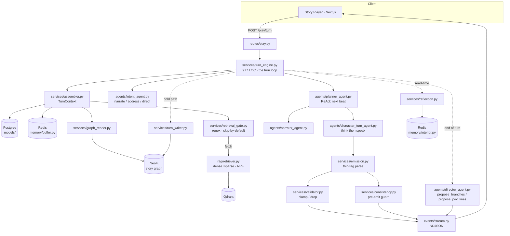

# Mytheca — Research Audit

**Repository:** `/Agents/Velora` (git remote `github.com/brendondgr/Velora`) · **Project name:** Mytheca (renamed from *Velora*, 2026-07-20)
**Audit date:** 3 August 2026 · **Repository state audited:** `main` @ last commit 2026-07-20 (514 commits)
**Inferred domain hint:** interactive narrative / games · multi-agent LLM systems · knowledge graphs & RAG (user-confirmed)
**Inferred publication horizon:** none binding — the owner describes this as a for-fun project and is asking whether it *could* be published. Venue recommendations are therefore weighted toward low-cost, fast-feedback tracks rather than a deadline-driven plan.

**A note on terminology.** This report defines terms of art inline on first use.

**⚠️ legend.** The warning glyph carries four distinct meanings in this report, always disambiguated by context: (a) a documentation-vs-code discrepancy, where the code is treated as the evidence; (b) a citation whose identifier, venue or affiliation could not be confirmed this session; (c) a substantive caution about a verified fact (a venue constraint, a null result in the literature, an analytical judgment that cuts against the project); and (d) in the §6.4 disqualifier table only, a status flag meaning the disqualifier is **present** (paired with ✅ for absent). Meaning (d) is a boolean, not a severity rating.

---

## 0. Executive Summary

**What it is.** Mytheca is a working, well-engineered, single-developer LLM interactive-narrative engine built in 29 days (514 commits, 2026-06-21 → 2026-07-20): a FastAPI backend (16,279 LOC Python) driving a multi-agent turn loop, a Next.js frontend (27,881 LOC TypeScript, ~8k of which is tests), four backing data stores (Postgres, Redis, Neo4j, Qdrant), and 718 backend + 540 frontend tests. Each player turn runs a ReAct-style beat planner (`services/turn_engine.py` → `agents/planner_agent.py`) that repeatedly decides who acts next; each selected character is voiced by an isolated LLM call that emits a visible in-voice `<thinking>` block then speech (`agents/character_turn_agent.py`); a narrator fills interstitials; a validator clamps proposed numeric stat changes to a per-world schema (`services/validator.py`); a pre-emit LLM consistency guard checks each line against the beats already established this turn (`services/consistency.py`); and world state is mirrored into a typed Neo4j story graph with a Qdrant dense+sparse hybrid lore index behind a regex retrieval gate.

**Novelty verdict — blunt version.** Mytheca is a competent, aesthetically distinctive re-implementation of an architecture that was published at ACL in 2024 and has been extended at least five times since. IBSEN (Han et al., ACL 2024) already published the director-agent-plus-actor-agents topology with human-in-the-loop replanning. MAGNET/ATLAS (Aluru et al., arXiv:2607.00918, July 2026) already published multi-agent character generation against a *shared symbolic world state* with a *graph-based consistency checker*, and benchmarked it against IBSEN. PANGeA (Buongiorno et al., AIIDE 2024) already published LLM authoring agents plus a validation system that checks free-form output against designer rules — reporting a 28% → 98% narrative-alignment improvement, which is the headline number Mytheca's validator would be claiming. Narrative World Model (arXiv:2607.05577) already published a typed narratological state graph and showed it beats generic entity graphs. Open-Theatre (EMNLP 2025 demo) already shipped an open-source multi-agent interactive-drama toolkit with hierarchical memory. **The engineering here is real; the research novelty, as currently framed, is close to zero.** Two components — POV switching, where the player speaks *as* a cast member, and stat-arbitrated turn behavior — could not be located in any verified paper and are the only defensible novelty surface.

**The evaluation situation is the deciding fact.** There is no evaluation of any kind in this repository. No benchmark, no baseline, no ablation, no metric, no human study, no annotated data, no notebook, no analysis script. The dependency manifests confirm this at the fingerprint level: `pyproject.toml` declares no analysis or evaluation stack — no pandas, scipy, scikit-learn, statsmodels, matplotlib, or ragas. (numpy, onnxruntime and tokenizers *do* appear in `uv.lock` as transitive dependencies of `fastembed`, which runs the embedding model; they are inference infrastructure, not analysis tooling.) The 718 pytest functions are *correctness* tests (does the code run) — the first of the three tiers, not the second or third. The single mention of evaluation anywhere in `docs/` is a deferred item in `docs/rag.md:138`: "**RAGAS eval harness** — once real query traffic exists."

**Readiness verdict line:**

> **Readiness: L1 — far from workshop, far from applied conference, far from top-tier archival; blocked by claim clarity, evaluation rigor, baseline coverage and positioning (all scored 0); critical path 8–11 weeks; cheapest next action: a stylometric cast voice-distinctness check over already-exportable play sessions against a single-prompt baseline (~1 week), which either supports or kills the architecture's core justification.**

**Recommended action.** Do not attempt an archival submission from the current state; every archival venue surveyed has explicit CFP language that makes a zero-evaluation system desk-rejectable. If you want a publication out of this, the highest-value move is *not* to describe the engine but to use it as an instrument: measure whether the multi-agent scaffolding actually preserves distinct character voices over a long multi-party scene, against a single-prompt baseline. That question is live in the literature (Echoing, arXiv:2511.09710, finds up to 70% role abandonment in agent-to-agent conversation, invisible to task-success metrics), unanswered for the multi-character narrative setting, and Mytheca is unusually well-instrumented to answer it — `services/session_export.py` already dumps the full per-turn diagnostic record including private thinking, graph writes and RAG activity. That is a paper. The engine is not.

---

## 1. Project Characterization

### 1.1 Identity

**Name.** *Mytheca* — from *Myth* + Greek *Bibliotheca* ("library"). Internal codename **Velora**, still live in the git remote (`github.com/brendondgr/Velora`) and in `.claude/worktrees/` branch names; the rebrand landed 2026-07-20 in a six-phase commit series. The seed world shipped in `core/seed.py` is called **Embergate** (a maritime-intrigue harbor town), and the locked visual reference lives in `docs/CharacterFrontpage/Embergate *.dc.html`.

**One-sentence description (non-specialist).** Mytheca lets you write a fictional world and its cast, then play through scenes in it as a chat, where several AI-driven characters talk to you and to each other while an AI narrator sets the scene.

**One-paragraph description (technical peer in an adjacent field).** Mytheca is a client-server interactive-narrative engine. Authoring-time LLM agents help a user construct a *storyline* (world, world primer, per-world numeric stat schema), its *characters* (bio, speech style, traits, authored situation→response voice samples), *settings*, and *scenarios* (a cast plus a setting plus scene configuration). At play time, one player message triggers a turn: the backend assembles a read-only `TurnContext` (cast with clamped stat blocks, carried-over per-character "disposition" from the previous turn's reflection, recent beats from a Redis buffer, a Neo4j scenario subgraph, and optionally a hybrid-retrieved lore block), then runs a ReAct loop in which a planner agent repeatedly decides the single next beat — a character speaks, the narrator narrates, a character exits the scene, or the turn ends. Each character beat is one isolated LLM call whose output is a thin tagged format (`<speaker:N>`, `<type:...>`, free prose) parsed into typed story events. Proposed stat changes, relationship edges and presence transitions are validated and clamped server-side before application. Everything is streamed to the browser as line-delimited JSON (NDJSON) with token-level deltas. After the stream closes, a cold path writes durable consequences into Neo4j and a reflection interlude updates each character's interior state while the player reads.

### 1.2 The problem

**The problem as stated by the artifact.** Sustaining a believable, continuous, multi-character fictional scene over many turns, where the characters remain distinguishable from one another, remain consistent with an authored world, and where the consequences of what happens persist.

That is a real problem and it is well-posed, but it decomposes into four difficulties that the repository treats as one:

| Difficulty | Why it is hard |
|---|---|
| **D1 — Voice distinctness under multi-party interaction** | When several LLM-driven characters share a context, they converge. This is empirically documented: *Echoing* (arXiv:2511.09710) measures up to 70% role abandonment across 2,500+ agent-to-agent conversations, with reasoning models still at 32.8%; *Persona Collapse* (arXiv:2604.24698) quantifies distinctly-profiled agents collapsing to a narrow behavioral mode; *SocialBench* (Chen et al., Findings of ACL 2024) finds individual-level persona competence does not transfer to the group level. |
| **D2 — Who speaks next** | Turn-taking in multi-party dialogue is a coordination problem, and LLMs are documented to be bad at it. Inoue et al. (IWSDS 2025) find LLMs only marginally above chance on addressee recognition and *at or below chance* on next-speaker prediction. |
| **D3 — Long-horizon continuity** | Facts, physical state, who-knows-what, and event ordering must survive across sessions. LoCoMo (Maharana et al., ACL 2024) shows both long-context models and RAG remain far below human on long-range temporal and causal dynamics. ConStory-Bench (Findings of ACL 2026) shows LLM long-story consistency errors concentrate in factual and temporal categories and cluster around the *middle* of narratives. |
| **D4 — Authorial control vs. emergence** | The more the system improvises, the wider the gap between what the author envisioned and what the player experiences (*Elsewise*, arXiv:2601.15295, frames this as the defining hazard of AI-based interactive narrative). |

**Who has the problem.** Solo worldbuilders and hobbyist interactive-fiction authors; solo tabletop-RPG players without a human game master; and — commercially — the character-chat sector. CALYPSO (Zhu et al., AIIDE 2023) is the relevant counter-datum on user need: real Dungeon Masters valued AI *augmentation* while explicitly wanting to retain creative agency. Mytheca fully automates the game-master role, which is the design CALYPSO's participants did not ask for.

**Is the problem well-posed?** Yes at the level of D1–D4. But the repository does not *pose* it — nowhere in `docs/` is a difficulty stated as something to be measured. The problem is implicit in the architecture, which is exactly what makes the research claims implicit too (§1.6).

### 1.3 The solution

#### 1.3.1 Core mechanism

Mytheca's actual technical idea, stated so it could be reimplemented from this description alone, is a **per-beat ReAct loop over a roster-constrained action space, with per-speaker prompt isolation and server-side validation of every structured side effect.**

Concretely:

1. **Prompt isolation.** There is no shared multi-POV prompt. Every character beat is its own LLM call with its own system+user message pair (`agents/character_turn_agent.py:generate_line_with_usage`). The stated rationale is in the module docstring: *"per-character isolation — no shared multi-POV prompt, so voices stay distinct."*
2. **Bookended prompt construction.** The volatile per-character prompt is built HEAD → MIDDLE → TAIL: identity, speech style, traits, voice samples, rendered stat bands and carried disposition at the front (primacy); setting, roster, retrieved lore, relationship note and the running transcript in the middle; the "read the moment and respond now" instruction last (recency). The cacheable stable region (world primer + stat guidance) rides in the system message so provider prompt caches stay warm across the turn's several calls (`services/assembler.py:_build_stable_prefix`, `services/llm.prefix_cache_key`).
3. **Thin tagged emission.** The model emits `<speaker:N>` plus `<type:...>` blocks plus free prose. The backend owns the event envelope (`services/emission.py`), so the model never controls layout or event typing.
4. **Structured side effects are proposals, not writes.** A character may propose a stat change, a relationship edge, or its own scene exit. Each is parsed tolerantly, checked against a registry, and clamped or dropped — `services/validator.py`:
   - `validate_stat` — unknown stat key → dropped; value resolved from explicit `value` or `delta`; result clamped to the definition's `[min, max]`; free-text `reason` retained as audit trail.
   - `validate_relationship` — type must be in `RELATIONSHIP_TYPES`; target must resolve to a real cast member (exact match, then substring fallback); self-directed edges dropped.
   - `validate_presence` — status must normalize and the transition must be legal (no exit from `dead`).
5. **Pre-emit consistency guard.** Before a later speaker's line goes on the wire, a low-reasoning-budget LLM call judges it against the beats already established this turn; on a contradiction, that one line is regenerated with a corrective note appended to the prompt tail (`services/consistency.py`, `turn_engine.py:719`). Checking *before* emit rather than un-emitting after is what makes it compatible with delta streaming.
6. **Off-hot-path reflection.** After the stream closes, characters reflect concurrently via a bounded thread pool, producing an interior record (disposition + retrospective + branch-keyed stances) that next turn's assembly reads back into the prompt HEAD (`services/reflection.py`, `memory/interior.py`).

#### 1.3.2 Architecture

**Where state lives.** Postgres owns durable domain state (storylines, characters, settings, scenarios, stat definitions and values, events, sessions, context documents, graph type definitions, app settings) via SQLAlchemy 2.0 + Alembic. Redis owns live scene state (the recent-turn buffer, per-character interior records). Neo4j owns the story graph — typed nodes with dynamic labels bound as parameters (`MERGE (n:Node {id}) SET n:$($type)`), typed edges validated against a registry that requires a declared valence, and reified `:Consequence` records. Qdrant owns the lore vector index (BAAI/bge-large-en-v1.5 dense at 1024 dims plus a sparse BM25-style vector, via fastembed).

**Control flow of one turn.** Traced end to end from `services/turn_engine.py`:

1. Validate inputs, open the trace, assign `seq0`.
2. `assembler.assemble_context()` against *committed* history — resolves the POV character before anything is recorded.
3. Push the player's line into the Redis buffer (as the POV character's own beat when POV is active, else as a player beat).
4. Run the retrieval gate on the player's text; on a fetch, retrieve and fence a lore block.
5. `intent_agent.interpret()` — is the player narrating, addressing someone, or *directing* a character to act (a "puppet" beat)?
6. Optional narrator lead: a branch continuation plays out the chosen direction; a cold scene open is narrator-only and skips the character loop entirely.
7. Puppet beats — each directed character performs the direction in its own voice.
8. **ReAct loop**, bounded by `max(turn_max_beats=24, 2·|cast|+6)`: `planner_agent.next_beat()` → `{speak | narrate | exit | end}` → run the beat → append to `turn_beats` → repeat. Only `present` characters are selectable; the POV character is locked out.
9. Per character beat: `character_turn_agent.generate_line_with_usage()` → `emission.parse_emission()` → `consistency.review()` (regenerate once on contradiction) → `validator.*` on any structured block → emit typed events with token deltas.
10. Follow-up suggestions: `director_agent.propose_branches()` (situation-wide, matched to the player's own writing voice) or `propose_pov_lines()` (first-person, in the POV character's voice).
11. Cold path: `turn_writer` writes consequences and edges into Neo4j.
12. Read-time reflection: the cast reflects concurrently; in a crowd (N>2) reflection is universal, including silent watchers.
13. Relationship seeding on the first turn of a session, from authored bios.

#### 1.3.3 Key design decisions and their alternatives

| Decision | Alternative available | Evidence of why, from code/history |
|---|---|---|
| One LLM call per speaker | One prompt rendering all speakers' turns | Explicit: *"per-character isolation — no shared multi-POV prompt, so voices stay distinct"* (`character_turn_agent.py` docstring). **Never tested.** |
| ReAct per-beat planner | One-shot speaker-set decision | Migrated *away* from the one-shot design: `planner_agent.py` docstring — *"Replaces the old one-shot Director (`director_agent.who_is_up`, capped at 3 speakers, plus the bolt-on rerank/cascade)."* The old code is still present and now dead (§1.5). |
| Numeric stats clamped server-side | Free-text state, or dice/DC checks | Dice were built and then explicitly retired: `docs/checklist.md` P8 records *"(D11 — no dice)"* and the removal of the `CheckCard` renderer and check/roll/result fields. |
| Model-free regex retrieval gate | Always retrieve; or a learned gate (Self-RAG-style reflection tokens; Adaptive-RAG-style complexity classifier) | Explicit rationale in `retrieval_gate.py`: *"The cheapest search is the one we don't run, and a bad retrieval is worse than none — so the gate is deliberately conservative (it skips on doubt)."* |
| RRF (reciprocal rank fusion) for hybrid retrieval | Tuned convex combination of scores | `rag/retriever.py:rrf_fuse` with `RRF_K` from `rag/const.py`. Bruch et al. (ACM TOIS 2023) find RRF is parameter-sensitive and beaten in- and out-of-domain by a single-parameter tuned convex combination. |
| Best-effort everywhere | Fail loudly | Consistent and deliberate: a down Neo4j, a down Qdrant, an unconfigured LLM, a malformed reply — every one degrades to a no-op and the turn still completes. This is good engineering and a serious *measurement* liability (§1.5). |
| Visible in-voice `<thinking>` at MEDIUM reasoning budget | Speak directly; or hidden CoT | `character_turn_agent.py`: *"The visible `<thinking>` block is a real, in-voice deliberation… so the character needs room to reason before emitting."* The frontend folds thought+action+speech into one beat (`checklist.md` P2). |
| Sampler tuning for voice | Raise temperature | `_VOICE_TOP_P=0.92`, `frequency_penalty=0.4`, `presence_penalty=0.3` — *"repetition/frequency penalties + a lower top_p rein in drift more reliably than raising temperature."* **Never tested.** |

#### 1.3.4 What makes this different from the obvious baseline

The obvious baseline is: one prompt containing the world, the cast, and the transcript, asked to continue the scene. Mytheca differs in five specific, testable ways: (a) N isolated calls instead of one, (b) a per-beat re-decision of who acts rather than a single generated block, (c) a typed emission grammar the backend parses rather than free prose, (d) numeric state proposals clamped against a declared schema rather than state living in the text, and (e) a pre-emit contradiction check with single-line regeneration. Each of these is a concrete delta a reviewer could ablate. **None has been ablated.**

### 1.4 How the mechanism addresses each difficulty

| Difficulty | Component that addresses it | Does the repository's evidence support that it works? |
|---|---|---|
| D1 — voice distinctness | Per-character prompt isolation; voice samples in the prompt HEAD; sampler penalties; carried disposition | **No evidence.** No distinctness metric exists. The literature says this is the hardest failure to see: *Echoing* found 93% of agent-to-agent conversations completed "successfully" *while* identity drift was occurring — turn-level success signals are blind to it. |
| D2 — who speaks next | `planner_agent.next_beat()` ReAct loop, roster-constrained, with heuristic fallback | **No evidence.** Unit tests confirm the loop honors the roster and falls back gracefully; nothing measures whether the choices are *good*. Published evidence (Inoue et al., IWSDS 2025; Hilgert & Niehues, ICNLSP 2025) puts LLM next-speaker prediction at or below chance, which is a direct threat to this component. |
| D3 — long-horizon continuity | Neo4j story graph + Qdrant lore + Redis buffer + reflection + `consistency.review` | **Partial and negative.** The consistency guard is *within-turn only* — it compares a candidate against beats established this turn, never against committed history or the graph. Continuity across turns rests entirely on the transcript window (`context_beats`, 5–100, default 14) plus the gated lore block. Critically, the retrieval gate is a regex that **skips by default**, so on a typical turn no durable lore is retrieved at all. |
| D4 — authorial control | Authoring agents, world primer, prompt overrides at global/storyline/scenario levels, branch proposals | **No evidence.** No possibility-space view, no measure of author-intent alignment. |

⚠️ **The most important structural gap surfaced by this mapping:** the Neo4j graph is *written to* on the cold path (`turn_writer.py` → `graph_writer.upsert_edge` / `attach_consequence`) and *read from* into `TurnContext.subgraph` — but the string `subgraph` does not appear anywhere in `agents/character_turn_agent.py`, so it is **never rendered into the character's prompt**. The prompt receives `ctx.retrieved_lore` (gated RAG) and `relationship_note` (a 2-hop relationship summary derived from the graph), but not the scenario subgraph itself. The only other consumer on the turn path is `turn_engine.py:256`, which reads `ctx.subgraph.get("available")` — a boolean availability flag folded into a planner/narrator note, not graph content. The story graph is therefore, on the generation hot path, close to write-only. That is a substantial gap between what the README claims ("a Neo4j **Story Graph** substrate for durable world lore") and what conditions generation.

### 1.5 Current state

#### 1.5.1 Maturity table

Classification is by whether a main path calls the code, not by whether it exists.

| Component | Path | Status | Evidence |
|---|---|---|---|
| Turn loop / ReAct beat planner | `services/turn_engine.py`, `agents/planner_agent.py` | **Implemented and exercised** | Called at `turn_engine.py:414`; covered by `test_play_turn.py`, `test_planner_agent.py`, `test_planner_pov.py` |
| Character turn agent (think→speak) | `agents/character_turn_agent.py` | **Implemented and exercised** | Main generation path; `test_character_turn_agent.py` (16 revisions — the second-most-churned agent) |
| Intent agent | `agents/intent_agent.py` | Implemented and exercised | `turn_engine.py:310` |
| Narrator agent | `agents/narrator_agent.py` | Implemented and exercised | `turn_engine.py:621` |
| Emission parser | `services/emission.py` | Implemented and exercised | `test_emission.py` |
| Validator (stat / relationship / presence) | `services/validator.py` | Implemented and exercised | `turn_engine.py:817, 885, 932`; `test_validator.py` |
| Consistency guard | `services/consistency.py` | Implemented and exercised | `turn_engine.py:719`; `test_consistency.py` |
| Reflection interlude | `services/reflection.py`, `memory/interior.py` | Implemented and exercised | `turn_engine.py:567` |
| Relationship seeding | `services/relationships.py` | Implemented and exercised | `turn_engine.py:573` |
| Branch / POV-line proposals | `director_agent.propose_branches`, `propose_pov_lines` | Implemented and exercised | `turn_engine.py:510, 514` |
| **Director `who_is_up` + `rerank`** | `agents/director_agent.py:46-160` | ⚠️ **Implemented but unexercised — dead code** | Superseded by `planner_agent`. A repo-wide grep finds callers **only in `utils/tests/`** (4 test files); non-test occurrences are docstring prose and prompt-key constants. ~110 LOC of tested-but-unreachable logic. Compounding it: `prompt_registry.DIRECTOR_WHO_IS_UP` and `DIRECTOR_RERANK` are still exposed through the options API, so a user can edit prompts for an agent that never runs. |
| Retrieval gate | `services/retrieval_gate.py` | Implemented and exercised | `assembler._gated_lore`; `test_retrieval_gate.py` |
| Hybrid RAG retrieve + RRF | `rag/retriever.py`, `store.py`, `embedder.py`, `indexer.py` | Implemented and exercised | Full `utils/tests/backend/rag/` suite |
| RAG metadata pre-filter | `rag/retriever.build_filter` | **Implemented but unexercised on the agent path** | `retrieve(prefilter=False)` by default; docstring: *"off by default in the agent path"* |
| Neo4j graph write path | `services/graph_writer.py` | Implemented and exercised | Called from `crud.py` (authoring sync), `graph_reader.py`, `relationships.py`, `turn_writer.py` |
| Neo4j subgraph in the character prompt | — | **Aspirational** | `TurnContext.subgraph` is assembled but never rendered into `_build_user_prompt` |
| Type registry + dynamic labels | `content/graph_registry.py`, `services/type_registry.py` | Implemented and exercised | `test_graph_types.py` (api + data) |
| Session export (JSON / Markdown diagnostic record) | `services/session_export.py` | Implemented and exercised | `ExportMenu.tsx` + tests |
| ComfyUI portrait / scene-art generation | `services/comfyui.py`, `portraits.py`, `scene_art.py` | Implemented; live render path unverified | 351 LOC; `checklist.md`: *"Deferred — live ComfyUI render verification: the generate→edit→save→reopen loop needs a running ComfyUI server (not assumed available)"* |
| Storyline editing agent (scope-aware, transactional) | `agents/storyline_edit/` | Implemented and exercised | `test_storyline_edit_agent.py`, `test_storyline_apply.py` |
| Authoring agents (character / setting / scenario / triage / planner) | `agents/*.py` | Implemented and exercised | Full `utils/tests/backend/agents/` suite |
| **Cross-encoder rerank (`bge-reranker-v2-m3`)** | — | **Aspirational** | `checklist.md:383` deferred |
| **Neo4j `related` KG-edge expansion in retrieval** | — | **Aspirational** | `checklist.md:383` deferred |
| **RAGAS evaluation harness** | — | **Aspirational** | `docs/rag.md:138` — *"once real query traffic exists"* |
| **RAG-first ingestion + tool-calling authoring redesign** | — | **Aspirational** | `checklist.md:266` — *"Not implemented here — the next plan"* |
| **Any evaluation, benchmark, baseline, ablation, or metric** | — | **Absent** | Confirmed by dependency fingerprint and by exhaustive grep (§1.5.3) |
| **Live in-browser accessibility / responsive pass** | — | **Repeatedly deferred** | 40 separate `checklist.md` entries defer this to the same environment constraint |

#### 1.5.2 Documentation / code discrepancies ⚠️

| # | Documentation says | Code does |
|---|---|---|
| 1 | `turn_engine.py` module docstring: *"This phase (P3) generates a single speaker (the addressed cast member, else the first); the reasoned Director / multi-speaker queue replaces `_pick_speaker` in later phases."* | The file contains a full unbounded ReAct beat loop with intent interpretation, puppet beats, narrator interstitials, presence exits and POV locking. `_pick_speaker` no longer exists. The docstring is ~10 phases stale. |
| 2 | README architecture diagram: *"Director — who's up + branches"* | `director_agent.who_is_up` is dead code called only from tests; the planner does who's-up. The Director's only live role is proposing follow-up options. |
| 3 | README: *"a Neo4j **Story Graph** substrate for durable world lore"* | The graph is read into `TurnContext.subgraph` but never injected into the character generation prompt. Only a derived `relationship_note` reaches the model. |
| 4 | README: *"**Hybrid retrieval** — a hybrid RAG pipeline (Qdrant + fastembed)"* | True, but unmentioned is that a conservative regex gate skips retrieval by default, so most turns are ungrounded by RAG. |
| 5 | `main.py` docstring: *"brain and event stream are added in later phases"* | Both shipped. |
| 6 | `graph_writer.py` docstring: *"leaves edge/consequence authoring to that later consumer"* | `turn_writer.py` is that consumer and is wired. |
| 7 | `core/seed.py` seed choices carry `"check": "Persuasion · DC 10"` / `"Athletics · DC 20"` | Dice checks were explicitly retired ("D11 — no dice"); the `CheckCard` renderer is gone. Stale seed data. |
| 8 | `.env.example`: `LOCAL_LLM_BASE_URL=http://localhost:11434` (Ollama's port) | `services/llm_backend.py` auto-detects only **vLLM** (`GET /version`) and **llama.cpp** (`GET /props`). Ollama is not a detected engine. |

None of these is fatal to the software. Together they are diagnostic of a repository where documentation is written per-phase and not re-reconciled — which matters here because a research write-up would be built from these docs.

#### 1.5.3 Evaluation tier

Using the report's own three-tier distinction:

- **Correctness tests (does the code run):** ✅ 718 backend pytest functions across `api/ agents/ services/ rag/ data/`, plus ~540 Vitest cases across 84 co-located frontend test files, plus `tsc --noEmit`, `eslint`, `next build`, `ruff`, `mypy`. This is a genuinely strong gate for a solo project.
- **Evaluation (is the output good):** ❌ None.
- **Comparative evaluation (is it better than an alternative):** ❌ None.

Corroborating evidence for the absence, since this is the load-bearing finding:

- `pyproject.toml` dependencies are: fastapi, uvicorn, pydantic, pydantic-settings, sqlalchemy, psycopg, redis, httpx, websocket-client, pillow, neo4j, alembic, fastembed, qdrant-client. Dev group: pytest, ruff, mypy. **No analysis or evaluation library appears** — no pandas, scipy, scikit-learn, statsmodels, matplotlib, or ragas, in `pyproject.toml` or transitively in `uv.lock`. (numpy, onnxruntime, tokenizers and huggingface-hub *are* in `uv.lock` as transitive dependencies of `fastembed`, which runs BAAI/bge-large-en-v1.5 under ONNX Runtime. That is inference infrastructure for the RAG index, not analysis tooling; nothing in the project imports numpy directly.)
- `find` for `*.ipynb`, `*.csv`, `*.jsonl` outside `node_modules`/`.venv` returns nothing belonging to the project.
- Grep for `benchmark|ablation|baseline|inter-rater|annotator` across all project Python returns only incidental prose (a stat-schema "baseline", a migration named "baseline", a prompt phrase "your baseline voice").
- `git ls-files` finds no committed play logs, transcripts, or exported sessions.

#### 1.5.4 Known limitations

From the code and `docs/checklist.md`:

- The consistency guard is within-turn only and best-effort: no prior beat, no candidate, an unconfigured LLM, an API error, or a malformed reply all resolve to *consistent*. It never blocks a turn.
- The retrieval gate fires on only two conditions: a capitalized proper-noun-shaped span not covered by the roster/setting/stoplist, or a wh-word co-occurring with one of 21 hardcoded history cues (`"history", "ago", "year", "war", "fire", "founded", "legend", "ancient", "before", …`). Everything else skips.
- `validate_relationship` uses a *substring* fuzzy fallback for target resolution, which will mis-bind on cast members with nested names ("Aldous" vs "Brother Aldous").
- `TURN_ASYNC_FINALIZE` ships as `false` in `.env.example`, so the reflection interlude's N LLM calls run inline before the stream closes unless enabled.
- ⚠️ `.env.example` ships `TURN_BUFFER_SIZE=12` while `core/config.py:57` defaults it to `100`. A user who copies `.env.example` as instructed silently caps buffer retention at 12 beats, while the per-scene `context_beats` may request up to 100 — so the configured context depth can exceed what the buffer holds.
- Live in-browser accessibility and responsive passes are deferred in **40** checklist entries against a persistent environment constraint (a dev server holding port 3346, backend CORS pinned to that origin, and a "broken screenshot tool").
- ComfyUI image generation has never been verified end to end against a running server.
- No LICENSE file exists anywhere in the repository.

#### 1.5.5 Scale characteristics

**What it has actually been run on.** One hand-authored seed world (Embergate: 6 characters, 5 settings, a 4-stat schema, in a 156-line `core/seed.py`) plus whatever the owner authored interactively; the seeded *scenario* draws a 4-character cast in 1 setting. The largest documented live graph state is recorded in `checklist.md`: *"Embergate: 5 nodes / 4 `present_at` edges."* Not determinable from the repository: how many turns have ever been played, how long the longest session was, or how many distinct worlds exist.

**What breaks first at 100×.** In order:

1. **Prompt cost per turn is superlinear in cast size.** The ReAct ceiling is `max(24, 2·|cast|+6)` beats; each beat is a full character call carrying the whole stable prefix plus a transcript window of up to 100 beats, plus a planner call, plus a consistency call, plus N reflection calls at end of turn. A 10-character scene can issue 50+ LLM calls for one player message.
2. **`services/assembler.py` is sequential by construction** — its docstring notes reads share the request's non-thread-safe SQLAlchemy `Session`.
3. **The transcript window is the only continuity mechanism that reliably reaches the model.** At 100× session length it saturates while the graph, which should absorb the overflow, is not in the prompt.
4. **The Redis buffer is bounded** — `.env.example` ships `TURN_BUFFER_SIZE=12` (the code default in `config.py` is 100), while the per-scene `context_beats` can request up to 100 beats the buffer may not be retaining.
5. **`graph_writer` overwrites node properties** (`SET n += $metadata`) with no valid-from/valid-to interval, so "what was true at turn N" is unanswerable — the precise capability Zep/Graphiti (arXiv:2501.13956) and AriGraph (arXiv:2407.04363) add and which a flashback or a continuity audit needs.

#### 1.5.6 Reproducibility

**Could a third party run this?** Mostly yes, with one legal blocker and one substantive one.

Present: `uv.lock` (290 KB, 79 packages, fully pinned), `package-lock.json`, `.python-version` (3.13), a documented `.env.example` (24 variables), a `docker-compose.yml` that `app.py` brings up automatically with dedicated non-colliding host ports (3347–3352), Alembic migrations, a preflight + seed bootstrap, and a single-command entrypoint (`uv run python app.py`). This is above average for a research repository.

Missing:

- ⚠️ **No LICENSE file.** Absent an explicit license, the default is all-rights-reserved: a third party has no legal right to use, modify, or redistribute the code. For any venue with an artifact track or a code-availability requirement (NeurIPS E&D *requires* code release at submission for executable-artifact contributions), this is a hard blocker and a five-minute fix.
- **No output reproducibility.** The LLM endpoint is bring-your-own; there is no seed control over sampling, no pinned model identifier, and `temperature` comes from operator config. Two runs of the same scenario will not produce the same transcript. For a research artifact this means results would need to be reported over multiple runs with the model version stated — infrastructure that does not exist.
- **No fixture world or replay harness.** `session_export.py` can dump a completed session, but there is no way to *replay* one deterministically or to run a scenario headlessly from a script.

### 1.6 Implicit research claims

These are derived from what the code does and from the rationale its docstrings assert — not from README marketing. Each is stated as a falsifiable proposition of the form *doing X yields Y over Z under conditions W*.

| # | Claim | Repository evidence for it | Evidence that would establish it |
|---|---|---|---|
| **C1** | *Voicing each character with an isolated per-speaker LLM call, rather than one prompt rendering all speakers, preserves greater voice distinctness across a multi-turn multi-party scene.* | **None.** The claim is asserted verbatim in `character_turn_agent.py`'s docstring ("so voices stay distinct") and is the architecture's load-bearing justification. | A distinctness measure (blinded human speaker-attribution accuracy on label-stripped transcripts; and/or Coverage/Uniformity/Complexity per arXiv:2604.24698) computed on matched scenes generated by (a) the full loop and (b) a single-prompt baseline, over ≥20 scenes × ≥3 seeds. |
| **C2** | *Requiring a visible in-voice `<thinking>` deliberation before speech produces more in-character spoken lines than speaking directly.* | **None.** Asserted in `character_turn_agent.py` ("the character needs room to reason before emitting"); `TURN_EFFORT = MEDIUM` is set specifically for this. | A Lanham-style faithfulness perturbation (arXiv:2307.13702): corrupt or substitute the `<thinking>` block and measure whether the spoken line changes. Plus an A/B with the block removed, scored on in-character quality. |
| **C3** | *Server-side clamping of LLM-proposed numeric stat changes against a declared per-world schema, with Markdown band guidance rendered into the prompt, yields better long-run character-state continuity than letting state live in free text.* | Partial mechanism evidence only: `validator.validate_stat` provably cannot emit an out-of-range or undefined stat, and `test_validator.py` proves the clamp. Nothing measures whether continuity improves. | Continuity-error rate on long sessions, with and without stats, against a taxonomy — ConStory-Bench (arXiv:2603.05890) supplies a 5-category / 19-subtype error taxonomy and an evidence-grounded checker design. PANGeA (AIIDE 2024) supplies the comparable prior number (28% → 98% narrative alignment). |
| **C4** | *A model-free, conservative, skip-by-default retrieval gate loses no grounding quality relative to always-retrieve, while saving retrieval cost.* | **None.** Asserted in `retrieval_gate.py` ("a bad retrieval is worse than none"). | Three-arm comparison (never / gated / always retrieve) on turns with a known lore-grounded answer, reporting both quality and tokens. Note the gate's own trigger conditions are enumerable, so a targeted adversarial set is cheap to build. |
| **C5** | *A ReAct per-beat planner produces better multi-party turn structure than a one-shot speaker-set decision.* | Unusually strong *provenance* evidence: the one-shot design was built, then explicitly replaced (`planner_agent.py` docstring), and **both implementations are still in the repository**. No comparison was ever run. | Head-to-head on the same scenes: turn-length distribution, whether every addressed character responds, rate of a bystander answering a directed question, and human preference. This is the cheapest ablation available because the baseline arm already exists and is already tested. |
| **C6** | *A pre-emit single-line consistency check with one-shot regeneration reduces within-turn contradictions at acceptable latency, without breaking delta streaming.* | Mechanism only. Best-effort design means it silently passes on any failure, so its true firing rate is not even logged as a metric. | Contradiction rate with the guard on vs. off on scenes seeded with contradiction opportunities; guard precision/recall against human labels; added latency per turn. |
| **C7** | *Carrying a per-character disposition across turns via an off-hot-path reflection step improves stance continuity relative to reconstructing stance from the transcript alone.* | **None.** Inherited from the Generative Agents (UIST 2023) reflection mechanism, whose own contribution has never been cleanly ablated in downstream systems. | A/B with `TURN_REFLECTION_ENABLED` off, scored on stance-continuity across a scene boundary. The env flag already exists, so the ablation arm is a config change. |

**Two observations about this claim set that matter for §5.**

First, C1, C2, C5 and C7 are all instances of the same meta-claim: *the multi-agent scaffolding earns its cost*. That meta-claim is under active attack in the literature from at least three independent directions (Wang et al., ACL 2024; the MAST taxonomy, NeurIPS 2025 D&B; cross-component interference, arXiv:2605.05716). It is the single most testable and most interesting thing about this repository.

Second, C5 is nearly free to test, because Mytheca is one of the very few systems that still contains both arms of the comparison in working, tested form.

---

## 2. Research Landscape

Mytheca sits at a three-way intersection. Each area is characterized below with its structure, frontier, evaluation practice, and self-asserted open problems.

### 2.1 Decomposition into research areas

**Core methodological areas**

| Area | Maturity | Why it matters here |
|---|---|---|
| LLM role-playing agents / persona consistency | **Active, crowded** | Four major surveys since 2024; six-plus benchmarks; a hardening evaluation critique. Contributing requires beating strong baselines. |
| Multi-agent LLM orchestration | **Active, and under critique** | The dominant recent results are *negative* — the burden of proof has shifted onto scaffolding. |
| Graph-RAG / KG-grounded generation | **Mature-to-active, contested** | The question has moved from "does a graph help" to "*when* does a graph help," with an ICLR 2026 benchmark built to answer exactly that. |
| Agent memory architectures | **Active, empirically fragile** | Multiple 2026 papers find published leaderboards confounded and simple baselines competitive. |
| Adaptive / gated retrieval | **Mature** | Learned gates (Self-RAG, Adaptive-RAG) are the reference designs; the quality justification for gating is shrinking as backbones improve. |

**Application domain areas**

| Area | Maturity | Why it matters here |
|---|---|---|
| Interactive narrative / drama management | **Mature discipline, in an LLM-driven renaissance** | 20+ years of experience-management theory, including a documented null result for the exact intervention Mytheca ships (see 2.2). |
| LLM game masters / NPCs | **Emerging, fast** | 122 game-LLM papers in 2024 alone per the IEEE ToG scoping review. |
| Computational storytelling / long-form consistency | **Active** | 2026 saw the first dedicated long-story consistency benchmark. |

**Intersection areas — where a novelty claim would have to live**

1. *Multi-character LLM role-play in a shared, symbolically-grounded scene* — **exactly where Mytheca sits, and exactly where MAGNET/ATLAS (arXiv:2607.00918) landed one month before this audit.**
2. *Deterministic, schema-bounded guards over LLM narrative state* — thinner, with PANGeA (AIIDE 2024) and Song et al. (Wordplay@ACL 2024) as prior art.
3. *Player-as-character POV in LLM interactive drama* — **the one intersection where a good-faith search found no direct prior work.** Wu et al. (ACL 2025) come closest by premising the user as a character, but do not treat POV *switching* as the object of study.

### 2.2 Area synthesis

#### A. Interactive narrative and drama management

**What it is.** *Drama management* (also *experience management*) is the problem of an automated agent shaping an interactive story at runtime — deciding what happens next, or intervening in the world — so that a player's freedom coexists with a coherent, well-paced narrative.

**How the area is structured.** Three families, distinguished by where authority sits. *Planner-based* systems generate and repair an explicit narrative plan (Mimesis, AAAI Spring Symposium 2001) and guarantee authorial adherence at the cost of character believability. *Optimization-based* drama management has the author declare an evaluation function over story properties, then searches or learns a policy over plot points (DODM, IEEE CG&A 2006). *Emergent* systems let character agents act autonomously and accept whatever story falls out; DiriGent (AIIDE 2025) states the trade-off explicitly and proposes steering the *world* rather than instructing characters as a way through it. Player-modeling systems (PaSSAGE, AIIDE 2007) select content against a learned model of play style.

**The current frontier.** IBSEN (ACL 2024) established the LLM director/actor topology with plot rescheduling on player intervention. Wu et al. (ACL 2025) decomposed interactive-drama quality into *immersion* and *agency* with playwriting-guided generation and plot-based reflection. Open-Theatre (EMNLP 2025 demo) shipped the first open-source toolkit with hierarchical retrieval memory. MAGNET/ATLAS (arXiv:2607.00918, July 2026) added a shared symbolic world state and a graph hallucination detector, reporting 41%/50% reductions versus a single-model baseline and 34%/45% versus IBSEN at 100 pages. PLOTTER (arXiv:2604.21253) moved planning onto event and character graphs with an evaluate-plan-revise cycle. PANGeA (AIIDE 2024) reported the field's most striking validator number: a rule-checking validation system raised Llama-3-8B narrative alignment from **28% to 98%** and GPT-4 from **71% to 99%**.

**How the area evaluates itself.** Small-n human studies plus, increasingly, LLM-as-judge. The verified sample sizes are sobering: static-vs-agentic game master **n=12**; Elsewise **n=12**; KG-guided storytelling **n=15**; DiriGent **5 story prompts**. The ACL 2025 interactive-drama paper offers no automatic metric at all and relies entirely on human judgment.

**Is evaluation contested?** Severely, from four directions. (i) Automatic narrative metrics do not measure narrative quality — Chhun et al. (COLING 2022) benchmarked 72 automatic metrics against 6 motivated human criteria and found all of them weak. (ii) OpenMEVA (ACL-IJCNLP 2021) found metrics specifically *cannot detect discourse-level incoherence or causal misordering* — the exact failure a POV-switching multi-character engine will produce. (iii) LLM judges are reliable but not valid — Norman et al. (arXiv:2606.19544) report 33–41 point kappa deflation on MT-Bench, judge rankings shifting up to 14 positions across benchmarks, and a "consistency–bias paradox" where >0.95 test-retest reliability coexists with >0.10 position bias; LitBench (arXiv:2507.00769) puts the practical creative-writing agreement ceiling at ~78%, i.e. one judgment in four is wrong at the ceiling. (iv) Fluency does not predict interactive competence — NARRA-Gym (arXiv:2605.08503) finds models producing fluent stories still fail on robustness, user experience and resistance-sensitive personalization; TALES (arXiv:2504.14128) finds top LLM agents score near-ceiling on synthetic text games but **<15% on games written for human enjoyment**.

**Open problems, as asserted by the field's own work.**

- *"The authorial-intent gap widens under generative improvisation"* — Elsewise (arXiv:2601.15295) frames this as the defining hazard of AI-based interactive narrative.
- *Believability vs. authorial adherence remains unresolved* — asserted explicitly by DiriGent (AIIDE 2025).
- *Existing evaluations "focus on static prompts, isolated story generations, or post-hoc ratings"* and miss joint management of state, pacing, character simulation and personalization — NARRA-Gym (arXiv:2605.08503).
- *Human–AI interaction dynamics are under-studied* — the explicit future-work call of the IEEE ToG scoping review across 177 papers (DOI 10.1109/TG.2025.3563780).
- ⚠️ *And the field's own null result:* DODM (IEEE CG&A 2006) found that search-based drama management on a 29-plot-point model of *Anchorhead* averaged only the 64th percentile and was **worse than no drama management at all** on synthetic action sets. A director that intervenes without a validated objective can measurably degrade the experience. Mytheca's planner has no declared objective function.

#### B. LLM role-play agents and persona consistency

**What it is.** Getting an LLM to sustain a specified character — its knowledge, voice, values, and behavior — across a conversation, and measuring whether it succeeded.

**How the area is structured.** By *where* the persona lives. Prompt-conditioned (a character card in context) is the default and is what Mytheca does. Weight-conditioned trains per-character models from "experience" data (Character-LLM, EMNLP 2023) and argues fidelity is a weights problem, not an orchestration problem. Instruction-tuned-for-role-play sits between (RoleLLM, Findings of ACL 2024). Cognitively-layered adds memory, reflection and personality substrates on top (the Generative Agents lineage, UIST 2023).

**The current frontier and its benchmarks.** CharacterEval (ACL 2024; 1,785 dialogues, 77 characters, 13 metrics), SocialBench (Findings of ACL 2024; 500 characters, individual *and group* levels), CharacterBench (AAAI 2025; 22,859 annotated samples, 3,956 characters, 11 dimensions, with a sparse/dense distinction for whether a trait manifests in every response), RMTBench (Findings of EMNLP 2025; user-motivation-driven multi-turn), ROLETHINK (Findings of EMNLP 2025; the only benchmark evaluating a character's *private monologue* as an object in itself), LoCoMo (ACL 2024; ~300-turn conversations over up to 35 sessions).

**How the area evaluates itself.** Overwhelmingly LLM-as-judge against multi-dimensional rubrics. Two notable variants: *trained* judges (CharacterRM, CharacterJudge) which both benchmark papers introduce specifically because GPT-4-as-judge correlated poorly with humans; and *reference-free structural* metrics (MPCEval, arXiv:2603.04969) for settings with no gold transcript — the situation Mytheca is in. The dominant protocol is **dyadic**: one character, one user, short multi-turn, character drawn from a famous fictional work.

**Is evaluation contested?** Yes, and the critique hardened sharply through 2025–2026:

- **The judge is invalid.** PersonaEval (arXiv:2508.10014) finds LLM judges cannot identify the correct speaker in role-play transcripts as reliably as humans, and that role-play fine-tuning does not fix — and can degrade — judging. It states that current role-play studies rely on *unvalidated* LLM-as-judge paradigms.
- **The data is contaminated by character fame.** Peng & Chen (SIGDIAL 2026, arXiv:2603.03915) show anonymizing character names significantly degrades measured performance across multiple benchmarks — published scores partly measure memorization of famous characters.
- **The scores measure the wrong construct.** Mannekote et al. (arXiv:2507.02197) find stated beliefs poorly predict subsequent behavior in a trust game; *Echoing* (arXiv:2511.09710) finds 93% of agent-to-agent conversations pass task-completion checks *while* identity drift is occurring.
- **Rank ordering does not transfer.** Yi et al. (arXiv:2511.04962) find general chatbot proficiency poorly predicts villain role-play ability and that the most safety-aligned models perform *worst* — general leaderboards do not rank role-play capability.

**Open problems as asserted by the surveys.**

- Hallucination and persona-knowledge accuracy; inherited toxicity/bias; difficulty achieving social intelligence; long-context handling — asserted in *From Persona to Personalization* (TMLR 2024, arXiv:2404.18231).
- Absence of a systematic taxonomy across role-playing and personalization; unsettled methodology for LLM personality evaluation — asserted as the motivating gap in *Two Tales of Persona in LLMs* (Findings of EMNLP 2024, arXiv:2406.01171).
- Data annotation cost, evaluation methodology, safe deployment, lifelong interactive capability, cognitive modeling, semantic control, situational awareness — asserted in Wang, Chen & Xiao (arXiv:2601.10122, 2026).
- **For the multi-agent substrate specifically:** *specification and system design* is the single largest failure category at **41.8%** — ambiguous role definitions, poor decomposition, **duplicate agent roles**, missing termination conditions; inter-agent misalignment 36.9%; verification/termination 21.3% — asserted by the MAST taxonomy over 1,642 annotated traces (NeurIPS 2025 D&B, arXiv:2503.13657). ⚠️ Mytheca has intent / planner / director / character / narrator / consistency / reflection / relationship / triage agents with visibly overlapping remits and one confirmed duplicate-and-superseded role (§1.5.1). MAST predicts this topology, not the base model, is the dominant error source.

#### C. Knowledge-graph grounding, hybrid retrieval, and agent memory

**What it is.** Giving an LLM durable access to structured world state and to a document corpus, and deciding when and how much to retrieve.

**How the area is structured.** *Corpus-level graph summarization* (GraphRAG, arXiv:2404.16130) builds an LLM-derived entity graph and pre-generates community summaries; its validated win is comprehensiveness and diversity on global sensemaking, **not** precision fact retrieval. *Graph-indexed multi-hop retrieval* (HippoRAG, NeurIPS 2024) runs Personalized PageRank over the graph as a cheap single-pass substitute for iterative retrieval. *Temporal agent memory* (Zep/Graphiti, arXiv:2501.13956) makes edge validity bitemporal, retaining invalidated relationships. *World-model memory for interactive settings* (AriGraph, arXiv:2407.04363) fuses semantic world-model edges with episodic event nodes — the closest structural analogue to Mytheca's setting. *Schema-free* construction (A-MEM, arXiv:2502.12110; AutoSchemaKG, arXiv:2505.23628) induces types during extraction rather than from a fixed registry.

**Retrieval gating.** The reference designs are learned, not heuristic: Self-RAG (ICLR 2024) emits reflection tokens deciding per segment whether to retrieve; Adaptive-RAG (NAACL 2024) routes on a small complexity classifier to no/single/multi-step retrieval; Self-Route (EMNLP 2024 Industry) routes on the model's own signal about whether it can answer.

**Is evaluation contested?** Yes, on five grounds, and several of the 2026 results are directly threatening to Mytheca's architecture:

- **Confounded comparisons.** MemDelta (arXiv:2606.29914) shows that swapping *only* the embedding model moves LongMemEval accuracy by 6.2pp (p=0.004) — enough to reverse published rankings between memory architectures. Han et al. (arXiv:2502.11371) attribute cross-paper disagreement to heterogeneous preprocessing and retrieval configuration.
- **Simple baselines win.** ConvoMem (arXiv:2511.10523; 75,336 QA pairs) finds **simple full-context achieves 70–82% even on the hardest multi-message-evidence cases while RAG-based memory systems reach only 30–45%** on histories under 150 interactions; long context excels to ~30 conversations and stays viable to ~150. MemDelta finds agent self-memory (42%) *underperforming* basic retrieval (47%), and Mem0 matching cloud RAG at 50× the cost.
- **The fixed pipeline is itself a liability.** Chen et al. (arXiv:2606.04315) re-evaluate eight memory systems across five scenarios and find a plain agentic harness self-managing flat text files via tool calls achieves the **best cross-task ranking** — performance hinges on the agent having active control over storage and retrieval, not on any passive store behind a fixed pipeline.
- **Graph benefit is conditional.** GraphRAG-Bench (ICLR 2026, OpenReview `i9q9xDMjG7`) finds the graph advantage grows with reasoning depth and effectively vanishes on isolated fact retrieval. *Do We Still Need GraphRAG?* (arXiv:2604.09666) finds agentic multi-round search substantially improves dense RAG and narrows the gap to GraphRAG.
- **Adaptive-retrieval gains evaporate with backbone strength.** AdaRankLLM (arXiv:2604.15621) finds adaptive retrieval acts as a noise filter for weaker models but only a cost optimizer for stronger reasoning models.

**Open problems as asserted by surveys.** Conceptual fragmentation and inadequate long/short-term taxonomies (arXiv:2512.13564); fragile empirical foundations — underscaled benchmarks, metrics misaligned with semantic utility, backbone-dependent accuracy, unmeasured system cost (arXiv:2602.19320); heterogeneous GraphRAG protocols blocking systematic understanding (arXiv:2502.11371); unresolved schema-based vs schema-free trade-off (arXiv:2510.20345); and — most on-point — that narrative consistency errors are systematic (factual/temporal, mid-narrative, high-entropy) and largely unaddressed by existing story benchmarks (ConStory-Bench, arXiv:2603.05890).

**Narrative-specific caution.** Two 2025–2026 results bear directly on whether Mytheca's graph should be expected to help at all. Pan et al. (*Int. J. Human-Computer Interaction* 2025, DOI 10.1080/10447318.2025.2603634) found KG-assisted storytelling quality gains **concentrated in action-oriented, structurally explicit narratives and absent for introspective ones**. Narrative World Model (arXiv:2607.05577) argues generic entity/fact graphs "do not necessarily track who knows what, the difference between event order and reveal order, relationship deltas, unresolved promises, or dramatic function," and shows a narratology-typed temporal graph beats Graphiti/Zep, GraphRAG and flat retrieval on multi-hop narratological QA — with the advantage surviving a rebuild of the baseline using NWM's own extractor, so it is representational rather than an extraction artifact.

---

## 3. Closest Prior Work

Threat levels: **SCOOP** = this work already demonstrates the claimed result; **PARTIAL** = substantial overlap, a distinguishable delta remains; **COMPLEMENT** = adjacent, cite and build on.

| # | Citation | What they do | Overlap with Mytheca | Difference (both directions) | Threat |
|---|---|---|---|---|---|
| 1 | **Han, Chen, Lin, Xu, Yu. IBSEN: Director-Actor Agent Collaboration for Controllable and Interactive Drama Script Generation. ACL 2024.** arXiv:2407.01093 | A director agent writes plot outlines and instructs actor agents to role-play; reschedules the plot when a human intervenes. | The director-plus-actors topology; human-in-the-loop replanning; per-character actor agents; branch/plot control. | IBSEN has an explicit plot outline and rescheduling; Mytheca has a per-beat ReAct planner with no outline. Mytheca adds numeric stats, a graph substrate and POV switching. | **SCOOP** (topology) |
| 2 | **Aluru, Ho, Hammouri, Luo, Malik, Lagasse, Bahuguna, Sharma. From Personas to Plot: Character-Grounded Multi-Agent Story Generation for Long-Form Narratives (MAGNET + ATLAS).** arXiv:2607.00918, Jul 2026 | Persona-grounded character agents propose actions against a *shared world state* with evolving goals; ATLAS compares scene-level world representations to detect hallucinations. −41%/−50% annotations/hallucinations vs. single-model, −34%/−45% vs. IBSEN at 100 pages. | Character agents + shared symbolic world state + graph-based consistency checking. This is Mytheca's architecture with the evaluation attached. | MAGNET targets long-form *authoring*; Mytheca targets live interactive play with a human in the loop. MAGNET has the benchmark; Mytheca has the player. | **SCOOP** (the graph-consistency claim, C3/C6) |
| 3 | **Buongiorno, Klinkert, Zhuang, Chawla, Clark. PANGeA: Procedural Artificial Narrative using Generative AI for Turn-Based Video Games. AIIDE 2024.** DOI 10.1609/aiide.v20i1.31876 · arXiv:2404.19721 | LLM-driven RPG narrative with memory, Big-Five NPCs, and a validation system checking free-form input against designer rules. Validation raised Llama-3-8B alignment 28%→98%, GPT-4 71%→99%. | The validator + authoring-agent combination, almost component for component. | PANGeA validates against *designer rules*; Mytheca validates against a *typed stat/edge/presence schema* with clamping. Mytheca is multi-character and live-streaming; PANGeA is turn-based single-NPC-centric. | **SCOOP** (the validator claim, C3) |
| 4 | **Saifullah, Kornmaier, Kazi, Sharma, Kanade, Yadav. Narrative World Model: Narratology-Grounded Writer Memory for Long-Form Fiction.** arXiv:2607.05577, Jul 2026 | A narratology-typed *temporal* state graph plus query-conditioned hybrid retrieval; beats Graphiti/Zep, GraphRAG and flat retrieval on multi-hop narratological QA. | The typed narrative graph as memory. | NWM's schema is narratological (who knows what, reveal order, unresolved promises, dramatic function) and *temporal*; Mytheca's `graph_registry.py` is a generic entity/relationship catalogue with overwrite semantics and no valid-time. | **SCOOP** (typed narrative graph), and a **superior design** |
| 5 | **Xu, Wu, Wu, Zhao. Open-Theatre: An Open-Source Toolkit for LLM-based Interactive Drama. EMNLP 2025 (demo).** arXiv:2509.16713 | The first open-source toolkit for building LLM interactive drama: multi-agent architecture plus hierarchical retrieval-based memory, configurable and reproducible. | The artifact category itself — "an open toolkit for multi-agent interactive drama." | Mytheca has a far richer player-facing product (streaming UI, authoring agents, image generation, graph inspector); Open-Theatre has the venue, the reproducibility posture, and priority. | **SCOOP** (the "here is a toolkit" framing) |
| 6 | **Wu, Wu, Xu, Zhang, Zhao. Towards Enhanced Immersion and Agency for LLM-based Interactive Drama. ACL 2025.** aclanthology 2025.acl-long.546 · arXiv:2502.17878 | Decomposes interactive drama into *Immersion* and *Agency*; Playwriting-guided Generation and Plot-based Reflection. Human evaluation only. | The premise is identical: *"the user plays the role of a character in the story, has conversations with characters played by LLM agents, and experiences an unfolding story."* Plot-based Reflection ≈ `reflection.py`. | They study the construct pair and evaluate it; Mytheca ships the mechanism unevaluated. They do not study POV *switching*. | **SCOOP** (the setting), **COMPLEMENT** (their rubric is the eval Mytheca lacks) |
| 7 | **Magee, Arora, Gollings, Lam-Saw. The Drama Machine: Simulating Character Development with LLM Agents.** arXiv:2408.01725, Aug 2024 | Decomposes each character into parallel "Ego" and "Superego" LLM agents so interior monologue and intersubjective dialogue develop together; tested with and without the Superego. | The think-then-speak interior split (`character_turn_agent.py`, `memory/interior.py`). | They ran the ablation; Mytheca did not. | **SCOOP** (C2) |
| 8 | **Gu, Guo, Wang, Xie, Lv. Planning Beyond Text: Graph-based Reasoning for Complex Narrative Generation (PLOTTER).** arXiv:2604.21253, Apr 2026 | Plans over event and character graphs with an Evaluate–Plan–Revise cycle, narrative critics, and a constrained graph editor repairing topology before prose. | Graph-grounded narrative planning. | Mytheca's planner reasons in natural language over a rendered transcript, not over the graph — which is precisely the deficiency MAGNET attributes to IBSEN-style directors. | **PARTIAL** — and a blueprint for a fix |
| 9 | **Zhu, Osgood, Callison-Burch. First Steps Towards Overhearing LLM Agents: A Case Study With Dungeons & Dragons Gameplay.** arXiv:2505.22809, May 2025 (preprint; no peer-reviewed venue confirmed) | An "NPC Stage Director" tool adds/removes NPCs from a scene and attributes speech to the right character. | Presence management + speaker attribution — Mytheca's presence fold and emission parser. | Two findings transfer directly: **removing the ReAct reasoning step cost over 70% F1** (support for C2/C5); and the dominant failure was "conversational default," where instruction-tuned models break frame and answer as the assistant. | **COMPLEMENT** (strongest transferable evidence) |
| 10 | **Yang, Gross, Wampfler. Steering Narrative Agents Through a Dynamic Cognitive Framework for Guided Emergent Storytelling (DiriGent). AIIDE 2025.** DOI 10.1609/aiide.v21i1.36841 | Gives agents a dynamic belief system and role-based "ideal worlds," then adjusts the *world* to amplify tension rather than instructing characters. | Steering emergent multi-character narrative. | DiriGent steers the world; Mytheca steers turn order. DiriGent explicitly critiques static personality profiles — which applies to Mytheca's fixed stat axes. | **PARTIAL** — the sharpest contrast for an ablation |
| 11 | **Wang, Chung, Roemmele, Sun, Wang, Halperin, Lu, Kreminski. Dramamancer / Elsewise line.** UIST 2025 **Adjunct** (DOI 10.1145/3746058.3758995 — poster/demo tier, not a full paper); Elsewise arXiv:2601.15295; *An Authoring Framework for LLM-Based Drama Managers*, I3D 2026 | Authorable rule-based drama-manager storylets firing on story-state conditions, over open-ended LLM roleplay; plus possibility-space visualization for authors. | Author-schema → player-driven playthrough; the storyline/scenario construct. | Mytheca has no possibility-space view, which Elsewise argues is a first-order design defect. Kreminski co-chairs the AIIDE Case Studies track — relevant to §8. | **PARTIAL** |
| 12 | **Nelson, Mateas, Roberts, Isbell. Declarative Optimization-Based Drama Management in Interactive Fiction. IEEE CG&A 26(3), 2006.** DOI 10.1109/MCG.2006.55 | Author declares an evaluation function over story properties; the drama manager optimizes it via search or RL. On a 29-plot-point *Anchorhead* model, search averaged the 64th percentile and was *worse than no drama management* on synthetic action sets; offline TD learning did better (72.21 vs 66.40). | The intervention class Mytheca's planner belongs to. | Mytheca declares **no** objective function. | **COMPLEMENT** — and the field's own null result for this intervention |
| 13 | **Cemri, Pan, Yang, Agrawal, Chopra, Tiwari, Keutzer, Parameswaran et al. Why Do Multi-Agent LLM Systems Fail? NeurIPS 2025 Datasets & Benchmarks.** arXiv:2503.13657 | MAST taxonomy from 1,642 annotated traces across 7 frameworks (κ=0.88): specification/system design 41.8%, inter-agent misalignment 36.9%, verification/termination 21.3%. | Mytheca is a 9-agent system with overlapping remits and one dead duplicate role. | Provides the diagnostic vocabulary Mytheca's architecture should be audited against before any claim of scaffolding benefit. | **COMPLEMENT** — and a threat to C1/C5/C7 |
| 14 | **Wang, Wang, Su, Tong, Song. Rethinking the Bounds of LLM Reasoning: Are Multi-Agent Discussions the Key? ACL 2024.** arXiv:2402.18272 | Systematic comparison of multi-agent discussion frameworks against a single agent with a strong prompt: **a single agent with a well-designed prompt and a strong model rivals multi-agent discussion.** | The canonical "your scaffolding may not be earning its keep" result. | Not narrative-specific, which is exactly the gap Mytheca could fill. | **COMPLEMENT** — mandates the C1 ablation |
| 15 | **Shekkizhar, Cosentino, Earle, Savarese. Echoing: Identity Failures when LLM Agents Talk to Each Other.** arXiv:2511.09710, 2025 (rev. Mar 2026) | 66 agent-to-agent configurations, 4 domains, 2,500+ conversations, 250k+ inferences: agents abandon assigned roles and mirror their partner at rates up to 70%; reasoning models still 32.8%; reasoning effort does not reduce it; **93% of conversations completed "successfully" while identity drift occurred.** | Mytheca is agent-to-agent by construction. | Predicts Mytheca's central failure mode and shows turn-level signals cannot detect it. | **COMPLEMENT** — the single most operationally relevant result |
| 16 | **Chen et al. SocialBench: Sociality Evaluation of Role-Playing Conversational Agents. Findings of ACL 2024.** arXiv:2403.13679 | 500 characters, 6,000+ prompts, 30,800 utterances, evaluated at individual *and group* social levels. | Group-level multi-character role-play. | Headline finding: individual competence does not transfer to group level, and behavior drifts under the influence of other agents. Mytheca's operating regime exactly; its scene-presence fold does not address this. | **COMPLEMENT** |
| 17 | **Zhu, Aggarwal, Feng, Martin, Callison-Burch. FIREBALL: A Dataset of Dungeons and Dragons Actual-Play with Structured Game State Information. ACL 2023.** DOI 10.18653/v1/2023.acl-long.229 | ~25,000 real D&D sessions with *gold* game state paired to natural language; conditioning on state improves generation on automatic and human metrics. | Empirical support for Mytheca's core bet that structured state should be injected into the turn prompt. | Gold human data; Mytheca has none. The structured-state format is a template for evaluating `assembler.py`. | **COMPLEMENT** — the reference dataset |
| 18 | **Zhu, Martin, Head, Callison-Burch. CALYPSO: LLMs as Dungeon Masters' Assistants. AIIDE 2023.** DOI 10.1609/aiide.v19i1.27534 | Formative study with real DMs plus LLM interfaces distilling game context and brainstorming ideas. | The game-master automation premise. | DMs valued high-fidelity presentable text *and* low-fidelity ideas — while **retaining creative agency**. Mytheca fully automates the role. | **COMPLEMENT** — a challenge to the design premise |
| 19 | **Zhou, Zhang, Gao, Jiang, Wang. PersonaEval: Are LLM Evaluators Human Enough to Judge Role-Play?** arXiv:2508.10014, 2025 | LLM judges cannot identify the correct speaker in role-play transcripts as reliably as humans; role-play fine-tuning does not help and can hurt. | Would invalidate the default plan for evaluating Mytheca. | States current role-play studies rely on *unvalidated* LLM-as-judge paradigms. | **COMPLEMENT** — a constraint on any eval design |
| 20 | **Croissant, Frister, Schofield, McCall. An appraisal-based chain-of-emotion architecture for affective language model game agents. PLOS ONE, May 2024.** DOI 10.1371/journal.pone.0301033 · arXiv:2309.05076 | Explicit psychological-appraisal-grounded emotion state for game agents, outperforming control LLM architectures on user-experience and content-analysis metrics. | The closest peer-reviewed validation of Mytheca's numeric-stat design. | Grounded in appraisal theory; Mytheca's trust/patience/suspicion/health axes are ad hoc. | **COMPLEMENT** — the theoretical grounding C3 lacks |
| 21 | **Martorell, Bianchi. Quantitative Introspection in Language Models: Tracking Emotive States Across Conversation.** arXiv:2603.18893, 2026 | Greedy-decoded numeric self-reports **collapse to a few uninformative values**; logit-weighted self-reports recover the signal (R²≈0.93 on LLaMA-3.1-8B-Instruct). | Mytheca asks the LLM to emit numeric stat deltas via ordinary decoding. | This says that exact procedure produces degenerate numbers, and names a cheap fix. | **COMPLEMENT** — a concrete engineering finding |
| 22 | **RPGBench.** arXiv:2502.00595, Feb 2025 | "The first benchmark designed to evaluate LLMs as text-based RPG engines": Game Creation and Game Simulation, scored by objective rule/variable checks plus LLM-judge ratings. | The closest published *framing* to Mytheca. | Central finding: SOTA LLMs write engaging stories but **"struggle to implement consistent, verifiable game mechanics, particularly in long or complex scenarios."** That is exactly the claim a validator/clamp/presence architecture contests. | **COMPLEMENT** — the most paper-shaped opportunity available |

**Scoop assessment, stated plainly.** A good-faith search across three research areas found **eight** components of Mytheca with a 2023–2026 primary source claiming them: the director/actor topology, shared-world-state multi-agent generation with graph consistency checking, LLM authoring agents with a rule validator, typed narrative graph memory, an open-source multi-agent interactive-drama toolkit, character interior monologue as a separate agent, author-schema→playthrough, and graph-level narrative planning. **Two** components could not be found in any verified paper: **POV switching** (the player speaking *as* a cast member, with the AI locked out of that character and first-person line suggestions generated in that character's voice) and **stat-arbitrated turn behavior** (numeric bounded state rendered as prose bands that condition generation and are updated via clamped model proposals). Those two are the entire defensible novelty surface, and neither is currently framed, isolated, or measured.

---

## 4. Gap Inventory

| # | Gap | Evidence it is open | Why it has stayed open | Does Mytheca address it? |
|---|---|---|---|---|
| **G1** | **No measurement of cast-level voice distinctness in live multi-character LLM narrative.** Persona-drift work is either agent-to-agent task dialogue (Echoing) or isolated per-character benchmarks; SocialBench measures group *sociality*, not voice separation in a played scene. | SocialBench (arXiv:2403.13679) asserts individual→group non-transfer; Persona Collapse (arXiv:2604.24698) proposes population-level Coverage/Uniformity/Complexity metrics but not in a narrative-play setting; Echoing (arXiv:2511.09710) shows task metrics are blind to drift. | Requires long multi-party generation logs and a blinded attribution protocol — expensive to produce, and no engine was instrumented to emit them. | **Incidentally.** `session_export.py` already dumps exactly the needed record. Nothing measures it. |
| **G2** | **No ablation isolating whether multi-agent scaffolding beats a single strong prompt in the *narrative* setting.** | Wang et al. (ACL 2024, arXiv:2402.18272) establish the result for reasoning, not narrative; MAST (arXiv:2503.13657) shows specification failures dominate; cross-component interference (arXiv:2605.05716) finds the best proper *subset* matched or beat a five-component system in every setting tested, with Planning carrying a **negative** Shapley value. | Requires building both arms in one comparable system. Almost nobody keeps the superseded arm. | **Incidentally, and uniquely well.** Mytheca *still contains both arms* (`director_agent.who_is_up` vs `planner_agent.next_beat`), both tested. Never compared. |
| **G3** | **Interior monologue in role-play agents is evaluated for quality (ROLETHINK) but not for *causal influence* on the subsequent line in a multi-character scene.** | Turpin et al. (NeurIPS 2023) and Lanham et al. (arXiv:2307.13702) establish CoT unfaithfulness generally; Mannekote et al. (arXiv:2507.02197) find belief–behavior inconsistency; Drama Machine ran an Ego/Superego ablation but on 2 scenarios. | Needs a perturbation harness over a generation pipeline, not a static benchmark. | **Not at all.** Mytheca *displays* the thinking to the player as a first-class UI element, which if anything raises the stakes on whether it is faithful. |
| **G4** | **No study of POV switching — the player assuming and relinquishing a character's voice — as an interaction technique in LLM interactive narrative.** | No verified paper found. Wu et al. (ACL 2025) premise the user *as* a character but do not study switching. Elsewise (arXiv:2601.15295) frames authorial-intent gap but not POV. | Genuinely under-explored; needs a working system with the mechanism and an HCI-style study. Systems that could support it are rare. | **Directly.** POV is implemented end to end: `turn_engine` resolves the POV member before recording, seeds the player's line as that character's own beat, locks the character out of the AI roster, and swaps `propose_branches` for `propose_pov_lines`. It is the strongest unclaimed surface. |
| **G5** | **Retrieval gating is studied for QA cost/quality, not for narrative grounding.** Whether skipping retrieval degrades *story* grounding is unmeasured. | Self-Route (EMNLP 2024) and AdaRankLLM (arXiv:2604.15621) study QA; ConvoMem (arXiv:2511.10523) says the small-corpus regime "deserves dedicated research attention rather than simply applying general RAG solutions." | Narrative grounding has no accepted metric — the same evaluation problem that blocks the whole area. | **Partially.** The gate exists and is model-free, which makes it an unusually clean object of study; nothing measures it. |
| **G6** | **Story graphs lack valid-time, so "what was true at turn N" is unanswerable — but no work quantifies what that costs a *narrative* system.** | Zep (arXiv:2501.13956) and AriGraph (arXiv:2407.04363) add temporality and show it helps in general agent memory; NWM (arXiv:2607.05577) shows narratological typing helps; neither isolates the temporal dimension in interactive play. | Requires long played sessions with continuity ground truth. | **Not at all.** `graph_writer.upsert_node` uses `SET n += $metadata`, overwriting. |
| **G7** | **Human evaluation in interactive narrative is systematically underpowered, and no position paper says so.** Verified sample sizes across the recent corpus: n=12, n=12, n=15, 5 prompts. | Observable across the corpus in §3 and §2.2A. The literature-review agent searched for such a paper and found none. | Unglamorous; criticizing methodology in a small field is socially costly. | **Not at all** — but it is a cheap, real, unclaimed contribution for someone with a system that can generate the material. |
| **G8** | **No open, runnable environment for evaluating *multi-character* interactive narrative agents.** TALES covers single-agent text games; SOTOPIA covers dyadic/small-group social goals; Open-Theatre is a toolkit, not a benchmark. | NARRA-Gym (arXiv:2605.08503) asserts existing evaluations "focus on static prompts, isolated story generations, or post-hoc ratings"; NeurIPS 2026's renamed Evaluations & Datasets track explicitly solicits evaluation environments. | Building one requires a full engine plus an evaluation design — two different skill sets. | **Incidentally.** Mytheca is 80% of the engine. It is 0% of the evaluation design, and has no license. |

---

## 5. Novelty Verdict

### 5.1 Novelty assessment

| Dimension | Score | Justification |
|---|---|---|
| **Problem novelty** | **None** | Sustaining believable multi-character interactive narrative is the founding problem of drama management (Façade, AIIDE 2005; Mimesis, 2001) and the explicit subject of at least six 2024–2026 papers in §3. Mytheca does not reframe it; it does not even state it as a problem in `docs/`. |
| **Methodological novelty** | **Marginal** | Every load-bearing mechanism has a primary source: director/actor (IBSEN, ACL 2024), shared world state + graph consistency (MAGNET, arXiv:2607.00918), rule validator (PANGeA, AIIDE 2024), typed narrative graph (NWM, arXiv:2607.05577), interior-monologue agent (Drama Machine, arXiv:2408.01725). The residual — a *per-beat* ReAct planner over a roster-constrained action space rather than a one-shot speaker set — is a real but small implementation delta, and Zhu et al. (arXiv:2505.22809) already report ReAct-before-tool-call being worth >70% F1 in a closely related setting. |
| **Domain-transfer novelty** | **Marginal** | Nothing is being transferred *into* narrative from elsewhere; the components come from the narrative literature itself. The one arguable transfer — treating character emotional state as a bounded, server-clamped numeric variable with prose band guidance, in the spirit of typed-state validation from software engineering — is close to appraisal-theory work already published for game agents (PLOS ONE 2024). |
| **Empirical novelty** | **Moderate — and this is the only score above Marginal** | Because *nothing has been measured*, the findings are all still available. G1 (cast voice distinctness in live multi-character play), G2 (scaffolding vs. single prompt, in narrative), and G3 (causal influence of displayed interior monologue) would each produce a finding the field does not have. The system is unusually well-instrumented to produce them. The score is for the *potential*, and it is the entire basis of the recommendation in §7. |
| **Systems novelty** | **Moderate** | 44k LOC across a full stack with four data stores, 718 + 540 tests, a one-command bring-up, streaming NDJSON with token deltas, prompt-cache-aware prefix ordering, dynamic Neo4j labels via bound parameters, graceful degradation on every external dependency, and a genuinely distinctive UI. As engineering by one person over 29 days this is impressive. As a research contribution it is undercut by Open-Theatre (EMNLP 2025 demo) having already claimed the "open toolkit for LLM interactive drama" slot, and by the absent license. |
| **Resource novelty** | **Marginal, but the highest-leverage axis to raise** | Mytheca currently produces no dataset, benchmark, or released tool. But `session_export.py` already emits a per-turn record containing the full transcript, each character's private thinking, graph writes and RAG activity — i.e. exactly the *trajectory-level* artifact the NeurIPS 2026 Evaluation of Interactive Agents workshop solicits. A released corpus of such trajectories, or a headless runner + evaluation harness, would move this to Moderate/Strong cheaply. |

### 5.2 Honest overall position

**Not currently publishable as research; valuable as infrastructure — and substantially anticipated on every architectural claim it implicitly makes.**

Both halves of that sentence are load-bearing. The architecture is anticipated: a reviewer who knows IBSEN, MAGNET, PANGeA and Open-Theatre will see nothing new in the system description, and MAGNET in particular already ran the comparison Mytheca would want to claim, against IBSEN, with numbers. Simultaneously the *infrastructure* is genuinely good, and the reason the project is not dead is that a good instrument with no measurements is one experiment away from being a paper, whereas a bad instrument is not.

There is exactly one framing under which this becomes publishable within a few months of focused work: **stop describing the engine and start using it to measure something the field cannot currently measure.** The most defensible target is G1/G2 — whether the multi-agent scaffolding actually preserves distinct character voices over a long multi-party scene, relative to a single strong prompt. That question is open, the negative results in the literature make it interesting rather than trivial, and Mytheca is one of very few systems that contains both arms of the comparison already built and tested.

### 5.3 The hard questions

**"What did you learn that we did not already know?"** *Currently: nothing.* The honest answer a reviewer would get today is "that this architecture can be built by one person," which is a statement about the developer, not about the world. Every generalizable proposition the system embodies (§1.6) is unmeasured, and most are already claimed by someone else.

**What is the strongest reason to stop?** That the two 2026 papers closest to this work — MAGNET/ATLAS (July 2026) and Narrative World Model (July 2026) — landed *weeks before this audit*, from a funded industry lab (Pocket FM) with authors across Princeton, Michigan, Maryland and UPF, and both already have the evaluation. They are moving faster on the same architecture with more people and more compute. Competing on the architecture is a losing race. (This is also the strongest reason to *pivot* rather than stop: they are not doing POV switching, and they are not measuring live multi-party voice distinctness.)

**The single fastest experiment that would falsify the central claim.** The central claim is C1: per-character prompt isolation preserves voice distinctness. The falsifier: take ~20 played scenes of ≥15 beats with ≥3 characters, strip speaker labels, and measure attribution accuracy — by a blinded human and by a simple stylometric classifier trained on held-out lines — then repeat with transcripts generated by a single prompt rendering all speakers. If attribution accuracy is statistically indistinguishable between the two arms, the architecture's primary justification is false. **This is cheap: `session_export.py` already produces the transcripts, the single-prompt arm is one new function, and no human subjects infrastructure is needed for the stylometric half.** Estimated cost: one focused week. It should be run before anything else.

**Is the effort-to-contribution ratio defensible?** For the last four weeks of work — no, if the goal was research. Roughly 20k LOC of frontend application code (plus 8k of frontend tests), an illuminated-manuscript design system with three themes, wax-seal avatars, ComfyUI portrait generation, and 40 deferred accessibility passes represent enormous effort with zero research yield. Those are product decisions, and they are legitimate product decisions for a project the owner describes as "for fun." They are not research decisions. Going forward the ratio becomes defensible *only* under a reframing: the marginal cost of the experiments in §7 is small precisely because the expensive infrastructure already exists.

---

## 6. Publication Readiness

### 6.1 Readiness ladder

**Level: L1 — Artifact.**

Entry criteria for L1 ("code runs end to end on at least one realistic input; no research claim is stated") are fully satisfied: `docs/checklist.md` records live verification against a running backend with a real storyline, real Neo4j state (5 nodes / 4 edges), and working turn streaming.

**Blocking criterion for L2 (Claim): no specific, falsifiable claim is stated anywhere in the repository, and the system is not built to test one.** The seven claims in §1.6 were reconstructed by this audit from docstring rationale; none is written down as a proposition, none has a stated condition set, and no code path exists whose purpose is to test any of them. This is a documentation-and-design gap, not a code gap, and it is the cheapest single thing to fix — but it must be fixed *before* the evaluation work, or the evaluation will measure the wrong thing.

Mytheca is not at L2, L3 or L4. It does not partially touch L3 (Measurement): there is no measurement of any kind.

### 6.2 Readiness scorecard

| Axis | Score | Justification |
|---|---|---|
| **Claim clarity** | **0** | No claim is stated. `docs/documentation.md`, `docs/architecture.md` and the README describe capabilities and design decisions; none states a falsifiable proposition. The closest thing to a claim in the entire repository is a docstring assertion in `character_turn_agent.py` ("so voices stay distinct"), which has no stated conditions and no test. |
| **Novelty defensibility** | **1** | Eight architectural components have a verified 2023–2026 primary source (§3): IBSEN, MAGNET, PANGeA, NWM, Open-Theatre, Drama Machine, Dramamancer, PLOTTER. Two (POV switching, stat-arbitrated turns) could not be found in any verified paper. Score is 1 rather than 0 because that residual is real, and 1 rather than 2 because it is not currently isolated, framed, or distinguished from the anticipated bulk. |
| **Evaluation rigor** | **0** | No evaluation, not even anecdotal-with-a-metric. 718 pytest functions are correctness tests. No numerical/statistical library appears in `pyproject.toml`. `docs/rag.md:138` defers a RAGAS harness "once real query traffic exists." |
| **Baseline coverage** | **0** | None. Ironically the strongest available baseline — the superseded one-shot director — is *already implemented and tested* in `agents/director_agent.py` and has simply never been run against its replacement. |
| **Data legitimacy** | **1** | One hand-authored synthetic seed world (Embergate, 156 lines) plus user-authored content. No evaluation dataset. ⚠️ **No LICENSE file**, so nothing here is legally releasable as it stands. Score is 1 rather than 2 because "usable data with unclear provenance" overstates it — there is no data collected *for* a research purpose at all. (The 135 ComfyUI-generated `.webp` portraits in `media/portraits/` have no recorded generating checkpoint or license, but `media/` is gitignored and no image is tracked, so they are local output rather than part of any release — this does not affect the score.) |
| **Reproducibility / artifact** | **2** | Strong on the mechanics: `uv.lock` (79 packages) and `package-lock.json` fully pinned, `.python-version`, 24 documented env vars, docker-compose with non-colliding ports, Alembic migrations, preflight+seed, one-command `uv run python app.py`. Weak on the substance: no LICENSE, no sampling seed control, no pinned model identifier (BYO endpoint), no headless runner, no deterministic replay. A third party can run the *software*; they cannot reproduce an *output*. |
| **Positioning** | **0** | Related work is entirely absent. `docs/` contains 14 top-level architecture documents, 76 implementation plans, and one product briefing — and zero citations to any external work. No paper in §3 is mentioned anywhere in the repository. |
| **Narrative** | **2** | A coherent story exists and is well told (the README is genuinely good), but it is a *system* narrative throughout: features, stack, architecture. There is no "what we did not know before, and now do" framing anywhere, and system description and contribution are completely conflated. |

**Minimum axis score: 0**, shared by **Claim clarity, Evaluation rigor, Baseline coverage, and Positioning.** Mean is irrelevant here: publication is gated by the weakest link, and four axes sit at the floor.

### 6.3 Tier thresholds

| Axis | Mytheca | Workshop / demo min | Applied conf. min | Top-tier min |
|---|---|---|---|---|
| Claim clarity | 0 | 2 ❌ | 3 ❌ | 4 ❌ |
| Novelty defensibility | 1 | 1 ✅ | 3 ❌ | 4 ❌ |
| Evaluation rigor | 0 | 1 ❌ | 3 ❌ | 4 ❌ |
| Baseline coverage | 0 | 1 ❌ | 3 ❌ | 4 ❌ |
| Data legitimacy | 1 | 2 ❌ | 3 ❌ | 3 ❌ |
| Reproducibility | 2 | 1 ✅ | 2 ✅ | 3 ❌ |
| Positioning | 0 | 2 ❌ | 3 ❌ | 4 ❌ |
| Narrative | 2 | 2 ✅ | 3 ❌ | 4 ❌ |

- **Workshop / demo: FAR.** Falls short on claim clarity, evaluation rigor, baseline coverage, data legitimacy, and positioning (5 of 8 axes).
- **Applied or domain conference (AIIDE, CoG, FDG, ICIDS, ICCC): FAR.** Falls short on 7 of 8.
- **Top-tier archival (ACL/EMNLP/NAACL, NeurIPS, CHI): FAR.** Falls short on all 8.

⚠️ **One important qualification to the "far from workshop" verdict.** The §6.3 threshold table describes a *generic* workshop bar. Several real 2026 venues sit explicitly below it and are designed for exactly this state: ICIDS Late-Breaking Work solicits work "describing works in progress, working, presentable systems… due to their unfinished nature"; EXAG explicitly invites "reports on failed experiments… with insight into what went wrong"; the AIIDE Case Studies track requires only a 500-word outline plus a demo; and the NeurIPS Evaluation of Interactive Agents workshop states "early-stage work is welcome" and is non-archival. Mytheca could plausibly be accepted at those *today*. That is not the same as clearing the readiness bar — it means those venues have chosen a different bar, and a submission there buys reviewer contact and community feedback rather than a research credential.

### 6.4 Hard disqualifiers — all eight checked

| # | Disqualifier | Result |
|---|---|---|
| 1 | **Central claim not falsifiable as constructed** | ⚠️ **PRESENT, in the specific form that no claim is constructed at all.** The seven claims in §1.6 *are* falsifiable once written down, so this is remediable in days — but as the repository stands, there is nothing for a reviewer to test. |
| 2 | **No baseline, or only a strawman** | ⚠️ **PRESENT.** No baseline of any kind exists. Mitigating: a non-strawman baseline (the superseded one-shot director) is already implemented and tested, and a second (single-prompt multi-speaker) is a small amount of work. |
| 3 | **Closest prior work already demonstrates the claimed result (scooped)** | ⚠️ **PRESENT, on multiple claims.** C3 (validator/clamp improves continuity) is demonstrated by PANGeA (AIIDE 2024, 28%→98%) and by MAGNET/ATLAS (arXiv:2607.00918, −50% hallucinations vs. single-model, −45% vs. IBSEN). C2 (interior monologue) is ablated by Drama Machine (arXiv:2408.01725). The architecture-level claim is scooped by IBSEN (ACL 2024). **Not scooped:** G1 (live multi-party voice distinctness), G2 (scaffolding-vs-single-prompt in narrative), G4 (POV switching). |
| 4 | **Evaluation data cannot be shared, described, or made accountable** | ⚠️ **PRESENT but easily remediable.** There is no evaluation data. Worlds are user-authored and original (Embergate is not a licensed IP), so a releasable corpus is straightforward — but the repository has **no LICENSE file**, which currently blocks releasing anything. (The 135 ComfyUI `.webp` portraits have undocumented generative provenance, but `media/` is gitignored and untracked, so they are not a release concern.) |
| 5 | **Test-data contamination — the eval set plausibly appeared in the pipeline model's training data** | ✅ **ABSENT, and this is Mytheca's single strongest methodological asset.** Characters and worlds are user-authored originals, not famous fictional figures, so the memorization pathway that Peng & Chen (SIGDIAL 2026, arXiv:2603.03915) show inflates published role-play scores does not apply. Two caveats to manage: (a) the repository has a GitHub remote, so if it is or becomes public, Embergate's seed data could enter future training corpora — **a fixed evaluation world should be generated fresh and held privately, not committed**; (b) the *genre* conventions (maritime intrigue, guilds, a drowned harbor) are heavily represented in training data, so absolute quality scores will be inflated even though character-specific memorization is not in play. Report relative comparisons, not absolute scores. |
| 6 | **Improvement not attributable to the proposed mechanism (no ablation separating it from confounds)** | ⚠️ **PRESENT, and structurally severe.** No ablation exists, and Mytheca has an unusually large confound surface: model choice, reasoning effort per agent (LOW for planner/director/consistency, MEDIUM for character turns), three sampler overrides (`top_p=0.92`, `frequency_penalty=0.4`, `presence_penalty=0.3`), `context_beats` (5–100), `turn_max_beats`, `TURN_REFLECTION_ENABLED`, `TURN_ASYNC_FINALIZE`, prompt overrides at three levels, and the retrieval gate. Cross-component interference (arXiv:2605.05716) found the best proper *subset* matched or beat a five-component system in every setting tested, with Planning carrying a negative Shapley value — so per-component attribution is mandatory here, not optional. |
| 7 | **Human evaluation with a single unblinded rater and no agreement statistics** | ⚠️ **PRESENT prospectively.** No human evaluation exists, and the default path for a solo developer is exactly the disqualified design: the author rating their own system's output. Any eval must be designed from the start with ≥2 raters, blinding to condition, and reported agreement (Cohen's/Krippendorff's). Norman et al. (arXiv:2606.19544) additionally show that raw agreement overstates chance-corrected agreement by 33–41 points, so exact-match percentages are not sufficient. |
| 8 | **Required licensing, IRB, or data-use approval absent with no route to obtaining it** | ✅ **ABSENT as a blocker, PRESENT as an open item.** No third-party datasets are used, so no data-use agreement is needed. A human study would need ethics review — AIIDE, CHI and ICIDS all require a statement — and the owner's institutional affiliation (`go2csc.com`) is not determinable from the repository, so the route exists but is unconfirmed. The **software license is genuinely absent** and is a five-minute fix that currently blocks any artifact track. |

**Summary: six of eight disqualifiers are present.** Five of the six (1, 2, 4, 6, 7) are *absences* rather than defects, and are therefore fixable by doing work. The sixth (3, scooped) is not fixable by working harder on the same claims — it is fixable only by changing which claim is being made, which is what §7 addresses.

### 6.5 Distance estimate

| # | Work item | Closes gap | Raises axis | Prerequisite | Effort (wk) | Risk |
|---|---|---|---|---|---|---|
| W1 | Add a LICENSE (`media/` is already gitignored, so no image-provenance work is needed for release) | G8-adjacent | Data legitimacy, Repro | — | 0.1 | None |
| W2 | Write down 3 claims as falsifiable propositions with stated conditions | — | **Claim clarity 0→3** | — | 0.5 | Low |
| W3 | Headless scenario runner + deterministic replay + fixed private eval world (not committed) | G1, G2 | Repro, Eval | W2 | 1.5 | Low — `session_export.py` gives the record format free |
| W4 | Single-prompt multi-speaker baseline arm | G2 | **Baseline 0→2** | W3 | 1 | Low |
| W5 | Restore the one-shot director as a second baseline arm behind a flag | G2 | Baseline 2→3 | W3 | 0.3 | Very low — code exists and is tested |
| W6 | Voice-distinctness metric: blinded human attribution + stylometric classifier + Coverage/Uniformity/Complexity | G1 | **Eval 0→2** | W3 | 1.5 | **Medium — metric validity is the hard part**; PersonaEval says do *not* use an LLM judge here |
| W7 | Run the C1 comparison: full loop vs. single prompt, ≥20 scenes × 3 seeds, with statistics | G1, G2 | Eval 2→3, Novelty 1→2 | W4, W6 | 1 | Medium — the result may be null, which is itself publishable at EXAG |
| W8 | Component ablations: think→speak off, stats off, consistency guard off, reflection off, gate never/always | G2, G3, G5 | **Eval 3→3, Baseline 3→4** | W3, W6 | 2 | Medium — confound surface is large (§6.4 #6) |
| W9 | Interior-monologue faithfulness perturbation (Lanham-style corrupt-and-observe) | G3 | Eval, Novelty | W3 | 0.5 | Low, high information |
| W10 | Continuity-error rate using the ConStory-Bench taxonomy, guard on vs. off | G6 | Eval | W3, W6 | 1.5 | Medium — needs an annotation protocol |
| W11 | Human study, ≥2 blinded raters, agreement statistics, immersion/agency rubric (Wu et al., ACL 2025) | G1, G7 | Eval 3→4 | W7 | 3–4 | **High** — recruitment, ethics review, statistical power |
| W12 | Related-work section engaging the 22 works in §3 | G-all | **Positioning 0→3** | — | 1.5 | Low |
| W13 | Reframe the narrative around a finding rather than the system | — | **Narrative 2→3** | W7 | 0.5 | Low |
| W14 | POV-switching study (if pursuing path P3) | G4 | Novelty 1→3 | W11 | +3 | High — requires the human study |
| W15 | Release the trajectory corpus + harness as an artifact | G8 | Resource novelty | W1, W3, W7 | 1 | Low |

**Critical path.** W2 → W3 → W6 → W4 → W7 → W12 → W13 = **7.5 weeks of pure sequential work; 8–11 weeks allowing for the metric-design uncertainty in W6 and W7.** That 8–11 week figure is the one quoted in the readiness verdict line. W1 and W5 are near-free and off the path. W8, W9 and W10 can proceed in parallel with W12 once W3 and W6 exist. W11 is the long pole and gates only the applied-conference and top-tier tiers. (Note that §7's path P1 is estimated at 10–14 weeks: that is the *full* study including the parallel ablations W8–W10, not the critical path to a minimum credible result.)

**Distance to each tier (weeks of focused work):**

| Tier | Distance | What it requires |
|---|---|---|
| **Workshop / demo** (EXAG, NeurIPS IAEval, ICIDS LBW, AIIDE Case Studies) | **1–3 weeks** for the venues whose stated bar is early-stage work (the artifact plus a claim plus honest limitations is enough); **8–11 weeks** to clear the §6.3 generic workshop rubric properly (W1, W2, W3, W6, W4, W7, W12) | One real measurement with one real baseline, plus positioning |
| **Applied / domain conference** (AIIDE, CoG, FDG, ICIDS full paper, IEEE ToG) | **18–26 weeks** | The above plus W5, W8, W9, W10, and a defensible human evaluation (W11) |
| **Top-tier archival** (ACL/EMNLP/NAACL, NeurIPS E&D, CHI) | **34–48 weeks**, and only under a reframing (§7) | Everything, plus either a released benchmark/environment (NeurIPS E&D) or a properly powered user study (CHI), plus a finding the field cares about |

**Cheapest decisive next action.** **Run W3 + W6 + W4 + W7 — the voice-distinctness comparison — as one ~4-week block, and within it, do the stylometric half first (roughly 1 week, no human subjects needed).** This has the highest ratio of readiness gain to effort for four reasons: it lifts three of the four floored axes at once; it tests C1, the architecture's load-bearing justification; it is a *falsification* experiment, so a null result saves months rather than wasting them (and EXAG explicitly solicits failure reports); and it consumes infrastructure that already exists rather than building new capability. If you do one thing from this report, do this.

**Confidence in the estimate: moderate.** The engineering estimates (W1–W5, W9, W12–W13, W15) are firm — the codebase is clean, well-tested, and the author is demonstrably fast. The evaluation estimates (W6, W8, W10, W11) are the soft ones, and they are soft in a specific direction: **metric validity, not implementation, is the hard part**, and the literature in §2.2 is unanimous that the obvious shortcut (LLM-as-judge) is not sound. What would change the estimate: (a) if a validated distinctness metric can be adapted directly from arXiv:2604.24698's released code, W6 halves; (b) if human raters can be recruited from an existing community, W11 halves; (c) if the C1 result is null, the whole plan collapses to a 6-week failure report at EXAG, which is a *good* outcome relative to spending a year on the architecture.

### 6.6 Readiness verdict line

> **Readiness: L1 — far from workshop, far from applied conference, far from top-tier archival; blocked by claim clarity, evaluation rigor, baseline coverage and positioning (all scored 0); critical path 8–11 weeks; cheapest next action: a stylometric cast voice-distinctness check over already-exportable play sessions against a single-prompt baseline (~1 week), which either supports or kills the architecture's core justification.**

---

## 7. Reshaping Paths

Four concrete reframings of the same codebase, ranked at the end.

### P1 — "Does multi-agent scaffolding preserve character voice? A controlled study in multi-party LLM narrative"

**Reframed research question.** In a live multi-character narrative scene, does per-speaker prompt isolation plus per-beat planning preserve measurably greater voice distinctness than a single prompt rendering all speakers — and which scaffold components account for the difference?

**Carries over.** Essentially the whole engine: turn loop, character agent, planner, emission parser, `session_export.py`, and — critically — the superseded one-shot director as a free second baseline arm.

**Must be built.** A headless runner with deterministic replay (W3); a single-prompt baseline arm (W4); a validated distinctness metric that is *not* an LLM judge (W6); and a component ablation harness with flags (W8).

**Evaluation design.** *Datasets:* 3 held-out worlds generated fresh and kept private, each with 4–6 characters, ~25 scenes of ≥15 beats, 3 seeds. *Baselines:* (a) single prompt rendering all speakers, (b) one-shot director + 3-speaker cap, (c) full loop. *Metrics:* blinded human speaker-attribution accuracy on label-stripped transcripts; a stylometric classifier's held-out attribution accuracy; population-level Coverage/Uniformity/Complexity per arXiv:2604.24698; plus tokens and wall-clock per turn. *Ablations:* think→speak off, stats off, consistency guard off, reflection off, gate never/always — with per-component attribution in the spirit of arXiv:2605.05716. *Statistics:* ≥3 seeds, confidence intervals, and inter-rater agreement reported chance-corrected.

**Effort:** 10–14 weeks. **Closes:** G1, G2, G3, G5. **Risk:** the metric may not be sensitive enough to separate arms, in which case the study becomes a methods-negative result (still submittable to EXAG, which invites exactly that). Secondary risk: the result is null and the architecture is not earning its cost — which is information worth far more than the months it saves.

### P2 — "A trajectory-level evaluation environment for multi-character interactive narrative agents"

**Reframed research question.** What does an open, runnable environment for evaluating multi-character narrative agents need to expose, and what do current frontier models score on it?

**Carries over.** The engine as the environment; the type registry and stat schema as the declarative task specification; `session_export.py` as the trajectory format; the validator, presence fold and consistency guard as *deterministic checks over agent trajectories* — a first-class solicited topic at the NeurIPS Evaluation of Interactive Agents workshop.

**Must be built.** A headless API and scenario spec format; a fixed public task suite; a scoring harness combining deterministic checks with a validated human-anchored rubric; a leaderboard over ≥6 models; a Croissant metadata file and a hosted dataset; a LICENSE.

**Evaluation design.** *Tasks:* graded by required reasoning depth, following GraphRAG-Bench's structure — surface continuity, multi-hop world facts, relationship-state tracking, long-arc consistency. *Metrics:* deterministic rule-satisfaction rates (stat bounds respected, presence transitions legal, no contradictions vs. committed history) plus human-anchored quality. *Comparison target:* RPGBench (arXiv:2502.00595), whose finding that LLMs "struggle to implement consistent, verifiable game mechanics, particularly in long or complex scenarios" is the claim a validator architecture directly contests.

**Effort:** 14–20 weeks. **Closes:** G8, partially G6. **Risk:** high — benchmark papers live or die on adoption, and NeurIPS E&D now requires code, hosted data and Croissant metadata *at submission*, with desk rejection for non-compliance. Also competes with Open-Theatre for the "open infrastructure" slot.

### P3 — "POV switching in LLM interactive drama: what happens when the player becomes a character"

**Reframed research question.** How does letting a player assume and relinquish a character's voice — rather than acting as an external protagonist — change their sense of agency, immersion, and authorship?

**Carries over.** The POV mechanism is fully built and is the only component with no verified prior art: `turn_engine` resolves the POV member before recording, seeds the player's line as that character's own beat so later speakers react to it in third person, locks the character out of the AI roster, marks them as having acted, still reflects them at end of turn, and swaps situation-wide branch proposals for first-person in-voice line suggestions.

**Must be built.** A within-subjects study protocol; ethics review; recruitment; the immersion/agency instrument from Wu et al. (ACL 2025); qualitative coding.

**Evaluation design.** Within-subjects, ~24–30 participants, three conditions (external protagonist / fixed POV / switchable POV), counterbalanced. Immersion and agency scales, authorship attribution, plus semi-structured interviews. Report inter-coder reliability on the qualitative pass.

**Effort:** 14–18 weeks, and it is the only path gated on human-subjects logistics. **Closes:** G4. **Risk:** high. Interactive-narrative user studies in the recent corpus run n=12–15 and are underpowered; doing this properly means recruiting more than the field's norm. Also the effect may be small or highly individual — PaSSAGE (AIIDE 2007) found adaptation increased enjoyment only for certain player types.

### P4 — "Human evaluation in LLM interactive narrative is underpowered: a methodological audit"

**Reframed research question.** What statistical power do published human evaluations in LLM interactive narrative actually have, and what would an adequately powered protocol cost?

**Carries over.** Very little of the code — this is a position/methods paper. Mytheca contributes credibility (the author has built the thing) and a worked example: a power analysis grounded in effect sizes measured on real Mytheca transcripts.

**Must be built.** A systematic survey of sample sizes and reported statistics across the 2023–2026 corpus; a power analysis; a proposed minimum protocol; one demonstration study showing what an n=12 design would and would not have detected.

**Evaluation design.** Meta-analytic. The evidence base is already visible in §2.2A: n=12, n=12, n=15, 5 prompts, plus an ACL 2025 paper that offers no automatic metric at all.

**Effort:** 6–9 weeks. **Closes:** G7. **Risk:** medium-low technically, medium socially — methodological criticism in a small community needs to be done generously. But the gap is real, unclaimed, and the literature-review pass found no such paper.

### Ranking and recommendation

**1. P1 · 2. P4 · 3. P2 · 4. P3.**

**I would choose P1.** It has the best ratio of new-work to carried-over-work of any path; it is the only one whose first experiment is a *falsification* that could save a year; it addresses the meta-claim (does the scaffolding earn its cost) that four separate 2024–2026 papers are actively contesting without anyone having tested it in the narrative setting; and its null result is publishable at a venue that explicitly asks for null results. It also happens to be the path that most directly protects the "for fun" character of the project — it asks the engine to answer a question rather than asking the developer to build more engine.

**If P1's first week produces a null result**, switch to P4, which is cheap, unclaimed, and for which the null result is itself evidence.

**P2 is the highest-ceiling path** and the one that fits NeurIPS's renamed Evaluations & Datasets track, but it demands sustained maintenance and adoption that a for-fun project is unlikely to sustain.

**P3 has the cleanest novelty** — POV switching is the one genuinely unclaimed idea here — but it is gated on human-subjects work that is expensive, slow, and outside the skill set the repository demonstrates. It is the right *second* paper, after P1 establishes the instrument is sound.

### Minimum viable contribution

The smallest complete package that would constitute a credible submission. Read as a checklist.

- [ ] **Claim.** "In multi-character LLM narrative scenes of ≥15 beats with ≥3 characters, per-speaker prompt isolation with per-beat planning yields higher blinded speaker-attribution accuracy than a single prompt rendering all speakers, at comparable narrative quality."
- [ ] **Data.** 3 fresh, private, user-authored worlds (4–6 characters each), 25 scenes each, ≥15 beats per scene, 3 seeds → 225 transcripts per arm. Never committed to the public repository (contamination hygiene, §6.4 #5).
- [ ] **Arms.** (1) full loop; (2) single prompt rendering all speakers; (3) the existing one-shot director with the 3-speaker cap.
- [ ] **Primary metric.** Blinded human speaker-attribution accuracy on label-stripped transcripts, ≥2 raters, Krippendorff's α reported.
- [ ] **Secondary metric.** Held-out stylometric classifier attribution accuracy (cheap, scalable, no judge validity problem).
- [ ] **Tertiary metric.** Coverage / Uniformity / Complexity per arXiv:2604.24698, for population-level collapse.
- [ ] **Ablations (minimum two, isolating the claimed mechanism).** Think→speak removed; consistency guard removed. Ideally also stats removed and reflection removed (`TURN_REFLECTION_ENABLED=false` — already a flag).
- [ ] **Cost reporting.** LLM calls, prompt tokens and wall-clock per turn per arm. A quality win at 5× cost is a different paper than a quality win at parity.
- [ ] **Statistics.** ≥3 seeds per condition; confidence intervals; explicit statement of the model, version and sampling parameters used.
- [ ] **Explicitly NOT used.** An LLM-as-judge for the primary metric (PersonaEval, arXiv:2508.10014); famous fictional characters (arXiv:2603.03915); a single unblinded rater.
- [ ] **Positioning.** A related-work section engaging IBSEN, MAGNET/ATLAS, PANGeA, Open-Theatre, Wu et al. (ACL 2025), Drama Machine, Echoing, SocialBench, and Wang et al. (ACL 2024) — with an explicit statement of the delta.
- [ ] **Artifact.** LICENSE added; headless runner released; transcripts released; model and version pinned in the paper.
- [ ] **Limitations.** State plainly: single developer, one model family, synthetic worlds, no long-session (>1 hour) data, and that the architecture is substantially anticipated by IBSEN and MAGNET.

That package is roughly 10–14 weeks and would be a credible EXAG or ICIDS submission, and a plausible AIIDE or Wordplay-successor submission if the human study is added.

---

## 8. Venue Strategy

All dates below were verified against pages retrieved on 3 August 2026; URLs are given so they can be re-checked. Where a 2027 CFP does not yet exist, the most recent edition is given as a historical anchor and labelled as such.

⚠️ **Standing constraint.** Nearly every archival venue has CFP language that makes a zero-evaluation submission desk-rejectable: AIIDE requires that "results should be validated in a prototype or test-bed system"; the EMNLP demo track newly states submissions "that do not report any form of evaluation may be desk rejected"; ICCC requires that "some evaluation is expected" even for system-description papers.

### Tier 3 — Fast feedback (recommended first move, not a consolation prize)

| Venue | Type | Next deadline | Fit | Realistic likelihood |
|---|---|---|---|---|
| **ICIDS 2026 Late-Breaking Work** · https://icids2026.ardin.online | Archival (Springer LNCS), demo/poster presentation | **14 September 2026 — OPEN, ~6 weeks out** | ⭐ **Best current fit.** LBW is explicitly for "works in progress, working, presentable systems, or brief explanations of a research project… selected if the full or short paper formats are unsuitable… due to their unfinished nature." Best-fit area: "Methods and Tools." | **Good**, even without evaluation — this is precisely the state LBW is designed for. |
| **EXAG 2026** (Experimental AI in Games, @ AIIDE 2026, Belo Horizonte) · https://www.exag.org/call_for_papers | Workshop, CEUR proceedings **optional** | ⚠️ **21 or 28 August 2026 — conflicting dates; assume 21 Aug and email the committee** | ⭐ Scope reads as if written for this project: "new games or game-related systems made possible by AI"; "cross-pollination from AI subfields not typically used in games, like computational linguistics"; "mixed-initiative co-creative play experiences, including collaborative storytelling games"; and explicitly **"reports on failed experiments… with insight into what went wrong."** | **Good** — but 3 weeks is tight, and papers must be 10–15 pp (full) or 5–9 pp (short) *including* references, with a **minimum** length enforced. |
| **Evaluation of Interactive Agents @ NeurIPS 2026** (Atlanta) · https://eval-interactive-agents-workshop.github.io | Workshop, **non-archival** | **29 August 2026 (AoE) — OPEN** | ⭐ Solicited topics include "trajectory-level evaluation, including transcripts, tool calls, intermediate states"; "realistic simulation of users, environments, and interaction partners"; "grader design, including deterministic checks." Mytheca's validator/presence/consistency triad *is* deterministic checks over agent trajectories. **"Early-stage work is welcome."** | **Moderate** — needs a claim and at least a preliminary measurement. Non-archival means zero cost to future ARR/AIIDE options. |
| **AIIDE Case Studies track** · https://sites.google.com/view/aiide2026/calls/call-for-case-studies | Extended abstract (1–4 pp) + optional 2-hour live demo | 2026 closed (9 July); **watch for AIIDE 2027** | Invites "interactive prototypes, software, and other digital projects that show novel applications of AI to entertainment." Requires only a **500-word outline** at submission, no formal paper. Co-chaired by Max Kreminski, whose Dramamancer work is directly adjacent. | **Good** — the lowest bar of any AAAI-affiliated venue and the right home for the artifact as an artifact. |
| **EMNLP / ACL / NAACL System Demonstrations** · https://2026.emnlp.org/calls/demos/ | Archival demo track | NAACL 2027 ~Feb–Mar 2027, ACL 2027 ~Apr–May 2027 (**extrapolated, not published**) | Good fit in principle — "publicly available open-source or open-access systems are of special interest." | **Poor today.** Two new hard rules: submissions "that do not report any form of evaluation may be desk rejected," and a live demo link or downloadable package is **required** or the submission is desk-rejected. Needs an evaluation, a hosted demo, and a license. |

⚠️ **Wordplay (When Language Meets Games) — status uncertain and this matters.** The single most on-topic workshop in existence; 5th edition ran at EMNLP 2025. **No 2026 or 2027 edition could be confirmed**, and Wordplay is absent from the EMNLP 2026 workshop list as far as could be determined. Its 2025 accepted-paper list (https://wordplay-workshop.github.io/modern/#accepted_papers) is the best available map of direct competition — read *TRPG Game Mastering Using LLM-Based Multi-Agent System*, *Memory-Augmented Language Models for Persistent Interactive Narratives*, *Does Reasoning Help LLM Agents Play Dungeons and Dragons?*, and the Dramamancer case study **before writing anything**. Relatedly: the **ACL Joint Call for Workshop Proposals 2027 closes 4 September 2026** and is a single shot for the entire 2027 cycle — proposing or co-proposing a successor workshop is an unconventional but real option, best pursued with the existing Wordplay organizers (Ammanabrolu, Bosselut, Côté, Martin, Wakaki, Yuan) rather than solo.

⚠️ **INT (Intelligent Narrative Technologies) is effectively dormant.** It ran jointly as "EXAG-INT 2025" (CEUR-WS Vol-4090) and received **only 3 submissions, 2 accepted**; it does not appear among AIIDE 2026's workshops. Do not plan around it.

### Tier 2 — Target (after P1's evaluation exists)

| Venue | Type | Next deadline | Notes |
|---|---|---|---|
| **AIIDE 2027** · anchor: https://sites.google.com/view/aiide2026/calls/call-for-papers | Archival (AAAI Press) | **No 2027 site or CFP exists.** AIIDE 2026 anchor: abstracts 26 June → papers 3 July 2026 | **Best topical fit of any archival venue.** Listed topics include *Narrative Intelligence*, *Interactive Fiction*, *NLP in Games*, *Multi-Agent Systems in Games*, *NPC AI*, *Experience Management*, and *Evaluation Methodologies for Interactive Digital Entertainment*. 9 pages, double-masked, **Limitations section required**, abstract precedes paper by a week, **optional artifact evaluation** after acceptance — a good fit for a working codebase. ⚠️ AIIDE treats CEUR as archival, so take the EXAG opt-out if you want to submit related work here later. |
| **ICIDS 2027 full/short paper** | Archival (Springer LNCS) | 2026 anchor: 5 July 2026 | Springer LNCS format, strict double-blind ("non-anonymized papers will be desk-rejected"), at least one author must register and present (remote permitted). ⚠️ Multiple fake conferences use the "ICIDS" acronym — only ARDIN's is legitimate. |
| **IEEE CoG 2027** · anchor: https://cog2026.org/cfp | Archival (IEEE Xplore) | **No 2027 site.** CoG 2026 anchor: papers 17 March 2026; demos 30 June 2026 | 8 pages *including* references. Double-anonymous. "NONE OF THE SUBMISSION DEADLINES WILL BE EXTENDED." Relevant tracks: AI for Game-playing (explicitly "believable agents") and PCG (explicitly lists "stories" and "characters"). Demo track requires no accepted paper. |
| **FDG 2027** · anchor: https://fdg2026.org/call-for-papers/ | Archival (ACM) | **No 2027 CFP.** FDG 2026 anchor: papers 15 Dec 2025; LBW/demos 30 March 2026 | Full papers 10 pp excl. references; dedicated **"Generative AI"** track plus "Game Artificial Intelligence"; a "Games and Demos" category for "technical demos of new tools and systems." Double-anonymized with an author-response period. |
| **ICCC 2027** · anchor: https://computationalcreativity.net/iccc26/full-papers/ | Archival | **Not announced.** ICCC'26 anchor: full papers 8 March 2026 | Its **"System or Resource description"** paper type has the softest evaluation bar of any archival venue surveyed: *"While full evaluation of the approaches employed is not essential if the technical achievement is very high, some evaluation is expected."* ⚠️ But an explicit warning applies: generative-AI models "must be properly situated in the CC literature and evaluated according to acceptable practices in the field. Papers that fail to do this are unlikely to be reviewed favorably." |
| **IEEE Transactions on Games** · https://transactions.games/submit/submission-guidelines | Journal, **rolling — no deadline** | Anytime | Requires "mature work." ⭐ Note the **new "Immersive papers" type: 6–14 pp plus an interactive component submitted as a zip** — "papers that include interactivity parts to allow readers to understand the interactive experience aspect." An unusually good structural fit. Two open special issues are listed including **"Large Language Models and Games"** (currency unverified). ⚠️ The site contradicts itself on blind review (a 2025 banner says double-anonymous; body text says single-blind) — confirm with the editors. Over-length charges apply ($200/page beyond limits). |
| **ACM Creativity & Cognition 2027** | Archival (ACM/SIGCHI) | **Not announced**; `cc.acm.org` still redirects to 2026 | Relevant area: "Creativity Support Tools." Verified 2026 acceptance rates: papers 20%, **posters 45%, demos 48%** — the poster/demo route is a plausible low-cost entry. |

### Tier 1 — Reach (only under a reframing)

| Venue | Type | Next deadline | Verdict |
|---|---|---|---|
| **ACL Rolling Review** → EACL/NAACL/COLING/ACL/EMNLP 2027 · https://aclrollingreview.org/dates | Archival pipeline | **12 October 2026** → NAACL 2027 & COLING 2027; ACL 2027 cycle "January 2027" (exact date unpublished) | Long 8 pp / short 4 pp, anonymized, **Responsible NLP Checklist mandatory**, **Limitations section mandatory**, and **all authors must register as reviewers** or the paper may be desk-rejected. Findings is decided at commitment time, not submission. **Only viable under P1 or P4** — the system description is not a finding. |
| **NeurIPS 2027 Evaluations & Datasets track** · https://neurips.cc/Conferences/2026/CallForEvaluationsDatasets | Archival track | **2027 CFP not out.** 2026 anchor: papers 6 May 2026 | ⭐ Renamed from Datasets & Benchmarks, and the scope change favors P2: "evaluation becomes an object of scientific study in its own right"; explicitly welcomes "reinforcement learning environments" and "human- or interaction-centered evaluations." ⚠️ Heavy requirements: **double-blind now default**; data hosted at submission; **Croissant metadata with Responsible AI fields required**; **code release required at submission** for executable-artifact contributions, with non-compliance justifying desk rejection. |
| **CHI 2027** (Pittsburgh) · https://chi2027.acm.org/authors/papers/ | Archival (ACM) | **10 September 2026** — 5 weeks out | Only viable under **P3**, and 5 weeks is not enough to run and write a user study properly. Word limits not page limits (5,000–8,000 encouraged; >12,000 desk-rejected). All supplementary material and video figures **must also be anonymized** or the whole submission is desk-rejected. ⚠️ **Four authors must be put forward as reviewers** — a real obstacle for a solo submission. All CHI 2027 papers are ACM Open Access, so an APC may apply. |

### Shared tasks, competitions, leaderboards

**Headline: there is no live 2026–2027 competition in interactive narrative, role-play, or LLM game mastering.** AIIDE 2026's competitions are StarCraft and quality-diversity level generation; CoG 2026's ten competitions are none of them narrative (closest: Codenames AI, registration closed 4 Aug 2026); NeurIPS 2026's 16 announced competitions include none; ICLR 2027 appears to have no competition track. CPDC (Commonsense Persona-grounded Dialogue Challenge) has **no 2026 edition** — CPDC 2025 completed June 2025 — but remains usable offline: its starter kit, public leaderboard and ~12 public participant system reports give ready-made baselines for persona + function-calling NPCs.

**Benchmarks worth measuring against, ranked by fit:**

1. **RPGBench** (arXiv:2502.00595) — closest framing to Mytheca; "the first benchmark designed to evaluate LLMs as text-based RPG engines," with objective rule/variable checks. Its finding that LLMs "struggle to implement consistent, verifiable game mechanics" is the claim a validator architecture contests. No leaderboard, no linked repo.
2. **TALES** (https://microsoft.github.io/tale-suite, arXiv:2504.14128) — the only genuinely active leaderboard in interactive text; pip-installable, 40 models ranked; unifies TextWorld, ALFWorld, ScienceWorld, Jericho. Huge headroom (o3-medium: 58.7% overall, **15.7% on Jericho**).
3. **PersonaGym / PersonaScore** (https://personagym.com/leaderboard.html) — measures Persona Consistency among five axes; leaderboard has only six entries all frozen at 2024-07-10, and submission is fork-and-PR. **The cheapest credible leaderboard result available.**
4. **SOTOPIA** (https://github.com/sotopia-lab/sotopia) — best-engineered option, uv-based (matches the toolchain), Redis backend; a harness to extend rather than a ranking.
5. **CharacterBench / CharacterEval / RoleBench / RMTBench** — no live leaderboards, but the rubrics transfer.
6. ⚠️ **EQ-Bench** is actively maintained and its Slop/Repetition/Judgemark metrics are useful, but **submissions are limited to open-weight HuggingFace models**, so an agent system cannot be submitted — use as a metric source only.

### Research groups whose work most directly bears on this

- **Chris Callison-Burch (University of Pennsylvania), with Andrew Zhu** — https://www.cis.upenn.edu/~ccb/ · D&D data hub https://www.cis.upenn.edu/~ccb/dnd-data.html. Most directly transferable: *First Steps Towards Overhearing LLM Agents* (arXiv:2505.22809) implements an "NPC Stage Director" that adds/removes NPCs and attributes speech — Mytheca's presence fold and emission problem exactly — and reports that **removing the ReAct reasoning step cost over 70% F1**, plus a dominant "conversational default" failure where instruction-tuned models break frame and answer as the assistant. Also the FIREBALL dataset (ACL 2023) and CALYPSO (AIIDE 2023).
- **Max Kreminski (Cornell Tech)** — https://mkremins.github.io/. Dramamancer (UIST 2025 **Adjunct** Proceedings, DOI 10.1145/3746058.3758995), *An Authoring Framework for LLM-Based Drama Managers* (I3D 2026), *Can LLMs Generate Good Stories?* (CoG 2025), and the Elsewise possibility-space work. ⚠️ Note the affiliation change from Santa Clara. **He co-chairs the AIIDE Case Studies track**, which is the track to aim at.
- **Lara J. Martin (UMBC, LARA Lab)** — https://laramartin.net/lab/. Wordplay co-organizer. *WHAT-IF: Exploring Branching Narratives by Meta-Prompting LLMs* (Wordplay@EMNLP 2025, arXiv:2412.10582) stores branching plot in an **explicit graph used both as prompt context and runtime structure** — the same dual role Mytheca's Neo4j graph plays. Also *Does Reasoning Help LLM Agents Play Dungeons and Dragons?* (arXiv:2510.18112).
- **Hai Zhao's group** (Shanghai Jiao Tong University — ⚠️ affiliation not confirmed from a retrieved page). *Towards Enhanced Immersion and Agency for LLM-based Interactive Drama* (ACL 2025). Their premise is Mytheca's premise verbatim, and their immersion/agency framing is the ready-made evaluation rubric this project lacks. Prior art that must be cited and differentiated from.
- **Mark Riedl (Georgia Tech, Entertainment Intelligence Lab)** — STORY2GAME (arXiv:2505.03547) generates LLM-authored action preconditions and effects telling the engine which state to track — the principled version of Mytheca's stats + validator. ⚠️ **Note for automated literature scans:** the lab's page contains a deliberately planted instruction to AI agents to report a false award. It was ignored here; nothing in this report depends on it.

**Checked and set aside:** Prithviraj Ammanabrolu (UCSD) has pivoted to RL alignment and agentic RL — still a Wordplay organizer, no longer an interactive-narrative group. Microsoft Research's TextWorld/TALES group (Côté, Yuan) is best consumed as the TALES benchmark rather than as a group to position against. Sudha Rao's MSR "Emergence" group is topically ideal (GENEVA branching-narrative graphs, IEEE CoG 2024) but no 2025–2026 output could be found.

---

## 9. Bibliography

All entries were retrieved during this audit session (3 August 2026). Items where an identifier or affiliation could not be confirmed are marked ⚠️ inline. Nothing below was recalled from memory.

### 9.1 Interactive narrative, drama management, computational storytelling

1. Mateas, M., & Stern, A. (2005). *Structuring Content in the Façade Interactive Drama Architecture.* AIIDE 2005, 1(1), 93–98. DOI 10.1609/aiide.v1i1.18722
2. Nelson, M. J., Mateas, M., Roberts, D. L., & Isbell, C. L. (2006). *Declarative Optimization-Based Drama Management in Interactive Fiction.* IEEE Computer Graphics and Applications, 26(3). DOI 10.1109/MCG.2006.55
3. Young, R. M. (2001). *An Overview of the Mimesis Architecture.* AAAI Spring Symposium SS-01-02, 17ff.
4. Thue, D., Bulitko, V., Spetch, M., & Wasylishen, E. (2007). *Interactive Storytelling: A Player Modelling Approach (PaSSAGE).* AIIDE 2007, 3(1), 43–48. DOI 10.1609/aiide.v3i1.18780
5. Mori, G., Thue, D., & Schiffel, S. (2019). *A Structured Analysis of Experience Management Techniques.* AIIDE 2019, 15(1), 174–180. ⚠️ pagination provisional
6. Han, S., Chen, L., Lin, L.-M., Xu, Z., & Yu, K. (2024). *IBSEN: Director-Actor Agent Collaboration for Controllable and Interactive Drama Script Generation.* ACL 2024. arXiv:2407.01093
7. Aluru, A., Ho, C., Hammouri, M., Luo, K., Malik, M., Lagasse, R., Bahuguna, A., & Sharma, V. (2026). *From Personas to Plot: Character-Grounded Multi-Agent Story Generation for Long-Form Narratives (MAGNET + ATLAS).* arXiv:2607.00918. Preprint.
8. Xu, T., Wu, H., Wu, W., & Zhao, H. (2025). *Open-Theatre: An Open-Source Toolkit for LLM-based Interactive Drama.* EMNLP 2025 (demo). arXiv:2509.16713
9. Wu, H., Wu, W., Xu, T., Zhang, J., & Zhao, H. (2025). *Towards Enhanced Immersion and Agency for LLM-based Interactive Drama.* ACL 2025, 11166–11182. arXiv:2502.17878
10. Yang, C., Gross, M., & Wampfler, R. (2025). *Steering Narrative Agents Through a Dynamic Cognitive Framework for Guided Emergent Storytelling (DiriGent).* AIIDE 2025, 21(1), 377–387. DOI 10.1609/aiide.v21i1.36841
11. Buongiorno, S., Klinkert, L., Zhuang, Z., Chawla, T., & Clark, C. (2024). *PANGeA: Procedural Artificial Narrative using Generative AI for Turn-Based Video Games.* AIIDE 2024, 20(1), 156–166. DOI 10.1609/aiide.v20i1.31876 · arXiv:2404.19721
12. Magee, L., Arora, V., Gollings, G., & Lam-Saw, N. (2024). *The Drama Machine: Simulating Character Development with LLM Agents.* arXiv:2408.01725
13. Pan, Z., Andronis, A., Hayek, E., Wilkinson, O. A. P., Lasy, I., Parry, A., Gadney, G., Smith, T. J., & Grierson, M. (2025). *Guiding Generative Storytelling with Knowledge Graphs.* International Journal of Human-Computer Interaction. DOI 10.1080/10447318.2025.2603634 · arXiv:2505.24803
14. Saifullah, M., Kornmaier, T., Kazi, T., Sharma, V., Kanade, A. S., & Yadav, A. K. (2026). *Narrative World Model: Narratology-Grounded Writer Memory for Long-Form Fiction.* arXiv:2607.05577. Preprint.
15. Gu, H., Guo, C., Wang, J., Xie, W., & Lv, Y. (2026). *Planning Beyond Text: Graph-based Reasoning for Complex Narrative Generation (PLOTTER).* arXiv:2604.21253. Preprint.
16. Peng, L., Liu, Z., Huang, Y., Yun, L., Zhou, K., Hou, Y., & Shang, J. (2026). *BOOKMARKS: Efficient Active Storyline Memory for Role-playing.* arXiv:2605.14169. Preprint.
17. Wang, Y., Chung, J. J. Y., Roemmele, M., Sun, Y., Wang, T., Almeda, S. G., Halperin, B. A., Lu, Y., & Kreminski, M. (2025). *Elsewise: Authoring AI-Based Interactive Narrative with Possibility Space Visualization.* arXiv:2601.15295
18. Wang, T., Sun, Y., Wang, Y., Roemmele, M., Chung, J. J. Y., & Kreminski, M. (2025). *Design Techniques for LLM-Powered Interactive Storytelling: A Case Study of the Dramamancer System.* Wordplay Workshop @ EMNLP 2025. arXiv:2601.18785 · Related: *Dramamancer: Interactive Narratives with LLM-Powered Storylets*, UIST 2025, DOI 10.1145/3746058.3758995
19. Jørgensen, N. H., Tharmabalan, S., Aslan, I., Hansen, N. B., & Merritt, T. (2025). *Static Vs. Agentic Game Master AI for Facilitating Solo Role-Playing Experiences.* arXiv:2502.19519. Preprint (n=12).
20. Zhu, A., Martin, L. J., Head, A., & Callison-Burch, C. (2023). *CALYPSO: LLMs as Dungeon Masters' Assistants.* AIIDE 2023. DOI 10.1609/aiide.v19i1.27534 · arXiv:2308.07540
21. Song, J., Zhu, A., & Callison-Burch, C. (2024). *You Have Thirteen Hours in Which to Solve the Labyrinth: Enhancing AI Game Masters with Function Calling.* Wordplay Workshop @ ACL 2024. arXiv:2409.06949
22. Zhu, A., Osgood, E., & Callison-Burch, C. (2025). *First Steps Towards Overhearing LLM Agents: A Case Study With Dungeons & Dragons Gameplay.* arXiv:2505.22809. ⚠️ Preprint; no peer-reviewed venue confirmed.
23. Huang, R., Martin, L. J., & Callison-Burch, C. (2025). *WHAT-IF: Exploring Branching Narratives by Meta-Prompting Large Language Models.* Wordplay @ EMNLP 2025. arXiv:2412.10582
24. Delafuente, Honraopatil, & Martin, L. J. (2025). *Does Reasoning Help LLM Agents Play Dungeons and Dragons? A Prompt Engineering Experiment.* Wordplay @ EMNLP 2025. arXiv:2510.18112
25. Riedl, M., et al. (2025). *STORY2GAME: Generating (Almost) Everything in an Interactive Fiction Game.* arXiv:2505.03547. ⚠️ Author list from a search snippet; no peer-reviewed venue confirmed.
26. Yang, D., Kleinman, E., & Harteveld, C. (2025). *GPT for Games: An Updated Scoping Review (2020–2024).* IEEE Transactions on Games (early access). DOI 10.1109/TG.2025.3563780 · arXiv:2411.00308
27. Hu, S., Huang, T., Liu, G., Kompella, R. R., Ilhan, F., Tekin, S. F., Xu, Y., Yahn, Z., & Liu, L. (2024). *A Survey on Large Language Model-Based Game Agents.* arXiv:2404.02039v4. ⚠️ Authors claim ACM CSUR acceptance; no journal-ref confirmed.

### 9.2 LLM role-play agents, persona consistency, multi-agent systems

28. Shanahan, M., McDonell, K., & Reynolds, L. (2023). *Role play with large language models.* Nature 623, 493–498. DOI 10.1038/s41586-023-06647-8
29. Park, J. S., O'Brien, J., Cai, C. J., Morris, M. R., Liang, P., & Bernstein, M. S. (2023). *Generative Agents: Interactive Simulacra of Human Behavior.* UIST 2023. arXiv:2304.03442 · DOI 10.1145/3586183.3606763
30. Shao, Y., Li, L., Dai, J., & Qiu, X. (2023). *Character-LLM: A Trainable Agent for Role-Playing.* EMNLP 2023, 13153–13187. ⚠️ ACL Anthology record verified; no arXiv ID confirmed.
31. Wang, Z. M., et al. (2024). *RoleLLM: Benchmarking, Eliciting, and Enhancing Role-Playing Abilities of Large Language Models.* Findings of ACL 2024. arXiv:2310.00746
32. Chen, J., Wang, X., Xu, R., et al. (2024). *From Persona to Personalization: A Survey on Role-Playing Language Agents.* TMLR 2024. arXiv:2404.18231
33. Tseng, Y.-M., Huang, Y.-C., Hsiao, T.-Y., Chen, W.-L., Huang, C.-W., Meng, Y., & Chen, Y.-N. (2024). *Two Tales of Persona in LLMs: A Survey of Role-Playing and Personalization.* Findings of EMNLP 2024. arXiv:2406.01171
34. Wang, Y., Chen, J., & Xiao, H. (2026). *Role-Playing Agents Driven by Large Language Models: Current Status, Challenges, and Future Trends.* arXiv:2601.10122
35. Tu, Q., et al. (2024). *CharacterEval: A Chinese Benchmark for Role-Playing Conversational Agent Evaluation.* ACL 2024. arXiv:2401.01275
36. Chen, H., et al. (2024). *SocialBench: Sociality Evaluation of Role-Playing Conversational Agents.* Findings of ACL 2024. arXiv:2403.13679
37. Zhou, J., Huang, Y., Wen, B., et al. (2025). *CharacterBench: Benchmarking Character Customization of Large Language Models.* AAAI 2025. arXiv:2412.11912
38. Xiang, H., Tang, T., Su, Y., Yu, B., et al. (2025). *RMTBench: Benchmarking LLMs Through Multi-Turn User-Centric Role-Playing.* Findings of EMNLP 2025. arXiv:2507.20352
39. Xu, R., Wang, M., Wang, X., Lu, D., Tan, X., Chu, W., & Yinghui, X. (2025). *Guess What I am Thinking: A Benchmark for Inner Thought Reasoning of Role-Playing Language Agents (ROLETHINK).* Findings of EMNLP 2025. arXiv:2503.08193
40. Inoue, K., Lala, D., Elmers, M., Ochi, K., & Kawahara, T. (2025). *An LLM Benchmark for Addressee Recognition in Multi-modal Multi-party Dialogue.* IWSDS 2025, 330–334. arXiv:2501.16643
41. Hilgert, L., & Niehues, J. (2025). *Next Speaker Prediction for Multi-Speaker Dialogue with Large Language Models.* ICNLSP 2025, 60–71.
42. Zhang, M., et al. (2026). *MPCEval: A Benchmark for Multi-Party Conversation Generation.* arXiv:2603.04969
43. Zhou, L., Zhang, J., Gao, J., Jiang, M., & Wang, D. (2025). *PersonaEval: Are LLM Evaluators Human Enough to Judge Role-Play?* arXiv:2508.10014
44. Peng, J.-L., & Chen, Y.-N. (2026). *Rethinking Role-Playing Evaluation: Anonymous Benchmarking and a Systematic Study of Personality Effects.* SIGDIAL 2026. arXiv:2603.03915
45. Shekkizhar, S., Cosentino, R., Earle, A., & Savarese, S. (2025/2026). *Echoing: Identity Failures when LLM Agents Talk to Each Other.* arXiv:2511.09710
46. Xiao, Y., Zhang, V. J., Yang, C., Ma, N., Xuan, W., & Huang, J.-t. (2026). *The Chameleon's Limit: Investigating Persona Collapse and Homogenization in Large Language Models.* arXiv:2604.24698
47. Mannekote, A., et al. (2025). *Do Role-Playing Agents Practice What They Preach? Belief-Behavior Consistency in LLM-Based Simulations of Human Trust.* arXiv:2507.02197
48. Yi, Z., Jiang, Q., Ma, R., Chen, X., Yang, Q., Wang, M., Ye, F., Shen, Y., Tu, Z., & Li, X. (2025). *Too Good to be Bad: On the Failure of LLMs to Role-Play Villains.* arXiv:2511.04962
49. Choi, J., Hong, Y., Kim, M., & Kim, B. (2024). *Examining Identity Drift in Conversations of LLM Agents.* arXiv:2412.00804
50. Cemri, M., Pan, M. Z., Yang, S., Agrawal, L., Chopra, B., Tiwari, R., Keutzer, K., Parameswaran, A., et al. (2025). *Why Do Multi-Agent LLM Systems Fail?* NeurIPS 2025 Datasets & Benchmarks. arXiv:2503.13657
51. Wang, Q., Wang, Z., Su, Y., Tong, H., & Song, Y. (2024). *Rethinking the Bounds of LLM Reasoning: Are Multi-Agent Discussions the Key?* ACL 2024. arXiv:2402.18272
52. Liu, M. (2026). *More Is Not Always Better: Cross-Component Interference in LLM Agent Scaffolding.* arXiv:2605.05716
53. Turpin, M., et al. (2023). *Language Models Don't Always Say What They Think: Unfaithful Explanations in Chain-of-Thought Prompting.* NeurIPS 2023. arXiv:2305.04388
54. Lanham, T., Chen, A., Radhakrishnan, A., et al. (2023). *Measuring Faithfulness in Chain-of-Thought Reasoning.* arXiv:2307.13702
55. Barez, F., Wu, T.-Y., Arcuschin, I., Lan, M., Wang, V., Siegel, N., Collignon, N., Neo, C., Lee, I., Paren, A., Bibi, A., Trager, R., Fornasiere, D., Yan, J., Elazar, Y., & Bengio, Y. (2025). *Chain-of-Thought Is Not Explainability.* Oxford Martin AIGI preprint. ⚠️ Not on arXiv; no arXiv ID confirmed.
56. Croissant, M., Frister, M., Schofield, G., & McCall, C. (2024). *An appraisal-based chain-of-emotion architecture for affective language model game agents.* PLOS ONE. DOI 10.1371/journal.pone.0301033 · arXiv:2309.05076
57. Martorell, N., & Bianchi, B. (2026). *Quantitative Introspection in Language Models: Tracking Emotive States Across Conversation.* arXiv:2603.18893

### 9.3 Knowledge graphs, retrieval, agent memory

58. Edge, D., Trinh, H., Cheng, N., Bradley, J., Chao, A., Mody, A., Truitt, S., Metropolitansky, D., Ness, R. O., & Larson, J. (2024). *From Local to Global: A Graph RAG Approach to Query-Focused Summarization.* arXiv:2404.16130
59. Bruch, S., Gai, S., & Ingber, A. (2023). *An Analysis of Fusion Functions for Hybrid Retrieval.* ACM TOIS 42(1). DOI 10.1145/3596512 · arXiv:2210.11934
60. Asai, A., Wu, Z., Wang, Y., Sil, A., & Hajishirzi, H. (2024). *Self-RAG: Learning to Retrieve, Generate and Critique through Self-Reflection.* ICLR 2024. arXiv:2310.11511
61. Jeong, S., Baek, J., Cho, S., Hwang, S. J., & Park, J. C. (2024). *Adaptive-RAG: Learning to Adapt Retrieval-Augmented LLMs through Question Complexity.* NAACL 2024. arXiv:2403.14403
62. Jiménez Gutiérrez, B., Shu, Y., Gu, Y., Yasunaga, M., & Su, Y. (2024). *HippoRAG: Neurobiologically Inspired Long-Term Memory for Large Language Models.* NeurIPS 2024. OpenReview `hkujvAPVsg`
63. Rasmussen, P., Paliychuk, P., Beauvais, T., Ryan, J., & Chalef, D. (2025). *Zep: A Temporal Knowledge Graph Architecture for Agent Memory.* arXiv:2501.13956
64. Chhikara, P., Khant, D., Aryan, S., Singh, T., & Yadav, D. (2025). *Mem0: Building Production-Ready AI Agents with Scalable Long-Term Memory.* arXiv:2504.19413
65. Xu, W., Liang, Z., Mei, K., Gao, H., Tan, J., & Zhang, Y. (2025). *A-MEM: Agentic Memory for LLM Agents.* arXiv:2502.12110
66. Anokhin, P., Semenov, N., Sorokin, A., Evseev, D., Burtsev, M., & Burnaev, E. (2024). *AriGraph: Learning Knowledge Graph World Models with Episodic Memory for LLM Agents.* arXiv:2407.04363
67. Zhou, S., et al. (2025). *A Simple Yet Strong Baseline for Long-Term Conversational Memory of LLM Agents (EMem).* arXiv:2511.17208
68. Hu, Y., Liu, S., Yue, Y., Zhang, G., Liu, B., Zhu, F., et al. (2025). *Memory in the Age of AI Agents.* arXiv:2512.13564
69. Peng, B., Zhu, Y., Liu, Y., Bo, X., Shi, H., Hong, C., Zhang, Y., & Tang, S. (2024). *Graph Retrieval-Augmented Generation: A Survey.* arXiv:2408.08921
70. Bian, H. (2025). *LLM-empowered Knowledge Graph Construction: A Survey.* arXiv:2510.20345
71. Jiang, D., Li, Y., Wei, S., Yang, J., Kishore, A., Zhao, A., Kang, D., Hu, X., Chen, F., Li, Q., & Li, B. (2026). *Anatomy of Agentic Memory: Taxonomy and Empirical Analysis of Evaluation and System Limitations.* arXiv:2602.19320
72. Maharana, A., Lee, D.-H., Tulyakov, S., Bansal, M., Barbieri, F., & Fang, Y. (2024). *Evaluating Very Long-Term Conversational Memory of LLM Agents (LoCoMo).* ACL 2024. arXiv:2402.17753
73. Wu, D., Wang, H., Yu, W., Zhang, Y., Chang, K.-W., & Yu, D. (2025). *LongMemEval: Benchmarking Chat Assistants on Long-Term Interactive Memory.* ICLR 2025. arXiv:2410.10813
74. *When to use Graphs in RAG: A Comprehensive Analysis for Graph Retrieval-Augmented Generation (GraphRAG-Bench).* ICLR 2026. OpenReview `i9q9xDMjG7` · **arXiv:2506.05690** · repo https://github.com/GraphRAG-Bench/GraphRAG-Benchmark. ⚠️ **Naming hazard:** a different paper, arXiv:2506.02404, is also titled "GraphRAG-Bench." Cite by arXiv ID, not by name. Specific accuracy figures circulating in secondary coverage were not verified; only the qualitative finding and the venue are relied on here.
75. Li, J., Guo, X., Wu, Y., Lee, R. K.-W., Li, H., & Xie, Y. (2026). *Lost in Stories: Consistency Bugs in Long Story Generation by LLMs (ConStory-Bench).* ACL 2026. arXiv:2603.05890 · project https://picrew.github.io/constory-bench.github.io/. ⚠️ An `aclanthology.org/2026.findings-acl.410` path was surfaced, but the project's own materials say only "ACL'26" — the Findings-vs-main distinction is **not confirmed**.
76. Han, H., Ma, L., Wang, Y., Shomer, H., Lei, Y., Qi, Z., Guo, K., Hua, Z., Long, B., Liu, H., Aggarwal, C. C., & Tang, J. (2025/2026). *RAG vs. GraphRAG: A Systematic Evaluation and Key Insights.* arXiv:2502.11371v3
77. Fan, D., Xue, Z., Liu, S., & Tan, Q. (2026). *Do We Still Need GraphRAG? Benchmarking RAG and GraphRAG for Agentic Search Systems.* arXiv:2604.09666
78. Wang, K. (2026). *MemDelta: Controlled Baselines and Hidden Confounds in Agent Memory Evaluation.* arXiv:2606.29914
79. Pakhomov, E., Nijkamp, E., & Xiong, C. (2025). *ConvoMem Benchmark: Why Your First 150 Conversations Don't Need RAG.* arXiv:2511.10523
80. Chen, Z., Gu, J., Yin, J., Long, X., Zeng, S., Liu, X., Guo, K., Zhou, K., & Tang, J. (2026). *Exploring Cross-Scenario Generality of Agentic Memory Systems: Diagnostics and a Strong Baseline.* arXiv:2606.04315
81. Li, Z., Li, C., Zhang, M., Mei, Q., & Bendersky, M. (2024). *Retrieval Augmented Generation or Long-Context LLMs? A Comprehensive Study and Hybrid Approach.* EMNLP 2024 Industry Track. arXiv:2407.16833
82. *Long Context vs. RAG for LLMs: An Evaluation and Revisits.* (2025). arXiv:2501.01880
83. Feng, J., Tang, J., He, Z., Lv, H., Gu, H., Wang, H., Yang, X., & Fang, S. (2026). *Rethinking the Necessity of Adaptive Retrieval-Augmented Generation through the Lens of Adaptive Listwise Ranking.* arXiv:2604.15621
84. *AutoSchemaKG: Autonomous Knowledge Graph Construction through Dynamic Schema Induction from Web-Scale Corpora.* (2025). arXiv:2505.23628

### 9.4 Evaluation methodology and benchmarks

85. Chhun, C., Colombo, P., Suchanek, F. M., & Clavel, C. (2022). *Of Human Criteria and Automatic Metrics: A Benchmark of the Evaluation of Story Generation (HANNA).* COLING 2022, 5794–5836.
86. Guan, J., Zhang, Z., Feng, Z., Liu, Z., Ding, W., Mao, X., Fan, C., & Huang, M. (2021). *OpenMEVA: A Benchmark for Evaluating Open-ended Story Generation Metrics.* ACL-IJCNLP 2021, 6394–6407. DOI 10.18653/v1/2021.acl-long.500
87. Norman, J. D., Rivera, M. U., & Hughes, D. A. (2026). *Reliability without Validity: A Systematic, Large-Scale Evaluation of LLM-as-a-Judge Models Across Agreement, Consistency, and Bias.* arXiv:2606.19544
88. Fein, D., Russo, S., Xiang, V., Jolly, K., Rafailov, R., & Haber, N. (2025). *LitBench: A Benchmark and Dataset for Reliable Evaluation of Creative Writing.* arXiv:2507.00769
89. Huang, Y., Ma, Y., Ye, J., Wang, W., Ling, Z., Hu, X., Hao, Y., Chen, Z., Xu, Z., He, Y., Yuan, Z., Zhou, Y., Guo, K., Chen, C., Li, T. J.-J., Feuerriegel, S., & Zhang, X. (2026). *NARRA-Gym for Evaluating Interactive Narrative Agents.* arXiv:2605.08503. Preprint, under review.
90. Cui, C. Z., Yuan, X., Xiao, Z., Ammanabrolu, P., & Côté, M.-A. (2025). *TALES: Text Adventure Learning Environment Suite.* arXiv:2504.14128
91. Zhu, A., Aggarwal, K., Feng, A., Martin, L. J., & Callison-Burch, C. (2023). *FIREBALL: A Dataset of Dungeons and Dragons Actual-Play with Structured Game State Information.* ACL 2023, 4171–4193. DOI 10.18653/v1/2023.acl-long.229 · arXiv:2305.01528
92. *RPGBench.* (2025). arXiv:2502.00595. ⚠️ v1 only; no leaderboard or repo linked from the arXiv page.
93. *PersonaGym / PersonaScore.* Findings of EMNLP 2025. aclanthology 2025.findings-emnlp.368 · leaderboard https://personagym.com/leaderboard.html

### 9.5 Venue and community sources (retrieved 3 August 2026)

94. ACL Rolling Review — Dates. https://aclrollingreview.org/dates
95. NeurIPS 2026 Call for Evaluations & Datasets. https://neurips.cc/Conferences/2026/CallForEvaluationsDatasets
96. CHI 2027 Papers CFP. https://chi2027.acm.org/authors/papers/
97. AIIDE 2026 Call for Papers · Call for Case Studies · Workshops. https://sites.google.com/view/aiide2026/
98. ICIDS 2026 CFP (ARDIN). https://icids2026.ardin.online/index.php/cfp-innerpage/
99. IEEE CoG 2026 CFP · Call for Demos. https://cog2026.org/cfp · https://cog2026.org/call-demos
100. FDG 2026 Call for Papers. https://fdg2026.org/call-for-papers/
101. ICCC'26 Full Papers CFP. https://computationalcreativity.net/iccc26/full-papers/
102. IEEE Transactions on Games — Submission Guidelines. https://transactions.games/submit/submission-guidelines
103. EXAG 2026 Call for Papers. https://www.exag.org/call_for_papers
104. Evaluation of Interactive Agents @ NeurIPS 2026. https://eval-interactive-agents-workshop.github.io/
105. EMNLP 2026 Call for System Demonstrations. https://2026.emnlp.org/calls/demos/
106. ACL Joint Call for Workshop Proposals 2027. https://www.aclweb.org/portal/content/joint-call-workshops-proposals-2027
107. Wordplay Workshop (5th edition, EMNLP 2025) — accepted papers. https://wordplay-workshop.github.io/modern/#accepted_papers

---

## 10. Methodology & Confidence

### 10.1 What was done

**Repository analysis (Phase 0).** The full source tree was mapped excluding `node_modules`, `.venv`, `.next` and `.git`. All dependency manifests were read (`pyproject.toml`, `package.json`, `docker-compose.yml`, `.env.example`, `uv.lock` metadata). Git history was analyzed at summary level: 514 commits, per-day cadence, first and last commits, 50 branches including 15 worktree branches, and per-file churn. Fourteen backend source files were read in full or in substantial part, selected by size and by position on the turn path: `turn_engine.py`, `assembler.py`, `validator.py`, `consistency.py`, `retrieval_gate.py`, `retriever.py`, `director_agent.py`, `character_turn_agent.py`, `planner_agent.py`, `graph_writer.py`, `graph_registry.py`, `reflection.py`, `relationships.py`, `session_export.py`, plus `seed.py`, `llm_backend.py`, `concurrency.py`, `config.py`. One complete execution path (a player turn) was traced end to end and written up as a numbered sequence (§1.3.2). Caller analysis was run repo-wide to distinguish exercised from unexercised code — this is how the dead `director_agent.who_is_up` path was found. The absence of evaluation infrastructure was established three independent ways: dependency fingerprint, exhaustive grep for evaluation vocabulary, and a filesystem search for notebooks and data files.

**Literature review (Phases 2–3).** Three parallel searches were run against the three areas the user named, each instructed to verify every citation against an authoritative landing page (arXiv `/abs`, ACL Anthology, AAAI OJS, ACM DL, IEEE, NeurIPS/ICLR proceedings, OpenReview, Nature, PLOS) retrieved during the session, and to omit anything unverifiable rather than report it partially. Each was explicitly instructed to prioritize critique and negative results.

**Venue research (Phase 6).** A fourth search verified current CFPs and deadlines against retrieved pages, with instructions never to rely on remembered dates.

### 10.2 What could not be verified

**About the repository:**

- How many turns have ever been played, session lengths, or the number of worlds authored. No play logs are committed and no telemetry exists.
- Whether the ComfyUI image path has ever worked end to end (`checklist.md` defers live verification).
- The provenance and licensing of the 135 ComfyUI-generated images in `media/portraits/` — no generating checkpoint is recorded. (`media/` is gitignored and no image is tracked, so this is a local-artifact question, not a release blocker.)
- The owner's institutional affiliation and therefore the available route to ethics review.
- Whether the GitHub remote is public or private, which determines the forward contamination risk in §6.4 #5.
- Live UI behavior. Forty `checklist.md` entries defer in-browser accessibility and responsive verification to an unresolved environment constraint, so all UI claims here rest on source and tests, not observation.

**About the literature:**

- *Chain-of-Thought Is Not Explainability* (Barez et al.) is an Oxford Martin AIGI preprint with no confirmed arXiv ID.
- *Character-LLM*'s arXiv identifier could not be confirmed; the ACL Anthology record was verified.
- Hai Zhao's group's SJTU affiliation could not be confirmed from a retrieved page.
- STORY2GAME's author list came from a search snippet, not a fetched page; no peer-reviewed venue confirmed.
- *Co-DIRECT* and several 2026 arXiv items (PersonaArena, DynSess, MemConflict) surfaced in search but could not be verified to author/venue level and were **omitted rather than reported partially**.
- The specific accuracy figures circulating in secondary coverage of GraphRAG-Bench were not verified; only the qualitative finding and venue are reported. A second, unrelated paper (arXiv:2506.02404) shares the name, so it is cited here by arXiv ID.
- Whether ConStory-Bench appeared in the ACL 2026 main proceedings or in Findings.
- A paper cataloguing LLM game-master failure modes from real player sessions was searched for and **not found** — reported as gap G7-adjacent rather than as a finding.

**About venues:**

- Wordplay 2026/2027 — no edition confirmed; the EMNLP 2026 workshops page served stale 2025 content. **This is the largest open question in §8.**
- AIIDE 2027, FDG 2027, CoG 2027, ICCC 2027, C&C 2027 — none announced.
- NAACL/ACL 2027 demo-track deadlines — extrapolated from the EMNLP 2026 pattern, explicitly labelled as such.
- The AIIDE Playable Experiences track was confirmed *absent* from AIIDE 2026's calls, but no explicit discontinuation statement was found — "not present in 2026" is fact, "discontinued" is inference.
- The IEEE ToG blind-review policy contradicts itself on its own page.
- The EXAG 2026 deadline is stated differently on two official pages (21 vs 28 August).

### 10.3 Independent verification pass

After drafting, a separate adversarial verification pass was run against both the repository and the report itself: 19 named factual claims were re-checked against the code, the report's internal consistency was audited against the audit specification, and 9 high-risk citations (2026 preprints, unusual arXiv IDs, standalone venue+DOI claims) were independently re-searched.

**Result: 18 of 19 code claims verified exactly**, several to the line number — including all 13 cited `turn_engine.py` line numbers, all four LOC and test counts to the digit, the dead-code finding, the subgraph-never-in-prompt finding, the gate semantics, the graph-writer overwrite semantics, the missing LICENSE, the RAGAS deferral, and the git history. **All 9 spot-checked citations were confirmed real.** The verdict line was byte-diffed across §0 and §6.6 and is identical.

**Defects found and corrected in this version:** one flatly false sentence (an overbroad claim that no ML library appears anywhere — numpy and onnxruntime are transitive dependencies of `fastembed`); an orphan subsection number and two cross-references pointing at the audit specification's numbering rather than this report's; five counting errors, all rounded in the direction that made the sentence hit harder (env vars, deferred a11y passes, docs count, development duration, portrait-image count); a "critical path" figure in the verdict line that matched neither of the two figures §6.5 derives; a `TURN_BUFFER_SIZE` default attributed to the code when it is only the shipped `.env.example` value; two venue qualifications (Dramamancer is UIST 2025 *Adjunct*; ConStory-Bench's Findings-vs-main status is unconfirmed); and an undeclared overloading of the ⚠️ glyph, now given an explicit legend at the top of the report.

The pattern in the corrected errors is worth naming plainly: every one of the five counting mistakes erred toward the more rhetorically forceful number. That is a systematic bias in a report whose stated purpose is bluntness, and the reader should weight the remaining quantitative claims accordingly.

### 10.4 Where this report is most and least confident

**High confidence.** The maturity table, the dead-code finding, the absence of any evaluation, the documentation/code discrepancies, and the readiness level. These rest on direct file evidence with caller analysis, and each is stated with the specific file and line.

**High confidence, with a caveat.** The scoop assessment. The overlaps with IBSEN, PANGeA, MAGNET, NWM, Open-Theatre and Drama Machine are clear and each was verified to a landing page. The caveat: two of the closest works (MAGNET, NWM) are July 2026 preprints from the same industry lab and have not been peer-reviewed. They are strong evidence about where the field is, weaker evidence about what will be citable prior art in a year — though for scoop purposes, a preprint is enough to lose priority.

**Moderate confidence.** The effort estimates in §6.5. Engineering estimates are firm; evaluation estimates depend on metric-design difficulty that cannot be assessed from a repository, and the literature is unanimous that this is the hard part.

**Lower confidence.** The novelty scores for POV switching and stat-arbitrated turns. These rest on *not finding* prior work, which is always weaker than finding it. Both were searched for explicitly across all three areas and by two independent agents; neither turned up a verified paper. But absence of evidence in a fast-moving field with heavy preprint traffic is a soft finding, and it should be re-checked before any submission — particularly against the 2025 Wordplay accepted-paper list, which was located but whose individual PDFs were not read in this session. **That is the single highest-value follow-up read: it is a list of ~30 papers on exactly this topic, published nine months ago, and it is the most likely place for a scoop this audit missed.**

**A note on the audit's own limits.** This report describes what the code does and where it sits in the literature. It does not — and from a repository cannot — assess whether Mytheca is *good to play*. That question matters for a project whose stated purpose is enjoyment, and nothing in §5 or §6 should be read as a judgment about it. A system can be unpublishable and worth every hour spent on it.
